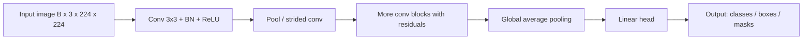

# Convolutional Neural Networks (CNNs)

## Beginner-Friendly Intuition

A convolutional neural network detects patterns in images by sliding small
filters across the input. Each filter is a tiny weight matrix (3x3 or
5x5); it produces a high response wherever the input matches the pattern
it has learned. Stacking convolution layers builds up a hierarchy of
patterns: early layers detect edges and corners, middle layers detect
textures and parts, late layers detect objects and scenes.

The reason CNNs are used at all is the right inductive bias for images:
**translation equivariance** (a cat in the top-left of the image is still
a cat in the bottom-right) and **local connectivity** (nearby pixels are
related, far-apart pixels are mostly not). Plain MLPs lack both. A 224x224
RGB input has 150K features; an MLP would need 150K weights per hidden
unit. A CNN shares the same 9 weights of a 3x3 filter across the whole
image, dramatically reducing parameter count without losing expressive
power.

## Formal Explanation

A 2D convolution layer is a tensor operation:

```
y[b, c_out, i, j] = Σ_{c_in, di, dj} W[c_out, c_in, di, dj] · x[b, c_in, i+di, j+dj] + b[c_out]
```

with input shape `(B, C_in, H, W)` and output shape `(B, C_out, H', W')`.
Hyperparameters:

- **Kernel size** `k` (typical 3, 5, 7).
- **Stride** `s` (default 1; larger strides downsample).
- **Padding** `p` (zero-padding around the input; "same" preserves spatial
  size).
- **Dilation** `d` (gaps in the kernel; expands receptive field without
  more parameters).

Output spatial size:
`H' = floor((H + 2p - d(k - 1) - 1) / s) + 1`.

Parameter count: `C_out · C_in · k · k + C_out` (a 3x3 conv with 64 input
and 128 output channels has `64 · 128 · 9 + 128 = 73,856` parameters).

### Pooling

Downsamples by a fixed rule (no learned parameters).

- **Max pooling.** Take the max over a `k x k` window. Captures the
  strongest activation; classical default.
- **Average pooling.** Take the mean. Smoother, sometimes used at the end
  of the network.
- **Global average pooling.** Average over all spatial positions, leaving
  one value per channel. Used as a parameter-free replacement for the
  large fully-connected layer at the end of older CNNs.

### Receptive field

Each output pixel "sees" a region of the input. A single 3x3 conv has
receptive field 3. Stacking two 3x3 convs gives receptive field 5;
stacking three gives 7. Strided or dilated convolutions grow the
receptive field faster. The receptive field at the final layer should be
at least the size of the structure you want to detect.

### Common building blocks

- **Conv + BatchNorm + ReLU.** The classical building block.
- **Residual block.** `y = x + F(x)` where `F` is two or three convs.
  Critical for training deep networks. Introduced by ResNet (He et al.,
  2015).
- **Bottleneck block.** 1x1 conv to reduce channels, 3x3 conv at reduced
  channels, 1x1 conv to restore channels. Standard in ResNet-50+ and
  efficient architectures.
- **Depthwise separable convolution.** Replace a standard `k x k` conv
  with a depthwise `k x k` (one filter per input channel) followed by a
  1x1 pointwise conv. Reduces parameters by ~9x for `k = 3`. Standard in
  MobileNet, EfficientNet.
- **Squeeze-and-excitation (SE).** A small attention block that
  recalibrates channel-wise activations. Used in EfficientNet and many
  modern CNNs.

### Common backbones

- **VGG (2014).** Simple stacks of 3x3 convs. Showed that depth matters.
- **ResNet (2015).** Residual connections enabled 50, 101, 152 layers.
  Still a strong default.
- **EfficientNet (2019).** Compound scaling (depth, width, resolution) with
  depthwise separable convs and SE blocks. Strong accuracy-per-FLOP.
- **ConvNeXt (2022).** Modernized CNN with transformer-inspired tricks
  (LayerNorm, GELU, larger kernels). Competitive with ViTs.

### CNNs vs ViTs

For image classification, vision transformers (ViTs) match or exceed CNNs
when trained on enough data (300M images for the original ViT). On
smaller datasets, CNNs often still win because their inductive bias
matches the data. Modern hybrid architectures (Swin, ConvNeXt) blend ideas
from both.

For tasks that need precise spatial localization (detection, segmentation,
medical imaging), CNNs are often still preferred. For small data and edge
devices, MobileNet/EfficientNet variants dominate.

## Why It Matters in Real Jobs

CNNs are the backbone of practically every deployed image system: phone
cameras, medical imaging, autonomous driving, content moderation, retail
visual search. Three production reasons. First, **transfer learning**: a
pretrained ImageNet CNN is the starting point for almost every custom
vision task; you fine-tune the head and sometimes the last few layers.
Second, **efficiency**: depthwise separable convs and quantization let
CNNs run at 30 FPS on a phone CPU. Third, **interpretability**: CNN
activations are easier to visualize than transformer attention; saliency
maps and class activation maps are well-developed tools.

## How It Works Step by Step

1. **Frame the task.** Classification, detection, segmentation, regression
   on images. Different heads sit on the same CNN backbone.
2. **Pick a backbone.** ResNet-18 or 50 for a strong baseline. EfficientNet
   for FLOP-constrained settings. ConvNeXt for state-of-the-art accuracy
   at moderate cost.
3. **Use a pretrained checkpoint.** ImageNet pretraining beats training
   from scratch for almost every custom task with less than 100K labeled
   images.
4. **Replace the head.** A few fully-connected layers or a single linear
   layer for classification. A specialized head for detection or
   segmentation.
5. **Train with augmentation.** RandomCrop, HorizontalFlip,
   ColorJitter. RandAugment, Mixup, CutMix for stronger results.
6. **Set the optimizer.** SGD with momentum and cosine LR for vision; AdamW
   for newer CNN architectures. Learning rate around `1e-2` for SGD,
   `1e-3` for AdamW. Cosine decay over 100-300 epochs.
7. **Evaluate per class.** Aggregate accuracy hides per-class failures;
   inspect the confusion matrix.
8. **Quantize for deployment.** Int8 quantization is standard for mobile
   and edge inference, with usually under 1 percent accuracy loss.

## Real-World Example

A team builds a defect detector for car body panels. 3K labeled images
across 6 defect classes. Training a ResNet-50 from scratch fails: training
loss does not decrease meaningfully because the dataset is too small. They
load an ImageNet-pretrained ResNet-50, replace the 1000-class head with a
6-class head, freeze the backbone for the first 10 epochs (fine-tuning
only the head), then unfreeze and train end-to-end with `lr = 1e-4` for 50
more epochs. They use RandomCrop, HorizontalFlip, ColorJitter, and Mixup.
Validation accuracy reaches 94.2 percent. They quantize to int8; accuracy
drops to 93.6 percent and inference latency on the production CPU drops
from 75 ms to 22 ms per image. The combination of pretraining,
augmentation, and the right architecture turned 3K images into a working
system.

## Common Mistakes

- Training a deep CNN from scratch on small data; transfer learning from
  ImageNet wins.
- Forgetting to apply data augmentation; CNN overfits quickly without it.
- Using `model.eval()` only sometimes; BatchNorm misbehaves at inference if
  not in eval mode.
- Resizing images to a smaller size than the backbone expects; useful
  detail is lost.
- Picking a kernel size by guess. Stick with 3x3 for most layers; use 1x1
  for channel mixing and 7x7 only at the very first layer (with
  appropriate padding) if at all.
- Skipping global average pooling and going straight to a giant FC layer;
  parameter explosion.
- Using LayerNorm in CNNs; BatchNorm and GroupNorm are the conventional
  choices.
- Training without learning rate decay; a flat LR plateau is almost
  universal.

## Interview Angle

**Question:** Why does a convolutional layer have far fewer parameters
than a fully-connected layer for image inputs, and what does that buy
you?

**Strong answer:** A fully-connected layer treats every input pixel as a
separate feature. For a 224x224 RGB image (150,528 features) with a
hidden layer of 1024 units, the weight matrix is `150528 × 1024 ≈ 154M`
parameters. A convolutional layer with 64 output channels and 3x3 kernels
has `3 × 3 × 3 × 64 + 64 = 1792` parameters. The reason: the conv layer
**shares weights**. The same 3x3 filter is applied to every spatial
position. The filter has `3 × 3 × 3 = 27` weights, regardless of the
input image size.

What this buys you. First, **parameter efficiency**: orders of magnitude
fewer weights mean orders of magnitude less data needed to fit them.
Second, **translation equivariance**: shifting the input by `k` pixels
shifts the output by `k` pixels. The features the network learns are the
same regardless of where in the image they appear. An MLP would have to
learn a separate set of weights for each location, which is wasteful for
images. Third, **local connectivity**: each output pixel depends only on
a small spatial neighborhood of the input, matching the locality of
visual structure (edges, textures, parts).

These three properties (weight sharing, equivariance, locality) are the
**inductive biases** of CNNs. They let CNNs train on relatively small
datasets that an MLP would need orders of magnitude more data for. The
biases are a feature, not a limitation: they encode prior knowledge about
images that we do not have to learn from data.

ViTs replace this inductive bias with a much weaker one (permutation
invariance over image patches), so they need much more data to compete.
That is why CNNs still dominate small-data and edge applications, while
ViTs win at internet scale.

**Weak answer:** "Convs have fewer parameters" without explaining weight
sharing or inductive bias.

**Follow-up questions:**

- What is the receptive field, and how do you grow it?
- What is the difference between max pooling and global average pooling?
- Why do residual connections help train deep CNNs?
- When would you use depthwise separable convolutions?

## Mini Exercise

Train a small CNN on CIFAR-10 (3-conv-layer network). Then add residual
connections and BatchNorm. Compare training and validation accuracy.
Note the gap.

## Diagram



---
## Navigation

[⬅ Previous](08-batch-normalization-layer-normalization.md) | [🏠 Home](../README.md) | [➡ Next](10-rnns-lstms-grus.md)
