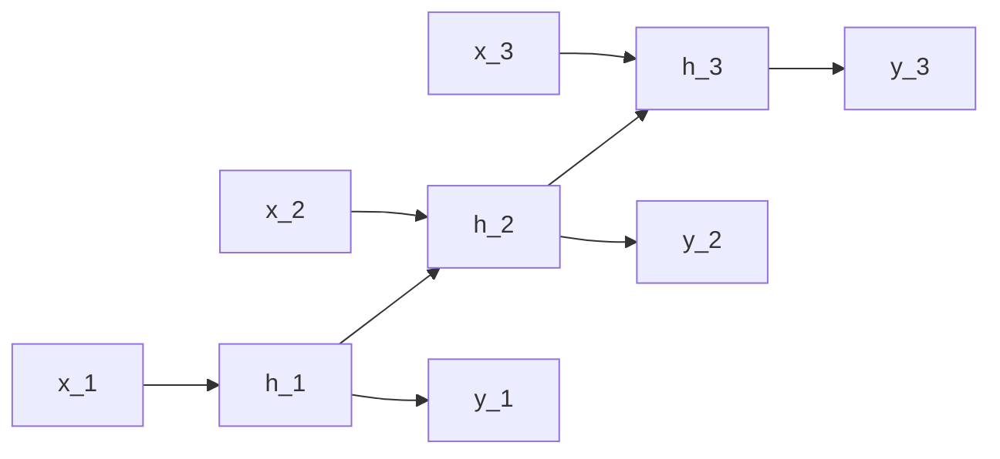

# RNNs, LSTMs, and GRUs

## Beginner-Friendly Intuition

A recurrent neural network processes a sequence one step at a time,
maintaining a **hidden state** that carries information from earlier
steps to later ones. After reading the whole sequence, the hidden state
summarizes everything seen. The recurrence is the network's way of
"remembering" the past.

The original vanilla RNN has a fatal flaw: as the sequence gets longer,
gradients propagated back through time vanish or explode. The network
cannot learn long-range dependencies; it forgets what happened more than
a handful of steps ago. LSTMs and GRUs were designed to solve this with
**gated** state updates that let gradients flow through long sequences
without vanishing.

In 2026, transformers have largely replaced RNNs for serious sequence
modeling. But RNNs are still useful for streaming inference (where you
process tokens one at a time and cannot afford the `O(T²)` cost of
attention), for very long sequences where memory is constrained, and for
specific tasks where the inductive bias matches the data.

## Formal Explanation

### Vanilla RNN

```
h_t = σ(W_h h_{t-1} + W_x x_t + b)
y_t = W_y h_t + b_y
```

Hidden state `h_t` is a function of the previous hidden state and the
current input. The same weights `W_h, W_x` are reused at every time step
(weight sharing across time, analogous to weight sharing across space in
CNNs).

Training uses **backpropagation through time (BPTT)**: unroll the RNN
across the sequence, treat it as a deep feedforward network, and apply
standard backprop. The "depth" of the unrolled network equals the
sequence length, so for a 100-step sequence, gradients propagate through
100 layers.

The classical problem: the gradient of `h_t` with respect to `h_0`
involves the product of `T` Jacobians of the recurrence. If the spectral
radius of `W_h` is less than 1, gradients vanish; if greater than 1, they
explode. Both make long-range learning impossible.

### LSTM (Long Short-Term Memory)

Introduced by Hochreiter and Schmidhuber (1997). Adds a separate **cell
state** `c_t` that flows forward with minimal interference, gated by
learned gates that decide what to add, forget, and output:

```
f_t = σ(W_f [h_{t-1}, x_t] + b_f)             # forget gate
i_t = σ(W_i [h_{t-1}, x_t] + b_i)             # input gate
o_t = σ(W_o [h_{t-1}, x_t] + b_o)             # output gate
c̃_t = tanh(W_c [h_{t-1}, x_t] + b_c)          # candidate cell state
c_t = f_t ⊙ c_{t-1} + i_t ⊙ c̃_t               # update cell state
h_t = o_t ⊙ tanh(c_t)                          # hidden state output
```

The forget gate decides what to drop from the previous cell state. The
input gate decides what new information to write. The output gate decides
what part of the cell state to expose as `h_t`. The cell state's update
is essentially additive (gated), which provides a path along which
gradients can flow without multiplicative attenuation. This is what
solves vanishing gradients.

Forget gate biases are often initialized to a positive value (e.g., 1) so
the cell state defaults to "remember" rather than "forget" early in
training.

### GRU (Gated Recurrent Unit)

Introduced by Cho et al. (2014). A simpler gated alternative with two
gates instead of three:

```
z_t = σ(W_z [h_{t-1}, x_t])                    # update gate
r_t = σ(W_r [h_{t-1}, x_t])                    # reset gate
h̃_t = tanh(W [r_t ⊙ h_{t-1}, x_t])             # candidate hidden state
h_t = (1 - z_t) ⊙ h_{t-1} + z_t ⊙ h̃_t          # interpolated update
```

No separate cell state; the hidden state itself carries forward.
GRUs have fewer parameters than LSTMs (three weight matrices vs four)
and often train slightly faster; on most tasks they reach similar
accuracy.

### Bidirectional RNN

Run two RNNs over the sequence: one forward, one backward. Concatenate
the hidden states. Each output position has access to both past and
future context. Standard for tagging tasks (NER, POS), where future
context disambiguates current tokens. For generation, only forward
direction is used.

### Encoder-Decoder

Two RNNs: encoder reads the source sequence and compresses it to a
fixed-length context vector; decoder generates the output one token at a
time conditioned on the context vector and previously generated tokens.
The classical machine translation architecture before attention. The
fixed-length context bottleneck was the main motivation for attention
mechanisms (see [11-attention-mechanism.md](11-attention-mechanism.md)).

### Why transformers replaced RNNs

Three reasons.

1. **Parallelism.** RNNs are inherently sequential; you must compute
   `h_t` before `h_{t+1}`. Training cannot be parallelized within a
   sequence. Transformers process the whole sequence in parallel via
   self-attention, enabling much larger models on the same hardware.
2. **Long-range dependencies.** Even LSTMs struggle past ~100 steps in
   practice. Self-attention has direct connections between any two
   positions; the path length between them is `O(1)` instead of `O(T)`.
3. **Scaling.** Transformers scale gracefully to billions of parameters
   and trillions of tokens; RNNs hit diminishing returns much earlier.

### Where RNNs still apply

- **Streaming inference.** Processing one token at a time at low latency
  (real-time speech recognition, online prediction). RNN inference is
  `O(d²)` per token; attention is `O(T · d)` per token at sequence
  length `T`.
- **Very long sequences with limited memory.** RNN memory is `O(d)`
  regardless of sequence length; attention is `O(T · d)` (or `O(T)`
  with FlashAttention) and can OOM at long context.
- **Constrained edge devices.** Small RNNs (1-3 layers, 100-500 hidden
  units) are still used in keyword spotting, simple TTS, and embedded NLP.
- **Hybrid models.** Some recent work combines linear-attention or state
  space models (S4, Mamba) with RNN-style recurrence to get the best of
  both worlds.

## Why It Matters in Real Jobs

RNNs are not the architecture for new training projects in 2026, but they
remain in production for the constraints above. A senior engineer should
know them well enough to (1) recognize when an RNN is the right
deployment choice, (2) maintain legacy LSTM/GRU systems, and (3) explain
in interviews why transformers won and what was lost in the transition.

## How It Works Step by Step

1. **Frame the sequence task.** Classification (sentiment), tagging
   (NER), generation (translation), forecasting (sales). Different heads
   on a similar RNN backbone.
2. **Pick LSTM or GRU.** GRU as default for speed; LSTM if your sequences
   are very long or accuracy matters.
3. **Decide on bidirectionality.** BiLSTM/BiGRU for tagging.
   Unidirectional for autoregressive generation.
4. **Stack 1-3 layers.** More than 3 rarely helps and slows training.
5. **Pad or pack sequences.** PyTorch's `pack_padded_sequence` skips
   padding tokens during recurrence, saving compute and avoiding gradient
   noise from padding.
6. **Initialize forget gate bias to a positive value (LSTM).** Often `1.0`.
   Helps long-range dependencies in early training.
7. **Add gradient clipping.** RNNs are prone to gradient explosion;
   `clip_grad_norm_(5.0)` is typical.
8. **For sequence generation, use beam search at inference.** Greedy
   decoding produces worse outputs.

## Real-World Example

A team builds a real-time anomaly detector for sensor streams from
industrial machinery. The model must process 100 readings per second per
machine, on a CPU at the factory. They train a 2-layer GRU with hidden
size 128 over windows of 30 seconds. They quantize to int8 and serve at
1.2 ms per reading on a single ARM core. A transformer with comparable
accuracy would take 8 ms per reading and cost more memory; the deployment
constraint makes the GRU the right choice. The lesson: when latency,
memory, or streaming requirements dominate, RNNs still win.

## Common Mistakes

- Using a vanilla RNN on long sequences; vanishing gradients break it.
- Using BPTT with very long sequences without truncation; memory blows
  up. Use **truncated BPTT** with windows of 50-200 steps.
- Forgetting to pack padded sequences; the model wastes compute on
  padding and gradients are noisy.
- Initializing the LSTM forget gate at 0; long-range memory is harder to
  develop early in training.
- Skipping gradient clipping; RNN gradients spike and NaN the loss.
- Using greedy decoding when beam search is appropriate; outputs are
  noticeably worse for translation and summarization.
- Picking RNN for a task where transformers fit and parallelism matters;
  training takes 10x longer.
- Not handling the initial hidden state correctly; default zeros are
  fine, but for streaming inference you must carry state across batches.

## Interview Angle

**Question:** Why do LSTMs and GRUs work where vanilla RNNs fail, and
what is the specific mechanism that solves vanishing gradients?

**Strong answer:** Vanilla RNNs apply a non-linear transformation `h_t =
σ(W_h h_{t-1} + W_x x_t)` at every step. The gradient of `h_T` with
respect to `h_0` involves the product of `T` Jacobians of this
transformation. With `tanh` activation and reasonable weights, each
Jacobian's spectral norm is less than 1; multiplying many of them
produces an exponentially shrinking gradient. After ~10-20 steps, the
gradient is effectively zero, and the network cannot learn to use
information from that far back.

LSTMs introduce a separate cell state `c_t` whose update is
`c_t = f_t ⊙ c_{t-1} + i_t ⊙ c̃_t`. The forget gate `f_t` is a sigmoid
in [0, 1]. When `f_t` is near 1, the cell state passes through almost
unchanged: `c_t ≈ c_{t-1}`. The gradient of `c_t` with respect to
`c_{t-1}` is approximately `f_t`, which is bounded by 1 but does not
necessarily decay. If the forget gate stays near 1 across many steps,
the gradient flows through with minimal attenuation. This is the
**constant error carousel** that the original LSTM paper described.

GRUs achieve the same effect with a simpler `(1 - z_t)` interpolation:
when `z_t` is small, the new hidden state is mostly the old one, and
gradients flow through cleanly.

The key insight is that **additive updates** (gated) preserve gradient
flow much better than **multiplicative updates** (a single weight matrix
applied at every step). The gates are learned, so the network can decide
when to forget, when to remember, and when to write new information,
adapting the gradient flow to the task.

In practice, even LSTMs and GRUs struggle past ~200 steps. The
transformer's self-attention has `O(1)` path length between any two
positions and is the cleaner solution for very long-range dependencies.

**Weak answer:** "Gates fix vanishing gradients" without naming the
constant error carousel or the additive vs multiplicative difference.

**Follow-up questions:**

- What is BPTT and what are its memory constraints?
- Why did transformers replace RNNs for most NLP tasks?
- When would you still pick an RNN today?
- What is the difference between LSTM and GRU?

## Mini Exercise

Train an LSTM and a GRU on a sequence task (sentiment classification on a
small dataset). Compare training time per epoch and validation accuracy
after a fixed number of epochs. Note that GRU is usually faster with
similar accuracy.

## Diagram



---
## Navigation

[⬅ Previous](09-cnns.md) | [🏠 Home](../README.md) | [➡ Next](11-attention-mechanism.md)
