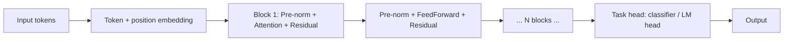

# Transformers

## Beginner-Friendly Intuition

A transformer is a stack of layers, each containing self-attention plus a
feedforward block, that processes a sequence in parallel. It has no
recurrence, no convolution, just attention. The 2017 paper "Attention Is
All You Need" introduced this architecture and showed it could match or
beat the best RNN-based machine translation systems while training much
faster.

The reason transformers ate the world: they parallelize cleanly across
sequence positions, scale to hundreds of billions of parameters without
hitting hard architectural walls, and capture long-range dependencies
through `O(1)` attention paths between any two positions. They also
transfer remarkably well: a single pretrained transformer can be
fine-tuned for translation, classification, summarization, code, and
hundreds of other tasks.

In 2026, every state-of-the-art language model, most state-of-the-art
vision models, and increasingly speech, audio, video, and multimodal
models are transformers.

## Formal Explanation

A transformer block has two sub-layers:

```
y_1 = x + MultiHeadAttention(LayerNorm(x))         # attention sub-block
y_2 = y_1 + FeedForward(LayerNorm(y_1))            # MLP sub-block
```

This is the **pre-norm** form, which is now standard. The original 2017
paper used post-norm (`y = LayerNorm(x + Attention(x))`); pre-norm trains
more easily at depth.

Stack `N` of these blocks (typically `N = 6, 12, 24, 96, 240` depending on
model size). Add an embedding layer at the input and a task-specific head
at the output.

### Three transformer flavors

- **Encoder-only.** Used for understanding tasks (classification,
  retrieval, NER). Bidirectional attention; every position attends to
  every other position. Examples: BERT, RoBERTa, DeBERTa, ModernBERT.
- **Decoder-only.** Used for generation. Causal attention mask; each
  position attends only to itself and earlier positions. Examples: GPT,
  LLaMA, Mistral, Claude, every modern LLM.
- **Encoder-decoder.** Used for sequence-to-sequence (translation,
  summarization). Encoder reads input bidirectionally; decoder generates
  output autoregressively, attending to encoder output via cross-attention.
  Examples: T5, BART, original Transformer.

The decoder-only architecture has come to dominate because instruction-
following, in-context learning, and chain-of-thought all work cleanly with
causal generation, and because pre-training on a single objective
(next-token prediction) is the simplest way to use any text data.

### Positional encoding

Self-attention is **permutation invariant** by default: shuffling the
input positions produces a shuffle of the output. To handle order,
transformers add positional information to the input embeddings:

- **Sinusoidal** (original 2017 paper). Fixed, deterministic encodings
  with sinusoids of different frequencies. Generalizes (in principle) to
  longer sequences than seen in training.
- **Learned**. Each position has a trainable embedding. Used by GPT-2,
  BERT. Limited to the maximum trained length.
- **RoPE (Rotary Position Embedding).** Encodes relative position by
  rotating query and key vectors in 2D subspaces. Used by LLaMA, Mistral,
  Qwen, GPT-NeoX. Generalizes well, the modern default.
- **ALiBi (Attention with Linear Biases).** Adds a position-dependent
  linear bias to attention scores. Generalizes to longer-than-trained
  sequences. Used in some models.

### Pre-norm vs post-norm

Post-norm: `y = LayerNorm(x + Sublayer(x))`. The residual passes through
the LayerNorm, which can shrink gradient signal at depth. Hard to train
beyond ~12 layers without warmup gymnastics.

Pre-norm: `y = x + Sublayer(LayerNorm(x))`. The residual carries
unmodified through the layer; LayerNorm sits inside the sublayer. Trains
much more reliably at 24, 48, 96+ layers. The default in modern
transformers.

### Feedforward block

A two-layer MLP applied independently to each position:

```
FFN(x) = GELU(x W_1 + b_1) W_2 + b_2
```

The hidden dimension is typically 4x the model dimension (`d_ff = 4 d`).
This block does most of the parameter count of a transformer (about
`8 d²` per block vs `4 d²` for attention's projections). Newer variants
(SwiGLU) replace `GELU` with a gated activation:

```
SwiGLU(x) = SiLU(x W_1) ⊙ (x W_3) · W_2
```

Used in LLaMA, GPT-NeoX, and many modern models. Slightly more parameters
per FLOP, slightly better quality.

### Scaling laws

Empirically, transformer loss scales as a power law in compute, data, and
parameters (Kaplan et al., 2020; Hoffmann et al., 2022 / Chinchilla). Key
findings:

- Loss decreases predictably with more parameters or more data.
- The optimal allocation of compute is roughly equal between scaling
  parameters and scaling tokens; the Chinchilla ratio is ~20 tokens per
  parameter.
- Pre-training on diverse data is far more effective than tuning on
  narrow data for emergent capabilities.

### KV caching for inference

In decoder-only generation, attention is computed for the full sequence
at each step. Naively, this is `O(T²)` per token. The fix is the **KV
cache**: cache the keys and values of all previous tokens; only the new
token's query attends to them. Per-token attention becomes `O(T · d)`.
Standard in every LLM serving stack.

### Quantization and efficiency

Modern serving uses int8 or int4 quantization, which cuts memory by 2-4x
with small accuracy loss. Combined with KV cache, FlashAttention, and
batched serving (continuous batching), production LLM throughput is
several thousand tokens per second per GPU.

## Why It Matters in Real Jobs

Transformers are the dominant architecture for any task that fits a
sequence model. Three production reasons. First, **transfer learning**:
fine-tuning a pretrained transformer is the highest-ROI move in NLP and
increasingly in vision. Second, **scaling**: with sufficient data and
compute, transformers continue to improve in ways CNNs and RNNs do not.
Third, **uniformity**: text, speech, code, images-as-patches, and
audio-as-spectrograms all flow through similar transformer architectures,
which simplifies tooling, training, and deployment.

The cost is real: transformer inference is expensive, context length is
bounded, attention is `O(T²)`. A team that knows when a smaller model or
a non-transformer approach is the better engineering choice ships better
systems.

## How It Works Step by Step

1. **Pick the flavor.** Encoder-only for classification and retrieval,
   decoder-only for generation, encoder-decoder for sequence-to-sequence.
2. **Pick a pretrained checkpoint.** Almost never train from scratch.
   BERT/RoBERTa/DeBERTa for encoder, LLaMA/Mistral/Qwen for decoder, T5
   for encoder-decoder.
3. **Pre-norm, RoPE or sinusoidal positional encodings, GELU or SwiGLU
   activations.** These are the modern defaults; deviate only if you have
   a reason.
4. **Configure attention masking.** Causal for decoder-only, bidirectional
   for encoder, both for encoder-decoder.
5. **Train with AdamW + cosine LR schedule + linear warmup.** Standard
   recipe.
6. **Use FlashAttention** in any modern training and inference stack.
7. **Use KV caching** for decoder inference.
8. **Quantize for deployment.** Int8 is the default; int4 for very large
   models.

## Real-World Example

A team needs to classify legal documents (10K classes, 50K labeled
documents). Their first attempt is a from-scratch CNN; validation
accuracy is 72 percent. They switch to fine-tuning RoBERTa-large for
6 epochs with `lr = 2e-5` and AdamW; validation accuracy is 88 percent.
They quantize the model to int8 and serve at 18 ms per document on a
CPU. A larger DeBERTa-v3-large reaches 90 percent but is too slow to
serve. The team ships RoBERTa-large with int8 quantization. The lesson:
the transformer's pretrained representations did the work; the
architecture choice between RoBERTa and DeBERTa was a small fraction
of the total improvement.

## Common Mistakes

- Training from scratch on small data; transfer learning from a
  pretrained checkpoint wins.
- Using post-norm instead of pre-norm in a deep transformer; training
  becomes unstable.
- Forgetting the causal mask in a decoder-only model; the model cheats
  and validation looks great.
- Forgetting the padding mask in variable-length batches; padding tokens
  pollute attention.
- Using sinusoidal or learned positional encodings when RoPE would
  generalize better; long-context evaluation fails.
- Skipping KV cache in production inference; latency is much worse than
  it could be.
- Using the wrong tokenizer (e.g., BPE-trained on different language);
  performance is silently terrible.
- Comparing transformer to CNN on small data without proper tuning of
  both; transformers need more data or pretraining to win.
- Assuming "bigger is always better"; on many tasks, a 100M-parameter
  fine-tuned model beats a 7B-parameter zero-shot one.

## Interview Angle

**Question:** Why did transformers replace RNNs and CNNs for most
sequence modeling tasks, and what are their costs?

**Strong answer:** Three reasons.

First, **parallelism**. RNNs are inherently sequential: `h_t` depends on
`h_{t-1}`, so you cannot parallelize the recurrence within a sequence.
Transformers compute self-attention across all positions in parallel
matmuls, which maps perfectly to GPU hardware. The same wall-clock budget
that trains a 1B-parameter LSTM trains a 10B+ parameter transformer.

Second, **direct long-range connections**. Self-attention has `O(1)`
path length between any two positions. RNN gradients must propagate
through `T` recurrence steps to connect distant positions, with vanishing
or exploding gradients. CNNs need many layers to grow the receptive
field. Transformers connect distant positions in a single attention
operation.

Third, **transfer learning**. A single pretraining objective (masked
language modeling for BERT, next-token for GPT) on diverse data produces
representations that transfer to almost any downstream task. CNNs have
this for ImageNet pretraining, but the transferability is narrower:
image classification pretraining transfers to detection but not to
language. Transformers' uniformity (text, code, image patches, audio
features all flow through similar architectures) gives a much larger
transfer surface.

The costs.

- **Quadratic attention.** `O(T² · d)` compute and `O(T²)` memory
  (mitigated by FlashAttention but still the dominant cost). RNNs are
  `O(T · d²)`, which scales linearly in T.
- **Memory at inference.** KV cache grows linearly with sequence length,
  which matters at long context.
- **Data hunger.** Transformers do less well than CNNs/RNNs on small
  data without pretraining; their inductive bias is weak (just
  permutation invariance over patches/tokens).
- **Compute at training.** State-of-the-art transformers cost millions of
  GPU-hours; few teams can train them from scratch.

In production, the right move is usually to fine-tune a pretrained
transformer rather than train one. The architecture is the most
important advance of the last decade in deep learning, and even teams
that do not train them must understand them to deploy them.

**Weak answer:** "Transformers parallelize better" without mentioning
long-range dependencies, transfer learning, or the costs.

**Follow-up questions:**

- What is the difference between encoder-only, decoder-only, and
  encoder-decoder transformers?
- Why is pre-norm preferred over post-norm in modern transformers?
- What is RoPE and why do modern LLMs use it?
- How does KV caching work?

## Mini Exercise

Take a pretrained BERT-base or RoBERTa-base from HuggingFace. Fine-tune
on any small text classification dataset (1000 examples, 4 classes) for
3 epochs. Compare to fine-tuning DistilBERT (smaller, faster). Report
validation accuracy and per-batch latency.

## Diagram



---
## Navigation

[⬅ Previous](11-attention-mechanism.md) | [🏠 Home](../README.md) | [➡ Next](13-training-deep-networks.md)
