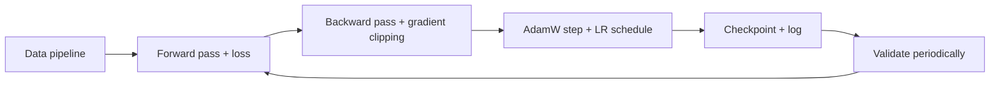

# Training Deep Networks

## Beginner-Friendly Intuition

Training a deep network is the orchestration of many moving pieces: the
data pipeline, the model, the loss, the optimizer, the schedule, the
hardware. When all pieces are right, training is uneventful. When one is
wrong, the whole thing diverges, plateaus, or silently underperforms. The
job of a deep learning engineer is to know which pieces matter, in which
order, and how they break.

The intuition: a network is a big numerical optimization problem with
millions to billions of parameters. The optimizer's job is to walk down a
loss surface defined by the data; your job is to set up the walk so it
reaches a useful minimum within the budget you have. Most "training
problems" are setup problems, not optimization problems.

This file focuses on the practical recipe and infrastructure: how to
take a model from "untrained" to "shipped" without burning the GPU bill.

## Formal Explanation

### The standard recipe

For a typical deep learning training run:

1. **Loss.** Cross-entropy for classification, MSE for regression,
   contrastive for embeddings. Match the loss to the task; see
   [../fundamentals/08-loss-functions-and-optimization.md](../fundamentals/08-loss-functions-and-optimization.md).
2. **Optimizer.** AdamW for transformers and most modern architectures;
   SGD with momentum for CNNs trained from scratch on classical
   benchmarks. See
   [06-optimizers-sgd-adam-rmsprop.md](06-optimizers-sgd-adam-rmsprop.md).
3. **Learning rate schedule.** Linear warmup over 500-2000 steps, then
   cosine decay to near zero. The most important hyperparameter after the
   peak LR.
4. **Batch size.** As large as fits in memory; use gradient accumulation
   to simulate larger batches. Linearly scale LR with batch size up to
   8x the original.
5. **Regularization.** Weight decay (decoupled in AdamW), dropout, data
   augmentation, label smoothing. See
   [07-regularization-dropout-weight-decay.md](07-regularization-dropout-weight-decay.md).
6. **Mixed precision.** FP16 or BF16 for forward and backward, FP32 for
   parameter updates. 2x faster, half the memory.
7. **Gradient clipping.** `clip_grad_norm_(1.0)` for transformers and
   RNNs to prevent NaN.
8. **Data pipeline.** Multi-worker, prefetched, augmented on the fly,
   shuffled per epoch. The most common bottleneck is the data loader,
   not the GPU.

### Mixed precision

Modern training uses **autocast** for the forward and backward pass,
which casts ops to FP16 or BF16 automatically. The optimizer keeps a
master copy of weights in FP32 to avoid loss-of-precision in updates.
Loss scaling (multiply loss by a factor before backward, divide
gradients after) prevents underflow in FP16 gradients. BF16 has higher
exponent range and does not need loss scaling, which is why it dominates
modern training (A100, H100, TPU support).

### Gradient accumulation

When the desired batch size does not fit in GPU memory, accumulate
gradients over multiple micro-batches before stepping the optimizer:

```
optimizer.zero_grad()
for i in range(accumulation_steps):
    loss = compute_loss(micro_batch_i) / accumulation_steps
    loss.backward()
optimizer.step()
```

Effectively trains at the larger batch size with the same memory cost.
Standard in large-model training.

### Distributed training

Three main strategies:

- **Data parallelism (DDP).** Replicate the model on each GPU; each GPU
  processes a different mini-batch; gradients are all-reduced (averaged
  across GPUs) before the optimizer step. Standard for moderately-sized
  models.
- **Tensor parallelism.** Split each layer's weights across GPUs.
  Communication-heavy; used for models too large to fit on one GPU
  (Megatron, large LLMs).
- **Pipeline parallelism.** Split the model by layer across GPUs. Each
  micro-batch flows through the pipeline. Bubble overhead is the cost.

**ZeRO** (DeepSpeed; Rajbhandari et al., 2020) shards the optimizer
state, then gradients, then parameters across data-parallel workers,
each at increasing memory savings and communication cost.
**FSDP** (Fully Sharded Data Parallel) is PyTorch's native version of
the same idea.

For most non-frontier teams, DDP plus mixed precision plus gradient
accumulation is enough.

### Learning rate finder

Sweep learning rate exponentially over a small subset of training data;
plot loss vs LR. The LR where loss starts decreasing rapidly is roughly
your peak LR; one tenth of that is a safe starting point. Standard
practice in `fastai` and `pytorch-lightning`.

### Checkpointing

Save model weights, optimizer state, and learning rate scheduler state
every `N` steps or every epoch. Allows resumption after preemption,
crashes, or hardware failures. Always test that your checkpoint loads
correctly before relying on it.

### Logging and monitoring

At minimum: loss per step, validation metric per epoch, gradient norm
per step, learning rate per step. Modern stacks also log per-layer
gradient and activation statistics, GPU utilization, and step time.
Without these, debugging is guessing.

## Why It Matters in Real Jobs

Three production reasons. First, **cost**: a poorly-set-up training run
wastes weeks of GPU time. The difference between an LR that converges in
50 epochs and one that takes 300 is the same model and a 6x cheaper
training bill. Second, **reliability**: training large models without
checkpointing, gradient clipping, and proper logging guarantees you will
lose a week to a single instability you cannot diagnose. Third,
**reproducibility**: a senior engineer can take a paper's described
recipe and reproduce its results within a few percent. That requires
knowing not just the model but the entire training stack.

## How It Works Step by Step

1. **Build the data pipeline first.** Verify it produces correct,
   shuffled, augmented batches at acceptable throughput. Profile it; if
   the GPU is starving, fix the dataloader.
2. **Overfit one batch.** Take a single mini-batch, train on it
   repeatedly, verify the loss reaches near-zero. If it does not, the
   model or loss is broken; fix that before scaling up.
3. **Pick the optimizer and LR.** AdamW with `lr` from a learning rate
   finder. Add 500-2000 steps of linear warmup and cosine decay.
4. **Add mixed precision.** `torch.cuda.amp.autocast` plus
   `GradScaler` (FP16) or just autocast (BF16).
5. **Add gradient clipping.** `clip_grad_norm_(1.0)`.
6. **Add regularization.** Weight decay, dropout, augmentation.
7. **Set checkpointing.** Save every N steps; keep the best validation
   metric checkpoint separately.
8. **Train.** Monitor loss, validation metric, gradient norm, GPU
   utilization, step time. Investigate any anomaly immediately.
9. **Evaluate honestly.** Held-out test set, per-segment metrics, with
   confidence intervals.

## Real-World Example

A team trains a 1B-parameter transformer on 8 A100 GPUs. Their first
recipe: AdamW, fixed `lr = 1e-4`, FP16, no gradient clipping. The loss
reaches NaN at step 1200. They add 1000 steps of warmup, switch to
BF16, and add `clip_grad_norm_(1.0)`. The loss is stable and reaches
the target in 200K steps. Total cost: 18,000 GPU-hours. They estimate
the original setup would have wasted 2-3 attempts at 24-30 hours each
before they identified the cause; the upfront care saved a week.

## Common Mistakes

- Skipping the overfit-one-batch test; later debugging is much harder.
- Training without gradient clipping in transformers; instabilities NaN
  the loss.
- Setting LR with no warmup; transformers diverge in the first few
  hundred steps.
- Forgetting to scale LR with batch size; effective training rate is
  off.
- Mixing FP16 and FP32 manually instead of using autocast; subtle bugs.
- Not checkpointing; one preemption costs you the entire run.
- Training without a validation set monitor; you have no way to detect
  overfitting or convergence.
- Profiling only after a problem; profile early to catch dataloader and
  GPU underutilization issues before they waste days.
- Using too small a batch with BatchNorm; statistics are noisy.
- Ignoring the data pipeline; it is the most common bottleneck.

## Interview Angle

**Question:** Walk me through how you would set up training for a new
transformer language model from scratch.

**Strong answer:** Start with the loss: causal LM with cross-entropy.
Optimizer: AdamW with `β1 = 0.9, β2 = 0.95, weight_decay = 0.1` (the
standard transformer config; `β2 = 0.999` works too, `0.95` is common
for LLMs). Learning rate: peak around `2e-4` for a 1B-parameter model,
scaled by batch size if very large. Schedule: linear warmup over 2000
steps, cosine decay to 10 percent of peak.

Batch: as large as fits, use gradient accumulation if needed. Mixed
precision: BF16 if hardware supports (A100/H100/TPU); otherwise FP16
with loss scaling. Gradient clipping at 1.0. Weight decay decoupled
(AdamW).

Data: tokenize once, store as packed sequences (no padding overhead),
shuffle per epoch with deterministic seed. Multi-worker data loader.
Prefetch enough to keep GPU full.

Distributed: DDP for moderate scale, FSDP or ZeRO for large scale.
Checkpoint every 1000 steps, retain the last 5 and the best validation
checkpoint.

Logging: loss per step, gradient norm per step, learning rate, GPU
utilization, time per step. Validate on held-out sample every 500-2000
steps.

Sanity checks before scaling: overfit one batch (loss should reach near
zero), train for 100 steps and verify gradients flow, look at attention
patterns and token distributions.

The most common failures: NaN loss (gradient explosion, missing
clipping or wrong dtype), data loader bottleneck (GPU at 30 percent
utilization), wrong masking (causal vs padding), and instability
without warmup.

**Weak answer:** Listing model components without addressing schedule,
mixed precision, or distributed training.

**Follow-up questions:**

- What is gradient accumulation and when do you need it?
- How does ZeRO/FSDP work?
- What is the linear scaling rule for batch size and LR?
- Why is BF16 preferred over FP16 for large model training?

## Mini Exercise

Set up a small training run (a 50M-parameter transformer on a small
text dataset). Implement: data loader with packing, AdamW, linear
warmup + cosine decay, gradient clipping, mixed precision, checkpoint
every 100 steps. Train for 1000 steps and report loss curve.

## Diagram



---
## Navigation

[⬅ Previous](12-transformers.md) | [🏠 Home](../README.md) | [➡ Next](14-debugging-neural-networks.md)
