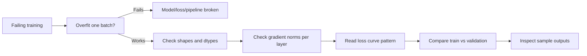

# Debugging Neural Networks

## Beginner-Friendly Intuition

Most "the network does not learn" problems are not optimization problems
or capacity problems. They are bugs: wrong shapes, wrong masks, leaked
data, wrong loss reduction, wrong learning rate by 100x. Debugging neural
networks is a discipline of systematic checks that catches these bugs
fast.

The intuition: networks fail loudly when they explode (NaN), and silently
when they do something almost right. Loud failures are easier; you check
gradients, dtypes, and clipping. Silent failures need active diagnosis:
overfit-one-batch tests, gradient flow inspection, sample-level error
analysis. The senior engineer is not the one who never has bugs; it is
the one who has a routine for finding them in 30 minutes instead of 3
days.

## Formal Explanation

### The diagnostic ladder

Run these in order when something is wrong:

1. **Overfit one batch.** Take a tiny batch (1-32 examples), train
   on it repeatedly. Loss should drop to near zero in 100-1000 steps. If
   not, the model, loss, or data pipeline is broken. This is the single
   most useful debug.
2. **Verify shapes and dtypes.** Print the shape and dtype of every
   tensor through the forward pass. Most bugs are visible here.
3. **Inspect a few examples.** Pick 5 random training examples and walk
   through them: input, intermediate activations, prediction, loss. Bugs
   in data pipelines, label encoding, and tokenization show up.
4. **Check gradient norms.** Log per-layer gradient norm during training.
   Vanishing (norms near 0 in early layers) or exploding (norms above
   1e3) is a major signal.
5. **Compare train and validation.** If training loss decreases but
   validation does not, you are overfitting or have a data leak. If
   neither decreases, the model is broken or the LR is wrong.
6. **Try a known-good baseline.** Replace your model with a tiny MLP and
   verify the rest of the pipeline trains it. If even the trivial
   baseline fails, the issue is in the data or training loop, not the
   model.
7. **Read the loss curve carefully.** Specific shapes indicate specific
   bugs (next section).

### Reading the loss curve

| Pattern | Likely cause |
| --- | --- |
| Loss is NaN immediately | Bad initialization, FP16 underflow, division by zero in loss |
| Loss is constant from step 1 | Wrong loss, gradients not flowing, frozen parameters |
| Loss decreases to a high plateau | LR too low, model too small, regularization too strong |
| Loss decreases then explodes to NaN | LR too high, no gradient clipping, FP16 overflow |
| Train loss decreases, val loss flat | Overfitting (need regularization) or data leak in training |
| Train loss flat, val loss decreases | Almost always a bug in your training loop, look for it immediately |
| Loss decreases predictably to a low value | Probably correct, but check sample outputs anyway |

### Gradient and activation inspection

Hook into the forward and backward passes:

- **Activation histograms per layer.** Healthy: roughly Gaussian, with
  many ReLU units near zero. Unhealthy: most units saturated (sigmoid),
  most units dead (ReLU at zero), all units near zero (vanishing
  signal).
- **Gradient histograms per layer.** Healthy: similar magnitudes across
  layers. Unhealthy: orders-of-magnitude differences (vanishing or
  exploding), or all zeros in early layers (vanishing).
- **Weight statistics over time.** Should change each step. Frozen
  weights mean gradients are not flowing or `requires_grad = False` was
  set somewhere.

PyTorch hooks let you log these at runtime without modifying the model:

```
def hook(module, input, output):
    print(module, output.std().item())
for layer in model.children():
    layer.register_forward_hook(hook)
```

### NaN diagnosis

NaN loss means somewhere a number became NaN. Common sources:

- **Division by zero.** Often in custom losses (e.g., dividing by a count
  that is zero in some batch). Add `+ 1e-8`.
- **Log of zero.** `log(p)` for `p = 0`. Use `BCEWithLogitsLoss` and
  `CrossEntropyLoss` (which compute the log internally with stability)
  rather than separate sigmoid/softmax + log.
- **FP16 overflow.** Loss scaling fixes most cases; switch to BF16 if
  available.
- **Exploding gradients.** Add `clip_grad_norm_(1.0)`.
- **Bad init.** Activations explode in early layers; verify
  initialization matches activation choice.

To find the source: enable anomaly detection
(`torch.autograd.set_detect_anomaly(True)`); the framework will report
which operation produced the NaN. Slow but precise.

### Train/validation gap diagnosis

If train accuracy is much higher than validation:

1. **Verify the split.** Random vs grouped vs time-series. A leak hidden
   by random splits on grouped data can produce a giant gap.
2. **Check augmentation.** Augmented training, un-augmented evaluation
   is the right setup; mismatched augmentation can produce gaps.
3. **Add regularization.** Dropout, weight decay, data augmentation,
   early stopping.
4. **Get more data or simplify the model.**

If train and validation are both bad:

1. **Lower LR.** Sometimes you are at the unstable edge.
2. **Check the loss function.** A wrong reduction or a sign error makes
   training useless.
3. **Test on a tiny subset.** If you cannot overfit 100 examples, the
   model is broken.

### Reproducibility

Seed RNGs, log library versions, freeze data, and store the full config
of every run. Without reproducibility, you cannot tell whether a "fix"
fixed anything or got lucky.

## Why It Matters in Real Jobs

Three production reasons. First, **time**: a methodical debug pass takes
hours; a flailing one takes weeks. Second, **trust**: stakeholders trust
engineers who can diagnose precisely (`"the loss spiked at step 2400
because gradient norm hit 1500"`) rather than vaguely (`"training is
unstable"`). Third, **avoidance**: every senior practitioner has internal
checklists from past bugs. Knowing the patterns means you set up the
training to avoid them in the first place.

## How It Works Step by Step

1. **Set up logging early.** Loss, gradient norm, learning rate,
   validation metric, GPU utilization, step time.
2. **Run the overfit-one-batch test.** Before any real training run.
3. **Check shapes and dtypes.** Print them; do not trust mental models.
4. **Run a tiny baseline first.** Verify the pipeline before scaling.
5. **Watch the loss curve.** Identify pattern from the table above.
6. **Inspect activations and gradients per layer.** Catches vanishing,
   exploding, and dead units.
7. **Look at sample outputs.** Pick 20 wrong predictions; what do they
   share?
8. **Iterate one variable at a time.** Change LR, then re-run; do not
   change LR and architecture together and compare.

## Real-World Example

A team trains a vision transformer; validation accuracy plateaus at 60
percent for 30 epochs. They run the diagnostic ladder. Overfit-one-batch
works (model can fit). Shapes look right. Gradient norms are stable.
Train loss decreases. Validation loss decreases for 5 epochs and then
plateaus while train loss continues falling. The pattern is overfitting,
not a model bug. They add RandAugment, mixup, stochastic depth, and
weight decay; validation accuracy rises to 78 percent in the same
training budget. The bug was not in the model; it was in the
regularization recipe. Without the methodical diagnosis, they would have
changed the architecture and wasted weeks.

## Common Mistakes

- Skipping the overfit-one-batch test; bugs become invisible at scale.
- Changing many things at once and not knowing which mattered.
- Assuming "training is unstable" means the optimizer is wrong; usually
  it is gradient clipping, dtype, or LR.
- Reading aggregate metrics without inspecting individual examples;
  systematic errors hide.
- Trusting `loss.item()` to converge to zero on a tiny batch even when
  predictions look wrong.
- Forgetting `model.eval()` during validation; dropout and batch norm
  silently change behavior.
- Using random seeds inconsistently; you cannot tell luck from
  improvement.
- Not logging gradient norm; you miss the most useful single signal.
- Treating NaN as a mystery; anomaly detection finds the source quickly.

## Interview Angle

**Question:** A teammate reports that their network's training loss is
decreasing but validation accuracy is stuck near random. What do you
check?

**Strong answer:** A train-loss-decreasing-but-validation-flat pattern
points to one of three things, in order of likelihood.

First, **a bug in the validation pipeline**, not the model. Check that
validation uses the same preprocessing, the same model in `eval()` mode,
the same label encoding, and the same metric computation. The number of
times "validation is broken" is the answer is much higher than people
expect.

Second, **a target leak in training**. The model is learning a feature
that gives it the answer at training time but is not present at
validation. Check the data: any feature that uses the label, any
post-event signal, any group-leakage where the same group is in both
splits.

Third, **severe overfitting** that the model can sustain on training but
not on validation. This is rarer for "stuck near random" specifically;
overfitting usually shows as a slowly diverging gap, not random
validation. But check anyway: regularization, augmentation, training
size.

Diagnostic steps. Run inference on a single training example and a
single validation example with the same model in `eval()` mode; compare.
If predictions differ wildly, validation pipeline. Compare the
distribution of features in train vs validation; large differences
indicate distribution shift or data leak. Train a tiny baseline (logistic
regression on the same features) on the same split; if its validation is
also random, the data is the problem.

The pattern "train decreases, validation random" almost never means the
model architecture is wrong. It means the pipeline is wrong somewhere.

**Weak answer:** "Add more regularization" without diagnosing where the
gap comes from.

**Follow-up questions:**

- What is the overfit-one-batch test and why is it useful?
- How do you find the source of a NaN loss?
- How would you diagnose vanishing gradients?
- How do you ensure reproducibility across training runs?

## Mini Exercise

Take a working training script. Introduce three bugs (one at a time):
wrong shape in the forward, wrong loss reduction, missing
`model.eval()` in validation. Run the diagnostic ladder on each. Note
which step in the ladder catches each bug.

## Diagram



---
## Navigation

[⬅ Previous](13-training-deep-networks.md) | [🏠 Home](../README.md) | [➡ Next](15-deep-learning-interview-patterns.md)
