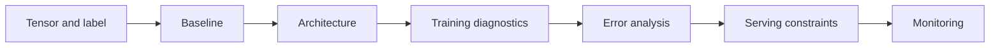

# Deep Learning Interview Patterns

## Beginner-Friendly Intuition

Deep learning interviews test whether you understand how models learn representations from tensors,
not whether you can recite layer names. A useful answer explains the input shape, target, model
family, loss, optimization loop, regularization, evaluation, and debugging plan.

The core pattern is: start with data and task shape, choose an architecture that fits the inductive
bias, train with visible diagnostics, inspect errors, and simplify when the model fails for ordinary
reasons such as bad labels, bad splits, underfitting, overfitting, or train-serving mismatch.

## Formal Explanation

A deep learning interview answer should cover:

- **Data representation:** image, text, audio, sequence, graph, or tabular tensors; shape; scale;
  normalization; augmentation; and label quality.
- **Architecture choice:** MLP, CNN, RNN, transformer, encoder, decoder, pretrained backbone, or
  multimodal model, with a reason tied to the data.
- **Training objective:** loss function, optimizer, learning rate, batch size, schedule, class
  weighting, and regularization.
- **Debugging evidence:** train and validation curves, ablations, overfit-one-batch check,
  calibration, gradient or activation checks, and error slices.
- **Deployment concerns:** model size, latency, memory, batching, quantization, drift, monitoring,
  and fallback behavior.

## Why It Matters in Real Jobs

Deep learning systems are powerful but expensive to debug when the fundamentals are hidden. A model
can fail because labels are noisy, augmentations are wrong, the validation set is contaminated, the
learning rate is unstable, the dataset is too small, or the metric ignores the most important user
segment.

Interviewers want to know whether you can reason from symptoms to causes. They also want to know
whether you would use transfer learning, a smaller model, or a classical baseline when that is the
more reliable engineering choice.

## How It Works Step by Step

1. **Define the tensor and target.** State input shape, output, label source, and class balance.
2. **Choose the baseline.** Use a simple heuristic, linear probe, small CNN, pretrained encoder, or
   smaller transformer before large custom training.
3. **Pick the architecture.** Match model bias to the data: convolution for local image structure,
   attention for sequence interactions, embeddings for discrete tokens.
4. **Train with diagnostics.** Track loss curves, metric curves, data samples, gradients, and failed
   predictions.
5. **Debug systematically.** Check data pipeline, labels, split leakage, underfitting, overfitting,
   optimization instability, and metric mismatch.
6. **Prepare for serving.** Measure latency, memory, batch behavior, cost, calibration, and
   degradation under distribution shift.

## Real-World Example

For a defect-detection image classifier, clarify whether the system blocks a manufacturing line,
routes images to human review, or only prioritizes inspection. Start with a pretrained CNN or vision
transformer backbone and a linear head, not a large model trained from scratch. Use augmentations
that preserve the defect label, evaluate recall at high precision if false alarms are expensive, and
inspect errors by camera, lighting, product type, and defect class.

The production plan should include confidence thresholds, human review for uncertain cases, drift
monitoring for camera changes, and a rollback path if a new model misses rare high-severity defects.

## Common Mistakes

- Naming an architecture without explaining the input representation.
- Training from scratch when transfer learning is the correct baseline.
- Ignoring label noise and data augmentation mistakes.
- Reporting validation accuracy without inspecting failed examples.
- Confusing overfitting with optimization failure.
- Forgetting inference latency, memory, batch size, and model versioning.
- Assuming a bigger model is better when data volume or label quality is the bottleneck.

## Interview Angle

Interviewers use deep learning prompts to test practical debugging and architecture judgment.

**Question:** Your neural network performs well on training data but poorly on validation data. What
do you do?

**Strong answer:** Verify the split and labels, compare train and validation distributions, inspect
examples, reduce model complexity or add regularization, use augmentation carefully, check leakage,
review the metric, and run ablations before collecting more data or changing architecture.

**Weak answer:** Add more layers, train longer, and assume deep learning will fix the problem.

**Follow-up questions:**

- How would you tell underfitting from overfitting?
- What would you check if loss becomes `nan`?
- When would you freeze a pretrained backbone?
- How would you deploy a model that is accurate but too slow?

## Mini Exercise

Pick an image, text, or sequence task. Write the input shape, output, baseline, architecture choice,
loss, primary metric, one debugging check, and one serving constraint. Then remove every model detail
that is not justified by the data or product requirement.

## Diagram

---
## Navigation

[⬅ Previous](14-debugging-neural-networks.md) | [🏠 Home](../README.md) | [➡ Next](../nlp/01-nlp-overview.md)
