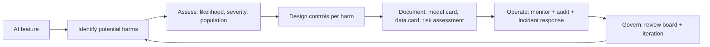

# AI Ethics Overview

## Beginner-Friendly Intuition

AI ethics is the engineering discipline that anticipates harms,
privacy risks, and misuse paths before release, and bakes controls
into the system to prevent them. The frame that matters: ethics is
not a separate review at launch; it is design constraints, technical
controls, and ongoing governance built into every layer of the
system. The team that treats ethics as a checkbox at the end ships
slowly and repeatedly hits launch blockers; the team that treats it
as design input ships consistently.

The intuition: every AI system has the potential to cause harm. Some
harms are obvious (a fraud model that disproportionately denies
credit to minorities), others subtle (a chatbot that subtly
encourages addictive use). The discipline is identifying potential
harms early, mapping them to controls, and operating those controls
in production.

This file is the entry point for the ethics-safety folder. The other
files cover specific concerns (bias, privacy, security, misuse,
responsible AI, governance). Read this for the frame; the others for
the depth.

## Formal Explanation

### The four-pillar frame

Most AI ethics frameworks (NIST AI RMF, EU AI Act, OECD principles)
converge on four pillars:

- **Fairness.** Outputs do not unjustly disadvantage individuals or
  groups based on protected attributes. Measured by disparate-
  impact metrics, equality-of-odds, demographic parity, calibration
  parity. See
  [02-bias-and-fairness.md](02-bias-and-fairness.md).
- **Transparency.** Stakeholders understand how the system works,
  what data it uses, and what its limitations are. Operationalized
  by model cards, data cards, explainability tooling, and clear user
  communication.
- **Accountability.** Specific people are responsible for specific
  decisions; audit logs preserve evidence; incidents are
  investigated and remediated. Operationalized by governance
  processes, documentation standards, and clear escalation paths.
- **Privacy.** Personal data is collected, processed, and stored
  with explicit consent and protection. See
  [03-privacy.md](03-privacy.md).

A fifth pillar often added: **safety**. The system does not produce
outputs that cause direct harm (medical misinformation, harmful
instructions, abuse content).

### Harm taxonomy

Concrete categories that a risk assessment must cover:

- **Allocational harm.** The system's decisions allocate resources
  unfairly (loans, jobs, healthcare access).
- **Quality-of-service harm.** The system works worse for some
  groups than others (speech recognition that fails on certain
  accents).
- **Stereotyping harm.** Outputs reinforce harmful stereotypes.
- **Denigration.** Outputs disparage individuals or groups.
- **Privacy harm.** Personal data is exposed.
- **Misinformation.** False or misleading outputs accepted as
  truth.
- **Manipulation.** The system nudges users toward decisions that
  benefit the operator at the user's expense.
- **Misuse harm.** The system is used by malicious actors for
  abuse.
- **Environmental harm.** The energy cost of training and serving
  models.
- **Labor displacement.** Economic effects on workers.

Risk assessment maps each potential harm to a likelihood, severity,
and mitigation. Engineering controls reduce likelihood and severity;
governance processes ensure the controls stay in place.

### The ethics-as-engineering frame

A common failure mode: ethics treated as a values discussion
detached from engineering. The frame that produces results:

- **Identify potential harms** at design time, not launch.
- **Map each harm to a control.** Disparate impact -> fairness
  audit. Privacy harm -> data minimization plus differential
  privacy. Misinformation -> grounding plus citation. Misuse ->
  rate limits plus content classifiers.
- **Operate the controls.** Monitoring, alerting, periodic audit.
- **Document the controls.** Model card, data card, audit log
  retention.
- **Iterate.** New harms discovered in production feed back into
  the controls.

Each step is engineering work. None is "have a values workshop and
write a policy". Both are needed; the engineering is the part that
prevents harm.

### Where ethics intersects compliance

The compliance frameworks (EU AI Act, NIST AI RMF, SR 11-7) codify
ethics into legal or regulatory obligations:

- **Risk classification.** What level of harm could this system
  cause? Determines which controls are mandatory.
- **Documentation.** Model card, data card, technical documentation,
  conformity assessment.
- **Human oversight.** For high-risk systems, humans must remain in
  the decision loop.
- **Accuracy and cybersecurity.** Performance and security must be
  documented and maintained.

See [07-ai-governance.md](07-ai-governance.md) for the governance
layer.

### Ethics review process

A practical review process at the team or organization level:

- **Design-stage review.** Before building, list potential harms;
  map to controls; reviewer (ethics, legal, security) signs off.
- **Pre-launch review.** Verify controls are in place; review the
  model card and risk assessment; check evaluation results.
- **Periodic re-review.** Quarterly or annually; new harms
  identified; new controls added; audit findings addressed.
- **Incident-driven review.** After any harm event, root-cause
  analysis; control gaps identified; system improved.

The review is documented; the documentation is itself an artifact
that auditors and stakeholders can inspect.

## Why It Matters in Real Jobs

Three production reasons. First, **the cost of an ethics incident
is enormous**: regulatory fines (GDPR up to 4 percent of global
revenue, EU AI Act up to 7 percent), customer trust loss, public
incident, sometimes legal liability. Second, **ethics is now part of
procurement**: Fortune 500 customers ask for ethics review evidence
in security questionnaires; the deal hinges on the answer. Third,
**ethics-by-design is cheaper than retrofitting**: a fairness
problem caught at design costs days of engineering; the same
problem caught after launch costs weeks of engineering plus the
incident.

## How It Works Step by Step

1. **Map the system to harm categories.** Allocational? Quality-
   of-service? Privacy? Misuse?
2. **For each identified harm, design a control.** Fairness audit,
   data minimization, content classifier, rate limit, human
   oversight.
3. **Document.** Model card, data card, risk assessment, control
   list.
4. **Test the controls.** Adversarial inputs, fairness metrics,
   privacy review.
5. **Operate.** Monitoring, periodic audit, incident response.
6. **Govern.** Review board, escalation path, retirement policy.
7. **Iterate.** New harms feed back into the controls; old controls
   re-examined as the system evolves.

## Real-World Example

A team builds a resume-screening tool. The ethics review at design.

Potential harms identified:

- **Allocational harm.** Disparate impact on protected classes
  (race, gender, age).
- **Quality-of-service harm.** Worse performance on resumes with
  non-standard formats or non-English content.
- **Misinformation.** False positives (qualified candidate
  rejected) and false negatives (unqualified candidate
  recommended).
- **Privacy harm.** Resume data is sensitive; PII handling required.

Controls designed:

- **Fairness audit.** Quarterly disparate impact analysis on
  hiring outcomes; alert if disparity exceeds 80 percent rule
  threshold; mandatory remediation if breached.
- **Quality-of-service.** Per-segment evaluation (resume language,
  format); per-segment SLOs; targeted improvements when a segment
  underperforms.
- **Human oversight.** No auto-rejection; the tool ranks; a human
  recruiter makes the final decision.
- **Privacy.** Resume data in encrypted store; deletion on candidate
  request within 30 days; audit log of every access.
- **Documentation.** Model card with intended use, performance
  metrics, fairness analysis, known limitations. Data card with
  sources, retention, protection.
- **Governance.** Quarterly review by a cross-functional board
  (ML, legal, HR, ethics); incident response with named
  on-call.

Nine months later, the audit catches a disparity emerging in one
segment. Investigation: a recent training data refresh introduced
bias from a particular source. Remediation: source filtered out;
model retrained; audit shows disparity restored. Without the
control, the disparity would have grown unnoticed; with it, the
team caught it within a quarter.

## Common Mistakes

- Ethics treated as a launch checkpoint, not a design input.
  Retrofit cost is much higher.
- Risk assessment treats only obvious harms. Subtle harms
  (manipulation, stereotyping) ignored.
- Controls documented but not operated. Compliance theater.
- No incident response for ethics issues. The first incident has no
  playbook.
- No periodic re-review. New harms accumulate as the product
  evolves.
- Ethics review without engineering input. The control list is
  unimplementable.
- Engineering without ethics input. The controls miss the harm
  categories.
- Treating ethics as a values discussion. Necessary but not
  sufficient; engineering is the part that reduces harm.

## Interview Angle

**Question:** A team is about to launch an AI feature that affects
user outcomes. Walk through how you would conduct an ethics review.

**Strong answer:** Ethics review is engineering work; the output is
a control list, not a values document.

**Step 1: identify potential harms.** Map the system to harm
categories: allocational (does it allocate resources?),
quality-of-service (does it work worse for some users?), privacy
(does it touch personal data?), stereotyping or denigration (does
it produce text or decisions that could harm individuals or
groups?), misinformation (could outputs be wrong and trusted?),
manipulation (could it nudge users against their interests?),
misuse (could attackers abuse it?).

**Step 2: assess each harm.** Likelihood (rare or common?),
severity (recoverable or not?), affected population (small or
large?). Some harms are negligible; some are critical. The list of
critical harms drives the control design.

**Step 3: design controls per harm.**

- Allocational: per-group fairness metrics, thresholds, audit.
- Quality-of-service: per-segment evaluation, per-segment SLOs.
- Privacy: data minimization, encryption, retention policy,
  right-to-erasure within the regulatory window.
- Stereotyping: content classifier, refusal of harmful outputs.
- Misinformation: grounding via retrieval, cite-or-abstain
  contract, calibrated confidence.
- Manipulation: explicit user benefit alignment; opt-out;
  transparency.
- Misuse: rate limits, content classifiers, abuse-pattern
  detection.

**Step 4: document.** Model card (intended use, performance,
fairness, limitations), data card (sources, retention, consent),
risk assessment, control list, audit log retention policy.

**Step 5: operate.** Monitoring per control, alerts on breach,
incident response runbook, named owner per control.

**Step 6: govern.** Pre-launch review by a cross-functional board.
Quarterly re-review. Incident-driven re-review. Documentation
maintained.

**Step 7: iterate.** New harms discovered in production feed back
into the controls. Old controls re-examined as the system evolves.

The senior instinct: **ethics is design constraint, not launch
checkbox**. The team that bakes the harm taxonomy into the
architecture ships consistently and avoids the launch-blocking
ethics review. The team that defers ethics to launch ships slowly
and repeatedly retrofits.

**Weak answer:** "Run a values workshop and write a policy." Misses
the engineering controls that actually reduce harm.

**Follow-up questions:**

- What is allocational harm and how do you measure it?
- What goes in a model card?
- How do you operate a fairness audit?
- What is the EU AI Act's risk classification?

## Mini Exercise

Pick an AI feature. List three potential harms it could cause, the
control that would mitigate each, and one metric you would monitor
in production to detect the harm.

## Diagram

---
## Navigation

[⬅ Previous](../machine-learning-system-design/10-design-an-ai-copilot-platform.md) | [🏠 Home](../README.md) | [➡ Next](02-bias-and-fairness.md)
