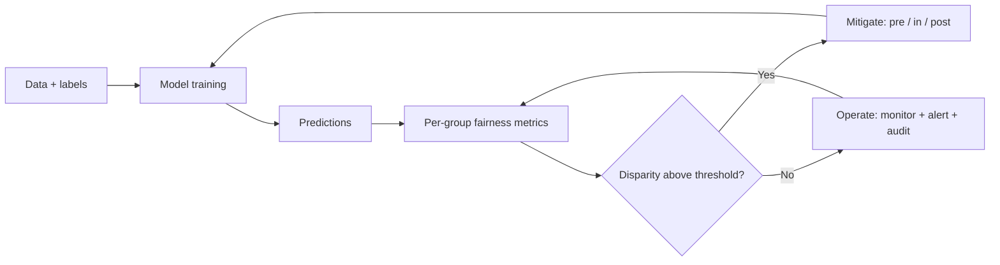

# Bias and Fairness

## Beginner-Friendly Intuition

Bias in an AI system is when its outputs differ systematically across
groups in ways that disadvantage some unfairly. Fairness is the
discipline of measuring, reducing, and operating against bias.
Neither is a moral abstraction; both are engineering problems with
specific metrics, specific controls, and specific failure modes.

The intuition: a model trained on historical data inherits historical
biases. A hiring model trained on a company's past hires reflects
the company's past hiring patterns, including any discrimination. A
medical diagnostic trained on majority-group data performs worse on
minority groups. A language model trained on internet text reproduces
the stereotypes in that text. None of this is the model "being
biased" in some abstract sense; it is the model accurately reflecting
biased data.

This file covers the bias and fairness tooling: where bias comes
from, how to measure it, how to mitigate it, and how to operate the
controls in production.

## Formal Explanation

### Sources of bias

Five major sources, often layered:

- **Historical bias.** The training data reflects past discrimination.
  A loan model trained on past approvals reproduces past bias even
  if the model itself is "fair".
- **Representation bias.** Some groups are underrepresented in the
  training data. The model performs worse on them because it had
  fewer examples to learn from.
- **Measurement bias.** The label is measured differently across
  groups. A "successful employee" label might be reviewed more
  strictly for one group than another; the model learns the
  reviewer's bias.
- **Aggregation bias.** A single model assumes one relationship
  fits all groups when relationships actually differ. Per-group
  models or interaction terms can address.
- **Deployment bias.** The model is deployed in a context different
  from training. A model trained on Western users deployed globally
  has deployment bias.

Each source needs a different mitigation; misdiagnosing the source
wastes effort.

### Fairness metrics

No single metric is the right one; choose by context.

- **Demographic parity.** Each group has equal probability of a
  positive prediction. Useful when the base rate should be equal
  (representation in shortlists). Strict; can mask quality
  differences.
- **Equality of opportunity.** Each group has equal true-positive
  rate (recall). The qualified candidates from each group have
  equal chance of being identified. Common in hiring, healthcare.
- **Equalized odds.** Each group has equal TPR and FPR. Stricter
  than equality of opportunity.
- **Calibration parity.** A predicted probability of 0.7 means 70
  percent positive across all groups. Calibration matters when
  scores feed into thresholds.
- **Disparate impact (80 percent rule).** The selection rate for
  any group should be at least 80 percent of the rate for the
  highest-rate group. EEOC standard for hiring; widely cited.
- **Predictive parity.** Each group has equal positive predictive
  value (precision).

The impossibility result (Chouldechova, Kleinberg et al.): under
unequal base rates, you cannot satisfy demographic parity, equalized
odds, and calibration parity simultaneously. The team must choose
which metrics matter for the use case and accept the trade-offs.

### Measuring bias

The standard procedure:

1. **Define groups.** Protected attributes (race, gender, age,
   national origin, disability, religion, etc.) per applicable law.
   Sometimes inferred (Bayesian Improved Surname Geocoding, BISG)
   when not directly observed; the inference is itself
   controversial.
2. **Compute the metric per group.** TPR, FPR, precision, selection
   rate per group.
3. **Compare across groups.** Disparity ratios. Confidence intervals
   on each.
4. **Flag breaches.** Disparity exceeding a threshold (e.g., 80
   percent rule, or per-pair statistical significance).

Tools: Fairlearn, AIF360, What-If Tool, Aequitas. Each provides
the standard metrics and visualization.

### Mitigating bias

Three intervention points:

- **Pre-processing.** Adjust the training data: reweight samples
  per group, drop biased features, generate synthetic balanced
  data.
- **In-processing.** Adjust the training objective: add fairness
  constraints to the loss, train per-group models, use adversarial
  debiasing.
- **Post-processing.** Adjust the predictions: calibrate per group,
  use group-specific thresholds, apply equalized odds correction.

Each has trade-offs:

- Pre-processing changes the data; downstream effects may be
  unpredictable.
- In-processing changes the model; harder to ship in regulated
  contexts where the model is locked.
- Post-processing is cheap and visible; per-group thresholds are
  legally controversial in some jurisdictions (treating individuals
  by group).

### Operating fairness controls

A production fairness control is not a one-time check; it is an
ongoing audit:

- **Per-group dashboards.** Continuous monitoring of fairness
  metrics.
- **Alert thresholds.** Disparity above threshold triggers
  investigation and remediation.
- **Periodic deep audit.** Quarterly or annual independent review;
  findings feed back into the controls.
- **Documentation.** Fairness analysis in the model card; regular
  updates.
- **Incident response.** When a fairness issue is detected, named
  owner, timeline to remediation, postmortem.

### Production gotchas

- **Drift over time.** Fairness can degrade as the data distribution
  shifts; ongoing monitoring catches it.
- **Intersectional bias.** A model can be fair for "women" overall
  and unfair for "Black women". Single-axis fairness misses
  intersectional disparities.
- **Proxy features.** Even when protected attributes are not
  features, proxies (zip code, name) can encode them. Removing the
  protected attribute alone is insufficient.
- **Feedback loops.** Biased predictions affect outcomes (a
  rejected loan applicant cannot demonstrate creditworthiness),
  which become training data for the next model, amplifying bias.
- **Disparate impact vs disparate treatment.** Some legal frameworks
  forbid disparate treatment (using a protected attribute) but
  allow disparate impact (unequal outcomes). Others forbid both.
  Know your jurisdiction.

## Why It Matters in Real Jobs

Three production reasons. First, **fairness is regulated**. EEOC
hiring rules, ECOA credit rules, EU AI Act high-risk classification
each impose requirements. Compliance failure has direct legal
consequences. Second, **fairness incidents are visible**. A biased
hiring model becomes a news story; the company's brand takes the
hit. Third, **fairness is a quality dimension**. A model that works
worse on some users is a worse model overall; the team that measures
per-segment performance ships better products.

## How It Works Step by Step

1. **Identify protected attributes** per applicable law and product
   context.
2. **Pick fairness metrics** matched to the use case (equality of
   opportunity, demographic parity, calibration parity, disparate
   impact).
3. **Measure baseline.** Compute metrics on the current system.
4. **Diagnose source.** Historical, representation, measurement,
   aggregation, deployment.
5. **Apply mitigation.** Pre-processing, in-processing, or
   post-processing.
6. **Re-measure.** Verify the mitigation worked without
   unacceptable accuracy loss.
7. **Document.** Fairness analysis in the model card.
8. **Operate.** Monitoring, alerts, periodic audit.
9. **Iterate.** Re-measure as the system evolves; address drift.

## Real-World Example

A team builds a credit scoring model. The fairness review at design.

- **Protected attributes.** Race, gender, age, marital status (per
  ECOA).
- **Metrics.** Disparate impact (80 percent rule) and equality of
  opportunity (equal TPR across groups). Calibration parity for the
  threshold.
- **Baseline.** Disparity ratio 0.72 between two race groups (below
  the 0.8 threshold). Equality of opportunity disparity 8
  percentage points.
- **Diagnosis.** Mix of historical bias (training data reflects
  past lending) and representation bias (one group underrepresented
  in approvals).
- **Mitigation.** Reweight samples per group during training (pre-
  processing); add fairness constraint to the loss (in-processing);
  per-group calibration (post-processing). Combined.
- **Re-measure.** Disparity ratio 0.86; equality of opportunity
  disparity 2 percentage points. Accuracy drops 1.5 points;
  acceptable.
- **Documentation.** Model card includes the fairness analysis,
  the mitigation steps, the residual disparity, and the monitoring
  plan.
- **Production controls.** Per-group dashboards. Alert if
  disparity ratio drops below 0.8. Quarterly independent audit.

A year later, an audit catches drift: disparity ratio at 0.78 due
to a data source that started over-representing one group.
Remediation: data source rebalanced; model retrained; disparity
restored. The control caught what would otherwise have been a
slow regulatory exposure.

## Common Mistakes

- Removing the protected attribute and assuming the model is fair.
  Proxies remain.
- Using a single fairness metric when multiple matter. The team
  optimizes one and the others degrade.
- Trying to satisfy all fairness metrics simultaneously without
  understanding the impossibility result.
- Skipping intersectional analysis. Single-axis fairness misses
  important disparities.
- Mitigating once and never re-measuring. Drift is real.
- Documentation without operation. Fairness theater.
- Ignoring deployment context. Training-time fairness does not
  guarantee deployment-time fairness.
- No incident response for fairness issues. First incident has no
  playbook.
- Treating fairness as an ML team problem. It is product, legal,
  ethics, and engineering together.

## Interview Angle

**Question:** A team is concerned about bias in their hiring model.
Walk through how you would diagnose and address it.

**Strong answer:** Bias diagnosis is multi-step. The output is a
mitigation plan with measured before-and-after.

**Step 1: define the scope.** What protected attributes apply? For
US hiring: race, gender, age, national origin, disability, religion
(EEOC). What fairness metrics matter? For hiring: equality of
opportunity (equal TPR for qualified candidates), disparate impact
(80 percent rule), calibration parity if scores feed thresholds.

**Step 2: measure baseline.** Compute the metrics per protected
group. Confidence intervals. Compare across groups; flag
disparities. Include intersectional analysis (race x gender).

**Step 3: diagnose the source.**

- **Historical bias.** Is the training data reflecting past
  discrimination? Audit the labels.
- **Representation bias.** Are some groups underrepresented? Count
  per group.
- **Measurement bias.** Is the label measured differently across
  groups? Audit the labeling process.
- **Aggregation bias.** Does one model fit all groups? Per-group
  models can reveal this.
- **Deployment bias.** Is deployment context different from
  training?

Each source needs a different mitigation; misdiagnosing wastes
effort.

**Step 4: design the mitigation.** Three intervention points:

- **Pre-processing.** Reweight, drop biased features, augment
  underrepresented groups.
- **In-processing.** Fairness constraint in the loss, adversarial
  debiasing, per-group models.
- **Post-processing.** Calibrate per group, group-specific
  thresholds (legally fraught in some jurisdictions), equalized
  odds correction.

Often combined. Each has trade-offs (legal, accuracy, complexity).

**Step 5: re-measure.** After mitigation, verify the fairness
metrics improved without unacceptable accuracy loss. Some accuracy
loss is acceptable; the team and legal define the threshold.

**Step 6: document.** Fairness analysis in the model card.
Mitigation steps, residual disparity, the fairness-accuracy trade-
off chosen and why.

**Step 7: operate.** Per-group dashboards in production. Alert on
disparity threshold breach. Quarterly audit. Annual independent
review.

**Step 8: feedback loop.** Drift over time can degrade fairness.
The deployed model affects outcomes (rejected applicants do not
get hired and do not become future positive examples), which
amplifies bias in retraining data. Monitor and intervene.

The senior instinct: **fairness is a measurable, mitigable
engineering problem with regulatory consequences**. The team that
treats it as such ships consistently; the team that treats it as a
values discussion ships slowly and risks legal exposure.

**Weak answer:** "Remove the protected attribute." Insufficient
(proxies remain) and misses the diagnostic, mitigation, and
operational steps.

**Follow-up questions:**

- What is the impossibility result and what does it imply?
- What is intersectional bias?
- How do you handle drift in fairness over time?
- What are proxy features and why do they matter?

## Mini Exercise

Pick an AI feature with potential fairness concerns. Identify the
protected attributes, the fairness metric you would optimize, the
intervention point (pre, in, post), and the production monitoring
you would build.

## Diagram

---
## Navigation

[⬅ Previous](01-ai-ethics-overview.md) | [🏠 Home](../README.md) | [➡ Next](03-privacy.md)
