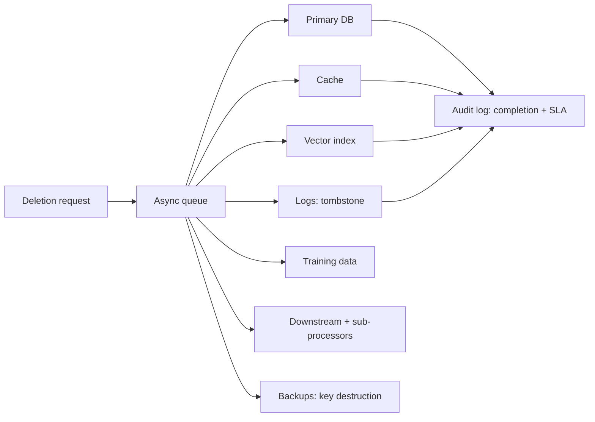

# Privacy

## Beginner-Friendly Intuition

Privacy in AI systems is about controlling who has access to personal
data, what is done with it, and how long it is kept. The frame that
matters: privacy is engineering, not policy. The privacy policy says
what; the engineering controls determine what is actually possible.
A team that promises "we delete your data on request" without an
implementation has not actually built privacy.

The intuition: AI systems collect, process, and often retain personal
data at scale. Each layer of the stack (ingestion, storage, model
training, inference, logs, caches) is a potential privacy risk. The
controls must be present at every layer; missing one is an incident
waiting.

This file covers the privacy concerns that matter in AI systems: PII,
regulated data, data minimization, differential privacy, and the
mechanisms that implement data subject rights (access, correction,
deletion).

## Formal Explanation

### What counts as PII and regulated data

- **PII (personally identifiable information).** Anything that
  identifies an individual: name, email, phone, address, IP
  address, account number, government ID. Many jurisdictions extend
  to anything that could identify in combination (zip + age + gender
  often does).
- **Sensitive PII.** Health information, financial information,
  political views, religious beliefs, sexual orientation, biometrics.
  Higher protection requirements.
- **PHI (Protected Health Information; HIPAA).** Medical records,
  health insurance, healthcare-related identifiers. US healthcare
  regulation.
- **Children's data.** COPPA in the US, age-of-consent rules in
  EU. Stricter handling for users under specific ages.
- **Regulated data.** Financial (PCI DSS for payment cards),
  educational (FERPA), government (FedRAMP). Each framework has
  its own controls.

### Major privacy frameworks

- **GDPR (EU, 2018).** Comprehensive privacy regulation. Lawful
  basis for processing, data minimization, purpose limitation,
  rights of data subjects (access, rectification, erasure,
  portability, objection), DPIA for high-risk processing,
  Data Processing Agreement with processors, breach notification
  within 72 hours, fines up to 4 percent of global revenue.
- **CCPA / CPRA (California).** Right to know, delete, opt-out of
  sale. Similar to GDPR in shape, narrower in scope.
- **HIPAA (US healthcare).** PHI handling, BAA with vendors,
  encryption, audit logs, breach notification.
- **PIPEDA (Canada), LGPD (Brazil), PIPL (China), DPDP (India).**
  Each jurisdiction has its own framework; multi-region products
  must comply with all applicable.

The common shape: lawful basis, data minimization, user rights,
breach notification, accountability evidence.

### Data subject rights and engineering implications

GDPR-style rights translate into engineering work:

- **Right to access.** Build an export tool: given a user ID,
  return all data the system holds about them. Includes
  derived data (predictions, embeddings).
- **Right to rectification.** Build a correction flow: when the
  user updates a fact, the system propagates the change.
- **Right to erasure ("right to be forgotten").** Build a deletion
  pipeline: given a user ID, delete their data from primary
  storage, derived storage (vector index, cache, logs), backups
  (or apply a tombstone the deletion service respects on
  restore), and downstream copies. SLA: typically 30 days from
  request.
- **Right to portability.** Export in a common format (JSON, CSV).
- **Right to object.** Stop processing for specific purposes
  (marketing, profiling). Requires per-purpose flags on the data
  records.

Each is real engineering. A system designed without the deletion
pipeline cannot achieve compliance.

### Data minimization

The principle: collect only what is needed. Operationalized:

- **Field-level review.** Each data field has a documented purpose.
  Fields without a purpose are dropped.
- **Default deny.** New fields require explicit approval, not
  opt-out.
- **Retention limits.** Each field has a retention period; data is
  deleted automatically when expired.
- **Aggregation.** Where possible, aggregate before storing
  (counts, sums) instead of individual records.

Data minimization reduces incident impact: less data = less to leak.

### Anonymization vs pseudonymization

- **Pseudonymization.** Replace identifiers with tokens (User_42 ->
  U-93847). The original identifiers stored separately with
  controlled access. Reversible. GDPR considers pseudonymized data
  still personal data.
- **Anonymization.** Remove or distort identifiers so the data
  cannot be linked back to an individual. Irreversible if done
  correctly. Hard to do correctly: aggregating to k-anonymity
  groups is the standard approach but is vulnerable to
  re-identification attacks.

Real-world anonymization is hard. Many "anonymized" datasets have
been re-identified by linking auxiliary data. Treat anonymization as
a layered defense, not a guarantee.

### Differential privacy

A formal privacy definition: a query mechanism is `(ε, δ)`-
differentially private if including or excluding any single
individual changes the query output probability by at most a factor
of `e^ε` (plus a small `δ` term). In practice: add calibrated noise
to query results so individual contributions are obscured.

- **Used for.** Training data privacy (DP-SGD), aggregate
  statistics on user data (Apple, Google use DP for telemetry).
- **Cost.** Noise reduces accuracy. The privacy-utility trade-off
  is real; tuning `ε` is part of the system design.
- **Limitations.** Composition: many DP queries on the same data
  consume privacy budget. Once exhausted, no more queries
  acceptable.

### Privacy in LLM systems

LLMs add specific privacy concerns:

- **Training data memorization.** Models can regurgitate exact
  strings from training data. Training data must be PII-redacted or
  the model must be evaluated for memorization.
- **Inference logs.** Prompts often contain PII. Logs need
  redaction; access controlled; retention limited.
- **Vector stores.** Embeddings can leak content; store with
  metadata (ACL, user ID); apply data subject rights to embeddings
  too (deletion propagates to the vector index).
- **Model fine-tuning on user data.** If fine-tuning uses user
  data, the user must consent; the model is now derived from their
  data and may need to be retrained on deletion.
- **Cross-tenant leakage.** Multi-tenant systems must isolate;
  one user's data must not appear in another's response.

### Implementation patterns

- **Detection at ingest.** Scan inputs for PII; redact, tokenize, or
  flag.
- **Encryption.** At rest (database, storage), in transit (TLS),
  and increasingly in use (confidential computing).
- **Access control.** Least privilege; per-field if needed; audit
  every access.
- **Logging discipline.** Log only what is necessary; redact PII;
  short retention; restricted access.
- **Cache key design.** Include user ID and ACL in cache keys to
  prevent cross-user leak.
- **Deletion propagation.** Single deletion request triggers
  deletes in primary storage, derived storage, vector index, cache,
  logs (or marks for tombstone), and downstream systems.

## Why It Matters in Real Jobs

Three production reasons. First, **privacy is regulated heavily**.
GDPR fines up to 4 percent of global revenue; CCPA penalties; HIPAA
violations. Non-compliance is existential for some companies.
Second, **breaches are visible**. A privacy incident is a public
event; customer trust suffers; regulatory scrutiny increases.
Third, **enterprise procurement requires privacy evidence**.
Security questionnaires, DPAs, BAAs are deal blockers without
documentation.

## How It Works Step by Step

1. **Map the data.** Every PII field, where it is collected,
   where it is stored, who has access, how long retained.
2. **Identify applicable frameworks.** GDPR, CCPA, HIPAA, etc.
3. **Design controls per framework requirement.** Lawful basis,
   minimization, retention, user rights, breach notification.
4. **Implement detection at ingest.** PII detection and redaction.
5. **Implement deletion pipeline.** Propagation across all data
   stores. SLA per regulation.
6. **Implement access export.** For data subject access requests.
7. **Encrypt.** At rest, in transit, considerations for in-use.
8. **Audit.** Every access logged; logs themselves access-
   controlled.
9. **Operate.** Periodic audit, breach drills, DPA per customer,
   sub-processor list.
10. **Iterate.** Privacy is ongoing; new data sources, new
    features, new regulations.

## Real-World Example

A team builds an HR-tech product handling employee data for
multiple customers (multi-tenant SaaS).

- **Data inventory.** Employee names, emails, salaries,
  performance reviews, dates of employment.
- **Frameworks.** GDPR (EU customers), CCPA (California), state-
  specific US privacy laws.
- **Controls.**
  - **Tenant isolation.** Per-customer database schema.
  - **Field-level encryption.** Salary, performance reviews
    encrypted at rest with per-tenant keys.
  - **Access control.** RBAC; per-field permissions; audit log of
    every access.
  - **Retention.** Per-field retention policy; salary archived
    after 7 years; performance reviews after 5; non-essential
    fields after 1.
  - **Deletion pipeline.** When a customer requests deletion of an
    employee, the system removes data from the database, the
    cache, the vector index, the search index, the audit log
    (tombstone, retain for the legal-hold window then delete),
    and the backups (encrypted with per-tenant keys; key destroyed
    on deletion to render data unrecoverable).
  - **Access export.** Self-service export for data subject
    access requests; 30-day SLA.
  - **DPA.** Templated; signed with every customer.
  - **Sub-processor list.** Maintained and shared with customers
    annually.
  - **Breach response.** Runbook with 72-hour notification SLA;
    drills quarterly.

A near-incident: a logging library upgrade started capturing full
request payloads including salary fields. PII detection caught it
in the pre-production environment; the change was reverted before
any logged data accumulated. The control prevented a privacy
incident that the team would not have noticed otherwise.

## Common Mistakes

- Promising privacy in policy without engineering. Policy without
  controls is an unenforceable claim.
- No deletion pipeline. The "right to be forgotten" cannot be
  honored.
- Logs full of PII. Compliance violation; data leak surface.
- Cache keys without user ID. Cross-user leak.
- Anonymization treated as a guarantee. Re-identification attacks
  succeed often.
- Vector stores not subject to deletion. Embeddings remain after
  the user is deleted from primary storage.
- Differential privacy applied without budget tracking.
  Composition leaks privacy.
- Cross-tenant data in the same logical structure. One bug = leak.
- Sub-processors not disclosed. Customer audit fails.
- No breach drill. First breach is the first time the team runs the
  playbook.

## Interview Angle

**Question:** How would you design data deletion ("right to be
forgotten") for a multi-tenant AI product?

**Strong answer:** Deletion is a propagation problem across many
data stores plus a SLA constraint plus an audit trail.

**Step 1: data inventory.** List every place a user's data lives:
primary database, derived stores (cache, vector index, search
index), logs, model training data, model artifacts (if fine-tuned
on user data), downstream systems (analytics warehouse, billing,
exported reports), backups.

**Step 2: deletion design per store.**

- **Primary database.** Delete row; foreign keys cascade.
- **Cache.** Invalidate all entries with the user ID in the cache
  key. Bulk invalidation if the cache supports it; full flush of
  the user's cache partition otherwise.
- **Vector index.** Soft delete (mark tombstoned), then compact
  periodically. Searches must skip tombstones.
- **Search index.** Delete from the index; refresh.
- **Logs.** Tombstone; retain encrypted for legal-hold window;
  delete after the window.
- **Model training data.** Remove from training data; if the
  model was already trained on it, the next retraining excludes
  it. For high-stakes systems, accelerate retraining.
- **Model artifacts.** If the model was fine-tuned on user-specific
  data, retrain without it. For shared models, this is usually not
  required.
- **Downstream.** Notify each downstream system; standard contract
  (DPA) requires them to delete too.
- **Backups.** Use per-tenant encryption keys. Destroying the key
  for a deleted tenant renders backups unreadable, satisfying
  most regulators without rewriting the backup.

**Step 3: SLA.** GDPR requires 30 days. The pipeline must complete
within that. Asynchronous: deletion request goes into a queue,
workers propagate to each store, completion tracked, completion
notification sent.

**Step 4: audit trail.** Every deletion request logged: who
requested, when, scope, completion status, completion time. Log
retained for the regulatory window.

**Step 5: testing.** Periodic deletion drills. Random deletion
request, verify all stores are cleaned, verify the user cannot
appear in any query.

**Step 6: edge cases.**

- **Legal hold.** If the data is subject to a legal hold, deletion
  is delayed; this must be communicated to the user.
- **Aggregated data.** Pure aggregates (counts, totals) typically
  do not need deletion if they no longer identify the individual.
- **Backups during deletion.** Deletion must be applied to backups
  taken before the request; key destruction or selective restore-
  and-delete are the two main approaches.
- **Multi-region replication.** Deletion must propagate to all
  regions; lag is real and must be tracked.

The senior instinct: **deletion is a data flow problem and an SLA
problem**. The system that ships without the deletion pipeline
cannot meet GDPR; the system that ships with it can. The work is
mostly engineering, not policy.

**Weak answer:** "Set a delete=True flag." Misses propagation,
SLA, audit, edge cases.

**Follow-up questions:**

- How do you handle deletion in a vector index?
- What is differential privacy and when is it useful?
- How do you redact PII in logs?
- What is the difference between anonymization and
  pseudonymization?

## Mini Exercise

Pick an AI feature that touches user data. List every place the
data lives. For each, describe how a deletion request would
propagate. Identify the place most likely to be missed.

## Diagram

---
## Navigation

[⬅ Previous](02-bias-and-fairness.md) | [🏠 Home](../README.md) | [➡ Next](04-security-risks.md)
