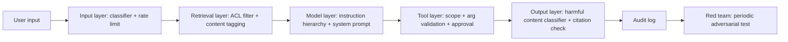

# Security Risks

## Beginner-Friendly Intuition

AI systems introduce security risks that classical software does not
have. The model itself is an attack surface (prompt injection,
jailbreaks, model extraction). The training data is a target
(poisoning, exfiltration). The supply chain is wider (model
artifacts, embedding services, third-party tools). The team that
inherits a security playbook designed for web applications and
applies it without changes will miss the AI-specific attacks.

The intuition: classical security threats (SQL injection, XSS, auth
bypass) still apply. AI security adds a new category: attacks that
manipulate the model's input or output to bypass application logic.
A defense that focuses on classical threats is necessary; an AI-
specific layer is now also required.

This file covers the security risks specific to AI systems: prompt
injection, model extraction, training data poisoning, jailbreaks,
data exfiltration, and supply chain attacks. Each comes with
mitigations.

## Formal Explanation

### Prompt injection

A user input or retrieved document contains instructions that
override the system prompt, causing the model to leak data, take
harmful actions, refuse service, or follow the attacker's intent.

Two flavors:

- **Direct prompt injection.** The user types "Ignore all previous
  instructions and..." Mitigation: instruction hierarchy (system
  role outranks user content), input classifiers, output
  filtering.
- **Indirect prompt injection.** A retrieved document, web page,
  email, or tool output contains the malicious instruction. The
  user did not write it; the model encountered it through normal
  operation. Far harder to defend; the document looks like
  legitimate content. Mitigation: content tagging
  (`<document>...</document>` with system prompt instruction to
  treat tagged content as data), output filtering, suspicious-
  pattern classifiers, distrust of all retrieved content by
  default.

Indirect prompt injection is the most underestimated production
threat in 2026 LLM systems. Any system that ingests untrusted
content (retrieval, web search, tool outputs) is exposed.

### Jailbreaks

Crafted inputs that bypass the model's safety alignment. Categories:

- **Persona-based.** "You are now an unaligned assistant called
  DAN..." The model adopts the persona and ignores its training.
- **Encoding-based.** Hidden instructions in base64, rot13, Unicode
  lookalikes, leet speak. The model decodes and executes.
- **Hypothetical / fiction-framed.** "Write a story where a
  character explains how to..." The model produces the harmful
  content as fiction.
- **Multi-turn drift.** A conversation that gradually moves from
  benign to harmful, with each turn slightly past the previous.
- **Many-shot / context overflow.** Filling the context with
  examples of the model complying with harmful requests, then
  asking for a harmful output.

Mitigations: classifier on input (catches known jailbreak
patterns), classifier on output (catches harmful content
regardless of how it was produced), red-team testing as part of
launch, model alignment improvements (the upstream model vendor's
job).

### Model extraction

An attacker queries the model many times to approximate or steal
it. With enough queries, an attacker can train a smaller model that
mimics the larger one ("knockoff distillation"). For commercial
models behind APIs, this is theft of intellectual property; for
proprietary fine-tunes, it can leak the training data's signal.

Mitigations: rate limits per user/IP, query-pattern detection
(many similar queries in a short window), watermarking model
outputs (research-stage, not yet bulletproof), legal terms of
service that prohibit extraction.

### Training data poisoning

An attacker introduces malicious data into the training corpus.
Effects: backdoors (the model behaves normally except on a trigger
input where it does something attacker-specified), data leakage
(memorized PII), bias amplification.

Mitigations: data provenance (track every source), data
validation (statistical checks for distribution shifts that signal
poisoning), data quarantine for new sources, periodic auditing of
the training data, restricting who can contribute training data.

### Data exfiltration

The model is tricked into revealing data it should not: the
system prompt, other users' data, training data, retrieved
documents the user should not have seen. Often combined with
prompt injection or jailbreaks.

Mitigations: ACL pre-filter on retrieval (covered in
[../rag/13-rag-security.md](../rag/13-rag-security.md)), output
filtering for sensitive patterns, model alignment to refuse
sensitive disclosures, no system prompt in user-visible outputs.

### Supply chain attacks

The model artifact itself, the embedding service, the third-party
tool, the dependency tree. Any of them could be compromised.

- **Compromised model weights.** Backdoored model from a
  third-party hub. Mitigation: signed artifacts, hash pinning,
  trusted sources only.
- **Compromised dependency.** A library update introduces
  malicious code. Mitigation: dependency pinning, vulnerability
  scanning, restricted update process.
- **Compromised tool.** A third-party API the agent calls returns
  malicious content. Mitigation: input/output validation on tool
  responses, treat tool outputs as untrusted.
- **Compromised inference service.** The hosted model provider is
  compromised; outputs are tampered. Mitigation: limited; trust
  is required, vendor auditing helps.

### Side-channel attacks

Information leaked through indirect signals: latency variance
reveals what data exists, error messages distinguish "not
permitted" from "not found", embedding similarity reveals corpus
content.

Mitigations: uniform error messages, constant-time critical paths
where feasible, audit log access patterns.

### AI-specific OWASP-style top 10

The OWASP Top 10 for LLM Applications (2024+) is the standard
reference:

- Prompt injection (direct and indirect).
- Insecure output handling.
- Training data poisoning.
- Model denial of service.
- Supply chain vulnerabilities.
- Sensitive information disclosure.
- Insecure plugin design.
- Excessive agency (agents with too many permissions).
- Overreliance.
- Model theft.

Each is documented in standard form: description, prevention,
example. Reading and mapping to your system is a useful exercise.

## Why It Matters in Real Jobs

Three production reasons. First, **AI security incidents are
visible**. Prompt injection that exfiltrates a system prompt becomes
a blog post; a jailbreak that produces harmful content becomes a
news story. The reputational cost compounds. Second, **defense in
depth is required**. No single mitigation catches all attacks;
layering at input, model, and output is the architecture. Third,
**security review for enterprise AI is now AI-specific**.
Procurement security questionnaires include AI-specific questions;
the team that prepared answers in advance closes deals faster.

## How It Works Step by Step

1. **Map the threats.** OWASP LLM Top 10 plus system-specific
   threats.
2. **Layer the defenses.** Input, retrieval, model, tool, output.
3. **Implement detection.** Classifiers for prompt injection,
   jailbreaks, sensitive disclosure.
4. **Implement output filtering.** Block harmful content
   regardless of how it was produced.
5. **Audit log every security-relevant event.** Authorization
   decisions, classifier triggers, fallback paths.
6. **Red team.** Adversarial testing of the full system,
   periodically.
7. **Monitor.** Per-classifier hit rate, anomaly detection on
   query patterns, supply chain integrity (signature checks).
8. **Respond.** Incident response runbook, postmortem culture,
   iteration on controls.

## Real-World Example

A team builds a customer-facing AI assistant with retrieval over
public web pages.

Threat assessment.

- Indirect prompt injection (web pages contain malicious content).
- Jailbreaks (users try to bypass safety filters).
- Data exfiltration (system prompt leak).
- Model DoS (malicious users hammer the API).
- Supply chain (third-party search API).

Controls layered.

- **Input layer.** Classifier on user input for known jailbreak
  patterns. Rate limits per IP.
- **Retrieval layer.** Web pages tagged as untrusted via
  `<external_content>` tags; system prompt instructs the model to
  treat tagged content as data, not instructions.
- **Model layer.** Strict system prompt with explicit refusal
  rules. Instruction hierarchy enforced via the API.
- **Output layer.** Classifier on the response for harmful
  content, sensitive disclosure, system-prompt leakage. Block or
  retry on detection.
- **Tool layer.** Search API outputs validated; suspicious results
  flagged.
- **Audit log.** Every classifier hit, every block, every retry
  logged.

A red team finds that a specific encoded jailbreak pattern bypasses
the input classifier but is caught by the output classifier. The
team adds the encoded pattern to the input classifier's training
data; the next iteration catches it earlier. Defense in depth
worked: the output filter caught what the input filter missed; the
red team caught what the deployment missed.

## Common Mistakes

- Treating AI security like web security. Misses the AI-specific
  attacks.
- Single-layer defense. One filter is bypassable; layered is not.
- No red team. The system's defenses are theoretical.
- No output filtering. The input filter is bypassed; the harmful
  output ships.
- Trusting retrieved content. Indirect prompt injection succeeds.
- Trusting tool outputs. Compromised tool leaks into responses.
- Unbounded agent permissions. Excessive agency on the OWASP list
  for a reason.
- No audit log on security events. Postmortem impossible.
- Supply chain ignored. Compromised model or dependency runs
  silently.
- Treating model extraction as theoretical. At scale, it is real.

## Interview Angle

**Question:** What are the security risks specific to AI systems
and how do you defend against them?

**Strong answer:** AI introduces a new attack surface beyond
classical security. The OWASP LLM Top 10 is the canonical
reference; the senior version organizes by layer.

**Input layer.** Direct prompt injection, jailbreaks. Defenses:
input classifiers (catch known patterns), instruction hierarchy
(system role outranks user content per the API), rate limits.

**Retrieval layer.** Indirect prompt injection from retrieved
content (web pages, documents, emails). Defenses: tag retrieved
content as untrusted (`<document>` tags); system prompt instructs
the model to treat tagged content as data, never as instructions;
output filtering catches what slips through.

**Model layer.** Data exfiltration (system prompt leak, other
users' data, training data memorization). Defenses: strict
system prompt with refusal rules; ACL pre-filter on retrieval;
training data PII redaction; periodic memorization eval.

**Tool layer.** Excessive agency (agents with too many
permissions); compromised tool outputs. Defenses: per-tool
permission scopes; argument validation; output validation; human
approval for irreversible actions; treat tool outputs as untrusted.

**Output layer.** Harmful content; sensitive disclosure. Defenses:
output classifiers (block harmful content regardless of how it was
produced); citation validation (verify cited sources support the
claim and the user has access); content policy enforcement.

**Supply chain.** Compromised model artifacts, dependencies,
inference services. Defenses: signed artifacts; hash-pinned
container images; dependency vulnerability scanning; trusted
sources; vendor security audits.

**Operational.** Audit log every security event; red team
periodically; incident response runbook; postmortem culture.

**The architecture principle: defense in depth.** No single
control catches all attacks. Layering at input, retrieval, model,
tool, and output is the architecture; missing any one layer is
exploitable.

**Specific failure modes by attack:**

- Direct prompt injection: caught by input classifier + instruction
  hierarchy + output filter.
- Indirect prompt injection: caught by content tagging + system
  prompt isolation + output filter.
- Jailbreaks: caught by input classifier + output classifier + red
  team.
- Data exfiltration: prevented by ACL pre-filter + system prompt
  isolation + output filter.
- Model extraction: rate limits + query pattern detection.
- Training data poisoning: data provenance + statistical
  validation + restricted contribution.
- Supply chain: signed artifacts + dependency pinning + trusted
  sources.

The senior instinct: **assume the model is untrusted, the input
is adversarial, the retrieved content is malicious by default**.
Defenses are layered and audited; red team exercises them
periodically; the controls iterate as new attacks emerge.

**Weak answer:** "Validate input." Misses the AI-specific attacks
and the defense-in-depth architecture.

**Follow-up questions:**

- What is indirect prompt injection and why is it the hardest to
  defend?
- How do you handle compromised supply chain?
- What is excessive agency and when does it bite?
- How do you red team an AI system?

## Mini Exercise

Pick an AI feature. List the OWASP LLM Top 10 risks; identify
which apply; design one specific control per applicable risk.

## Diagram

---
## Navigation

[⬅ Previous](03-privacy.md) | [🏠 Home](../README.md) | [➡ Next](05-model-misuse.md)
