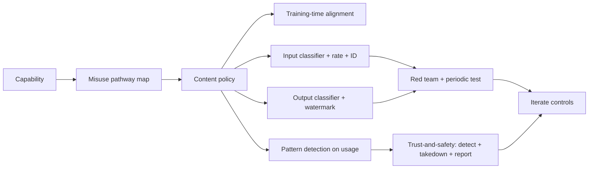

# Model Misuse

## Beginner-Friendly Intuition

Model misuse is when actors use the system, or the underlying model,
in ways that cause harm: generating disinformation, scams, abusive
content, malware, instructions for dangerous activity, impersonation
of real people, automated harassment. The frame that matters: misuse
is an adversarial problem. Some users will probe the system for
exploits; the team that does not anticipate this ships a system that
the abuse community will operate against the team's users.

The intuition: every AI capability has a misuse pathway. A coding
assistant can write malware. A copy assistant can write phishing
email. An image generator can produce non-consensual content. A
voice cloner can be used for fraud. The fact that the model is
useful for legitimate purposes does not exempt it from being abused;
the controls must address both.

This file covers the discipline of preventing misuse: red-teaming,
dual-use risk assessment, content policy enforcement,
abuse-prevention controls, and takedown protocols. Each is real
engineering work plus governance plus an operational team.

## Formal Explanation

### The misuse threat landscape

Categories that production systems must address:

- **Disinformation.** Generated text, images, video that look
  authoritative but spread false information. Election
  interference, health misinformation, financial pump-and-dump.
- **Fraud and scams.** Phishing email at scale, voice impersonation
  of family members for emergency-fund scams, fake customer service.
- **Non-consensual content.** Deepfakes of real people without
  consent (sexual, harassment, defamation).
- **Abuse and harassment.** Automated mass harassment, doxing
  content, hateful content directed at individuals.
- **Self-harm and exploitation.** Content that encourages suicide,
  eating disorders, child exploitation. Particular regulatory
  attention.
- **Illegal activity instructions.** Weapons, drugs, hacking,
  bypassing security controls.
- **Intellectual property infringement.** Outputs that reproduce
  copyrighted content; trademark misuse; patent claims.
- **Manipulation at scale.** Mass-personalized persuasion;
  astroturfing; coordinated inauthentic behavior.

The threat landscape evolves; new misuse modes emerge as new
capabilities ship. The team needs continuous threat modeling, not
one-time review.

### Dual-use risk

Many AI capabilities are dual-use: useful for legitimate purposes,
also useful for harm. A coding assistant helps developers and helps
attackers. A medical assistant helps patients and could give harmful
advice. An image generator creates art and creates non-consensual
content.

Dual-use risk assessment:

- **Capability mapping.** What can the system do?
- **Misuse pathway mapping.** For each capability, what is the
  obvious misuse?
- **Likelihood and severity.** How accessible is the misuse? What
  is the harm if it happens?
- **Mitigation per pathway.** Refusal, filter, restriction, audit.

Some capabilities are so dual-use that they require restricted
access: model release tiers (open weights vs API only), enterprise
licensing with usage policies, identity verification.

### Content policy

A formal policy stating what the system will not produce or assist
with. Major categories most providers cover:

- **Violent extremism and terrorism.**
- **Child sexual abuse material (CSAM).**
- **Non-consensual sexual content.**
- **Self-harm.**
- **Illegal activity (specific harm: weapons, drugs).**
- **Privacy violations (doxing, surveillance).**
- **Election interference and political manipulation.**
- **Hate speech (varies by jurisdiction).**
- **Fraud and scams.**

Each category has a definition, examples, and enforcement
mechanism. The policy is documented; it is enforced through
training (alignment) and through deployed classifiers; it is
operated through abuse reports and takedown.

### Enforcement controls

Layered, like security:

- **Training-time alignment.** Reinforcement learning from human
  feedback (RLHF), constitutional AI, refusal training. The model
  learns to refuse certain requests.
- **Input classifiers.** Detect abuse intent in the input. Block or
  flag.
- **Output classifiers.** Detect policy-violating output regardless
  of how it was produced. Block, retry with stricter constraints,
  or refuse.
- **Rate limits and access control.** Per-user, per-IP, per-API-
  key. Make abuse expensive.
- **Identity verification.** For high-risk capabilities (voice
  cloning, image generation of real people), require verified
  identity.
- **Watermarking and provenance.** For generated content, embed a
  watermark or provenance metadata so downstream consumers can
  detect AI generation.
- **Abuse detection.** Pattern detection on usage logs (volume,
  cluster of similar requests, suspicious targets).

### Red-teaming

The discipline of adversarial testing. A red team's job is to find
ways to make the system produce policy-violating output or take
harmful action. Process:

- **Scope.** What categories? What controls are being tested?
- **Methodology.** Manual probing, automated attack generators,
  combination.
- **Documentation.** Each finding: input, output, severity,
  reproducibility, recommended fix.
- **Triage and fix.** Engineering owns the fix; tracking until
  closed.
- **Re-test.** Verify the fix and check for regressions in adjacent
  cases.
- **Cadence.** Pre-launch; periodic in production; major-feature-
  triggered.

Red-teaming finds issues earlier than user reports; it is
preventive.

### Takedown protocols

When abuse is detected, the response. Components:

- **Detection.** User report, automated detection, third-party
  notice (DMCA, child safety).
- **Triage.** Severity classification, evidence preservation.
- **Action.** Account suspension, content removal, content
  classifier update, refund/compensation if required.
- **Notification.** Affected parties; regulators if required (CSAM
  must be reported to NCMEC in the US).
- **Postmortem.** What enabled the abuse? What controls failed?
  What is the fix?

A takedown SLA matters: hours for severe abuse (CSAM, imminent
harm), days for moderate.

### Abuse-pattern detection

Beyond per-request filtering, pattern detection on usage:

- **Volume anomaly.** A user sending 1000 generation requests in
  10 minutes.
- **Content clustering.** Many requests producing similar
  policy-adjacent content.
- **Target patterns.** Requests targeting specific individuals
  (potential stalking).
- **Coordination.** Multiple accounts producing similar content at
  similar times.

Operates as a SOC-style team with playbooks per pattern.

### Provenance and watermarking

Active research and policy area. C2PA (Coalition for Content
Provenance and Authenticity) provides standards for cryptographic
provenance. SynthID and similar embed model-specific watermarks.
Limitations: watermarks can be removed by determined attackers;
provenance helps but is not a complete solution. Useful as a layer.

## Why It Matters in Real Jobs

Three production reasons. First, **misuse incidents are
existential**. CSAM, election interference, mass fraud each have
the potential to take a product offline, attract regulatory
intervention, or end a company. The cost of a single severe
incident dwarfs the cost of comprehensive prevention. Second,
**enterprise customers require misuse controls**. Acceptable use
policies, content moderation evidence, abuse-handling protocols are
in every Fortune 500 procurement contract. Third, **misuse capacity
shapes regulation**. The EU AI Act, Singapore, UK, US executive
orders all explicitly cite misuse risks. The team that built the
controls early adapts to regulation; the team that did not faces a
launch-blocking compliance project.

## How It Works Step by Step

1. **Map capabilities.** What can the system do?
2. **Map misuse pathways.** For each capability.
3. **Assess severity and likelihood.** Per pathway.
4. **Document content policy.** What the system will not produce.
5. **Layer controls.** Training-time, input, output, rate, access,
   pattern detection.
6. **Red team.** Adversarial testing pre-launch and periodically.
7. **Operate abuse response.** Detection, triage, takedown,
   postmortem.
8. **Iterate.** New misuse patterns emerge; controls evolve.

## Real-World Example

A team deploys an image generation feature for a creative tool.

Misuse pathway assessment:

- Non-consensual sexual content of real people.
- CSAM generation.
- Deepfakes for fraud or harassment.
- Trademark and copyright infringement.
- Generation of harmful imagery (violent, self-harm).

Controls layered:

- **Training-time.** Filter training data for CSAM, sexual content
  of identifiable people. RLHF refusal training on harmful prompts.
- **Input classifier.** Detect prompts targeting real individuals
  (named or implied), prompts requesting policy-violating content.
- **Output classifier.** Per-image safety classifier; specific CSAM
  detection (NCMEC PhotoDNA equivalent); face detection for
  recognized individuals.
- **Rate limit.** Per user; tighter for new accounts.
- **Identity verification.** For likeness-of-real-person features
  (premium tier).
- **Watermarking.** SynthID-style watermark on every generated
  image; C2PA metadata embedded.
- **Abuse-pattern detection.** Cluster detection on prompts across
  users; alerts on suspicious patterns.
- **Takedown protocol.** User reports route to a 24/7 trust-and-
  safety team; CSAM reported to NCMEC within hours; account
  suspension on confirmed violation.

A red team finds that the input classifier missed a specific
encoding (Unicode lookalikes). Engineering fixes the classifier;
the next deployment catches the pattern. Defense in depth held
because the output classifier was the second layer.

A real incident later: an account generated 200 variations of an
attempted policy-violating prompt over 30 minutes; abuse pattern
detection flagged; account suspended; outputs reviewed; nothing
slipped through. The pattern detection is what caught it; per-
request filtering would have noticed the individual blocks but not
the pattern.

## Common Mistakes

- Misuse review at launch only, not ongoing. New misuse modes go
  unaddressed.
- Single-layer enforcement. One filter is bypassable.
- No red team. Defenses are theoretical.
- No content policy. Inconsistent enforcement.
- Takedown SLA absent. Severe abuse persists.
- Pattern detection missing. Bulk abuse undetected.
- Identity verification skipped on high-risk features. Misuse
  becomes cheap.
- Watermarking treated as a complete solution. It is one layer.
- No regulatory reporting flow. CSAM, certain other categories,
  have legal reporting requirements.
- Trust-and-safety team understaffed. Backlog grows; incidents
  fester.

## Interview Angle

**Question:** A team is launching a new AI feature with potential
for misuse. Walk through your misuse-prevention design.

**Strong answer:** Misuse prevention is layered defense plus
operational response.

**Step 1: capability mapping.** What can the feature do? Each
capability has misuse pathways.

**Step 2: pathway mapping.** Per capability, the obvious abuse:
disinformation, fraud, non-consensual content, illegal activity
instructions, exploitation, manipulation. Severity per pathway.

**Step 3: content policy.** Document what the system will not
produce or assist with. Specific categories with definitions and
examples. The policy is the contract; controls implement it.

**Step 4: layered controls.**

- **Training-time.** RLHF refusal training; alignment to the policy.
- **Input.** Classifier detecting abuse intent; rate limits per
  user/IP; identity verification for high-risk capabilities.
- **Output.** Classifier detecting policy-violating output; safety-
  specific detectors (CSAM, weapons); watermarking and provenance.
- **Pattern.** Abuse-pattern detection across users (volume,
  clustering, targeting, coordination).
- **Access.** Tiered access (open weights vs API; per-feature
  enabling); revocation flow.

**Step 5: red team.** Adversarial testing pre-launch. Specific
techniques: jailbreaks, encoded inputs, multi-turn drift, indirect
attacks. Documented findings, fix tracking, re-test. Periodic in
production.

**Step 6: takedown protocol.** Detection (user report, automated,
third-party notice). Triage with severity. Action (suspension,
removal, classifier update). Notification (affected parties,
regulators where required). Postmortem to fix the gap.

**Step 7: regulatory and legal flow.** CSAM must be reported to
NCMEC. DMCA takedowns. Court-ordered preservations. The legal
flow is real engineering work plus a process owner.

**Step 8: operate.** 24/7 trust-and-safety on-call for severe
abuse. Documented SLA per severity. Quarterly review of misuse
trends; controls iterate.

**Step 9: documentation and transparency.** Acceptable use
policy public. Transparency report on takedown volume by category.
Model card discloses known misuse pathways and the residual risk.

The senior instinct: **misuse is adversarial; defenses must be
layered, monitored, and operated**. The team that builds one
classifier and ships is the team that deals with the first
incident in production. The team that layers controls and
operates the response handles incidents as routine work.

**Weak answer:** "Add a content filter." Misses pattern detection,
operational response, regulatory flow.

**Follow-up questions:**

- What is dual-use risk and how do you assess it?
- How do you red team a new feature?
- What is C2PA and what does it solve?
- How do you handle a CSAM detection?

## Mini Exercise

Pick an AI capability. List three misuse pathways, the layered
control per pathway, and the takedown SLA you would set per
severity.

## Diagram

---
## Navigation

[⬅ Previous](04-security-risks.md) | [🏠 Home](../README.md) | [➡ Next](06-responsible-ai.md)
