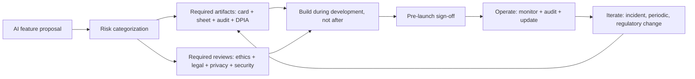

# Responsible AI

## Beginner-Friendly Intuition

Responsible AI is the operational practice that turns ethics
principles into engineering artifacts: model cards, data sheets,
fairness audits, ethics review boards, and design-stage controls.
The frame that matters: principles are necessary but not sufficient.
A team with strong principles and no artifacts cannot prove
compliance, cannot answer customer security questionnaires, and
cannot respond to a regulator. A team with both ships consistently.

The intuition: responsible AI is paperwork plus process plus
controls. The paperwork (model cards, data sheets) makes the system
inspectable. The process (review boards, design-stage gates) makes
decisions auditable. The controls (the actual engineering)
implement the principles. None alone is sufficient; all three
together are.

This file covers the responsible-AI artifacts and processes that
matter in production: model cards, data sheets, fairness audits,
ethics review process, and the design-stage controls that prevent
problems before they ship.

## Formal Explanation

### Model cards

A standardized document describing a deployed model. Originally
proposed by Mitchell et al. (2019); now standard practice and
required by many frameworks (EU AI Act, NIST AI RMF, enterprise
procurement).

Sections:

- **Model details.** Name, version, type, architecture, training
  date, point of contact, training compute and energy.
- **Intended use.** Primary use cases, primary users, out-of-scope
  uses.
- **Factors.** Relevant variations: demographic groups,
  environmental conditions, instrumentation, languages.
- **Metrics.** Performance metrics with definition, decision
  thresholds, variation approaches. Per-factor where relevant.
- **Evaluation data.** Datasets used for evaluation; selection
  rationale.
- **Training data.** Datasets used for training; preprocessing.
- **Quantitative analyses.** Per-factor performance, confidence
  intervals, fairness metrics.
- **Ethical considerations.** Risks identified, mitigations,
  residual risk.
- **Caveats and recommendations.** Known limitations, recommended
  uses, recommended refusals.

The model card is a public-or-customer-facing artifact. It is the
first thing a customer security team requests; it is part of the
EU AI Act's technical documentation; it makes the system
inspectable.

### Data sheets

The training data equivalent of a model card. Originally proposed
by Gebru et al. (2018). Sections:

- **Motivation.** Why was the dataset created?
- **Composition.** What is in it? Statistics, missing data,
  relationships between instances.
- **Collection process.** How was the data collected? Mechanisms,
  who collected, time frame.
- **Preprocessing.** Cleaning, labeling, feature extraction.
- **Uses.** Tasks the dataset has been used for; tasks not
  recommended.
- **Distribution.** Will the dataset be distributed? License?
- **Maintenance.** Who maintains? Update cadence? Erratum process?

Data sheets are the input-side counterpart to model cards. Together
they document the system's data flow and accountability.

### Fairness audits

A periodic, structured review of fairness metrics. Components:

- **Scope.** Which models, which protected attributes, which
  metrics.
- **Methodology.** Statistical tests, data sources, time period.
- **Results.** Disparities found, with confidence intervals, per
  intersection.
- **Interpretation.** Are the disparities significant? What is the
  legal context?
- **Recommendations.** Mitigations to consider; threshold for
  re-audit.
- **Owner and timeline.** Who acts on findings, by when.

Fairness audits are documented; the documentation is itself an
artifact regulators inspect. See
[02-bias-and-fairness.md](02-bias-and-fairness.md) for the metrics.

### Ethics review boards

A cross-functional group that reviews AI projects at design and
launch. Composition typically includes:

- **ML engineering.** Technical feasibility and limitations.
- **Product.** Use case and user impact.
- **Legal.** Regulatory exposure.
- **Privacy.** Data handling.
- **Security.** Adversarial risk.
- **Ethics or trust-and-safety.** Harm assessment.
- **Sometimes external.** Independent advisors for high-stakes
  systems.

The board reviews:

- **Design-stage proposals.** Before significant investment, is
  this the right thing to build?
- **Pre-launch.** Are the controls in place? Is the documentation
  complete? Is the residual risk acceptable?
- **Periodic.** Annual review of operating systems.
- **Incident-driven.** After a harm event, what changed?

Output: a documented decision (approve, conditional, reject)
with rationale. The documentation is the audit evidence.

### Design-stage controls

Many ethics problems are cheaper to prevent than fix. Design-stage
controls operationalize this:

- **Use-case categorization.** High-risk vs low-risk; specific
  controls per category.
- **Disallowed use cases.** Explicit list (e.g., social scoring,
  biometric surveillance in EU AI Act prohibited categories).
- **Required artifacts before launch.** Model card, data sheet,
  fairness analysis, threat model, DPIA where required.
- **Required reviews.** Ethics board, security review, privacy
  review.
- **Required mitigations.** Per risk category; specific to the
  system.

The controls are documented in a runbook; new projects follow the
runbook; deviations require explicit approval.

### Documentation as a deliverable

A common failure mode: documentation produced as a launch
deliverable, then not updated. Continuous responsibility:

- **Trigger updates.** Each model retrain, each significant change,
  each new finding from audits.
- **Versioning.** Model cards versioned alongside model versions.
- **Public-facing version.** Customer-facing model card on a public
  page; updated as the model changes.
- **Internal-facing version.** Detailed internal version with
  evaluation results, known issues, mitigation tracking.

The two versions overlap; the internal version is more thorough.

### Transparency reports

Some companies publish quarterly transparency reports: takedown
volume by category, abuse pattern trends, model usage statistics.
The reports build trust, satisfy regulator inquiry, and provide
public accountability.

### The process loop

Design -> Build -> Document -> Review -> Launch -> Operate ->
Audit -> Iterate. Each step has owners, deliverables, and
checkpoints. The framework is heavyweight for small features and
lightweight for big ones; calibrate to risk.

## Why It Matters in Real Jobs

Three production reasons. First, **enterprise procurement requires
the artifacts**. Model card, data sheet, fairness audit, security
documentation are deal blockers without them. Second, **regulators
ask for documentation**. EU AI Act, NIST AI RMF, sector-specific
regulators each require evidence. The team with documentation
adapts; the team without restarts. Third, **the artifacts force
the right conversations**. A team that has to write a model card
must answer "what is this for? what are the limitations? what are
the fairness implications?" The act of writing the document
surfaces issues that engineering alone misses.

## How It Works Step by Step

1. **Categorize the system.** Risk tier per applicable framework.
2. **Identify required artifacts.** Model card, data sheet,
   fairness audit, threat model, DPIA, etc.
3. **Build the artifacts during development.** Not after launch.
4. **Convene reviews.** Ethics board, security, privacy, legal.
5. **Address findings.** Engineering controls, documentation
   updates.
6. **Launch.** With documented residual risk and named owners.
7. **Operate.** Monitor, audit, update artifacts on changes.
8. **Iterate.** Periodic re-review; incident-driven re-review.

## Real-World Example

A team builds an AI hiring tool. The responsible-AI process.

- **Risk category.** EU AI Act high-risk (employment); NIST AI RMF
  high-impact; SR 11-7 (the parent company is a bank, so model risk
  management applies).
- **Required artifacts.**
  - Model card with intended use, performance, fairness analysis,
    limitations.
  - Data sheet for training data.
  - Fairness audit (annual; disparate impact and equality of
    opportunity per EEOC group).
  - DPIA per GDPR (employment data is sensitive).
  - Threat model.
  - Validation report per SR 11-7 model risk management.
- **Reviews.** Ethics board approval at design. Pre-launch review
  with engineering, legal, HR, ethics, security, privacy.
- **Design-stage controls.** No auto-rejection (mandatory human
  decision). Per-segment evaluation. Per-segment SLO.
- **Launch.** With public model card, customer-facing fairness
  analysis, internal validation report.
- **Operate.** Quarterly fairness re-measurement. Annual
  independent audit. Per-customer reporting on usage and
  fairness.
- **Iterate.** Year two: an audit catches drift on one segment.
  Mitigation deployed; model card updated; the change documented
  and shared with customers.

A separate would-be incident: a sales team wants to repurpose the
hiring tool for a different decision (promotion). The ethics board
review caught it: the validation was for hiring; promotion has
different risk profile and different fairness considerations; the
new use case requires a separate validation. The board's documented
decision prevented an off-spec deployment.

## Common Mistakes

- Documentation as a launch deliverable, then frozen. Stale.
- Model card without fairness analysis. Required by most
  frameworks; missing it blocks audits.
- No ethics review board. Decisions made by individuals; no
  cross-functional perspective.
- Review happens after engineering is mostly done. Cannot
  meaningfully change the design.
- Required artifacts not enforced. Some projects ship with full
  documentation; others ship with none.
- Internal-only documentation. Customers cannot satisfy
  procurement; regulators cannot inspect.
- No periodic re-review. New harms not addressed.
- Disallowed use cases not explicit. Off-spec deployment.
- Transparency report missing. No public accountability evidence.
- Heavyweight process for low-risk features. Slows shipping
  without value.

## Interview Angle

**Question:** A team is launching an AI feature. What
responsible-AI artifacts and processes would you require before
launch?

**Strong answer:** Calibrate to risk; the high-risk path is
heavier than the low-risk path.

**Step 1: categorize.** Apply the relevant frameworks.

- **EU AI Act.** Prohibited / high-risk / limited-risk / minimal-
  risk. Determines obligations.
- **NIST AI RMF.** Govern, Map, Measure, Manage; risk tiered by
  impact.
- **SR 11-7.** Banking model risk management; applies to credit,
  AML, capital decisions.
- **Sector-specific.** HIPAA for health, FERPA for education, ECOA
  for credit, EEOC for hiring.

**Step 2: required artifacts per category.**

- **Always.** Model card with intended use, performance,
  limitations.
- **High-risk.** Data sheet; fairness audit; threat model; DPIA;
  validation report; conformity assessment for EU AI Act.
- **Sector-specific.** SR 11-7 validation, HIPAA risk assessment,
  etc.

**Step 3: required reviews.**

- **Design-stage.** Ethics board reviews the proposal before
  significant investment. Cross-functional: ML, product, legal,
  privacy, security, ethics, sometimes external.
- **Pre-launch.** Engineering, legal, privacy, security, ethics
  sign off on controls and documentation.
- **Operating.** Quarterly fairness measurement, annual independent
  audit, periodic ethics re-review.
- **Incident-driven.** After any harm event, root-cause analysis;
  control gaps identified; documentation updated.

**Step 4: design-stage controls.**

- **Disallowed use cases.** Explicit list per framework
  (prohibited under EU AI Act, prohibited under company policy).
- **Mandatory human oversight.** For high-stakes decisions
  (employment, credit, health, legal).
- **Per-segment evaluation.** Quality and fairness per segment.
- **Required mitigations.** Per identified risk; documented and
  validated.

**Step 5: documentation discipline.**

- **Versioned.** Model cards updated per model version.
- **Public-facing.** Customer-facing model card; transparency report
  for products at scale.
- **Internal-facing.** Detailed evaluation results, known issues,
  mitigation tracking.
- **Trigger-driven updates.** Retrain, change, audit, incident.

**Step 6: operate the process.**

- **Owner per artifact.** Named individual responsible.
- **Cadence per review.** Quarterly fairness, annual audit, etc.
- **Tracking system.** Findings, fixes, re-test, closure.
- **Escalation.** Severe findings escalate to the board.

**Step 7: iterate.** New frameworks emerge (state laws, sector
regulations); the runbook updates; new artifact templates added;
old ones retired.

The senior instinct: **calibrate the process to risk and operate
it consistently**. A heavyweight process for every feature slows
shipping; no process for high-risk features ships harm. The right
team has tiered processes, runs them consistently, and updates
the artifacts continuously.

**Weak answer:** "Write a model card." Sufficient for low-risk
features; insufficient for high-risk. Misses the review,
operating, and iteration loop.

**Follow-up questions:**

- What goes in a model card?
- What is the difference between a model card and a data sheet?
- How does an ethics review board operate?
- How do you handle disallowed use cases?

## Mini Exercise

Pick an AI feature. Categorize the risk. List the required
artifacts. Identify the cross-functional reviewers. Draft one
section of the model card (intended use or limitations).

## Diagram

---
## Navigation

[⬅ Previous](05-model-misuse.md) | [🏠 Home](../README.md) | [➡ Next](07-ai-governance.md)
