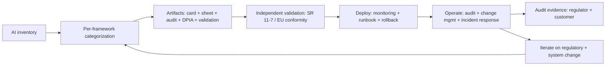

# AI Governance

## Beginner-Friendly Intuition

AI governance is the organizational layer that ensures AI systems
comply with regulations, internal policies, and risk frameworks
across their entire lifecycle. The frame that matters: governance
is the bridge between engineering and the regulator, the auditor,
the board, and the customer's compliance team. A team without
governance can ship features but cannot prove compliance, cannot
respond to regulatory inquiry, and cannot pass enterprise procurement
review.

The intuition: regulations and frameworks (EU AI Act, NIST AI RMF,
SR 11-7, ISO 42001) impose obligations. Governance translates each
obligation into engineering work, runs the work, documents the
results, and produces the evidence on demand. The work is mostly
process and documentation, not algorithm tweaks; the team that
treats it as engineering ships consistently across regulated
markets.

This file covers the major governance frameworks, the engineering
implications of each, the lifecycle governance loop, and the
documentation standards that make systems auditable.

## Formal Explanation

### Major frameworks

- **EU AI Act (2024-2026 phased enforcement).** Risk-based
  categorization: prohibited, high-risk, limited-risk, minimal-risk.
  High-risk systems (employment, credit, education, law
  enforcement, critical infrastructure) require conformity
  assessment, technical documentation, human oversight, accuracy,
  cybersecurity, post-market monitoring. Foundation models / GPAI
  have separate obligations. Fines up to 7 percent of global
  revenue.
- **NIST AI Risk Management Framework (AI RMF, 2023).** Voluntary
  US framework. Four functions: Govern, Map, Measure, Manage.
  Influential globally; increasingly cited in US federal
  procurement.
- **SR 11-7 (US banking, 2011).** Model risk management for
  banks. Independent validation, ongoing monitoring, governance.
  The template that bank-deployed AI follows; widely studied
  outside banking.
- **ISO/IEC 42001 (2023).** AI management system standard.
  Certifiable; some enterprises require certification.
- **ISO/IEC 23894 (2023).** AI risk management guidance.
- **OECD AI Principles.** International soft-law framework;
  influences national policies.
- **Sector-specific.** HIPAA (US health), GDPR (EU privacy), FCRA
  (US credit), EEOC (US employment). Each adds AI-specific
  guidance over time.
- **National.** UK AI Safety Institute principles; Singapore
  Model AI Governance Framework; Canada AIDA. Multi-region products
  must comply with all applicable.

### EU AI Act categorization in detail

- **Prohibited AI.** Social scoring by governments, real-time
  biometric identification in public spaces (with narrow law-
  enforcement exceptions), emotion recognition in workplaces and
  schools, untargeted scraping of facial images, exploitation of
  vulnerabilities. Cannot be deployed in EU regardless of
  controls.
- **High-risk AI.** Biometric identification (non-prohibited),
  critical infrastructure, education and vocational training,
  employment and worker management, essential services (credit,
  insurance), law enforcement, migration and border control,
  administration of justice, democratic processes. Obligations:
  risk management system, data governance, technical
  documentation, record keeping, transparency, human oversight,
  accuracy and cybersecurity, conformity assessment, registration
  in the EU database.
- **Limited-risk AI.** Chatbots, emotion recognition, biometric
  categorization, deepfakes. Transparency obligations (users
  informed they are interacting with AI; AI-generated content
  marked).
- **Minimal-risk AI.** Most consumer AI. No specific obligations
  beyond general law.
- **GPAI / foundation models.** Documentation, copyright
  compliance, summary of training content. "Systemic risk" GPAI
  (large compute thresholds) get additional obligations: model
  evaluations, adversarial testing, incident reporting, risk
  mitigation.

### NIST AI RMF in detail

Four functions, each with categories and subcategories:

- **Govern.** Policies, accountability structure, risk
  tolerance, integration with organizational governance.
- **Map.** Context, categorization, capabilities, third-party
  risk, AI lifecycle stages.
- **Measure.** Metrics for AI risks (effectiveness, robustness,
  fairness, privacy, security, transparency, accountability).
- **Manage.** Risk response, prioritization, monitoring,
  documentation, incident response.

The framework is voluntary; the structure is widely adopted as a
checklist for AI risk management.

### SR 11-7 model risk management

Three-line-of-defense model:

- **First line.** Model developers and users. Build, document,
  use the model.
- **Second line.** Independent validation. Effective challenge:
  conceptual soundness, ongoing monitoring, outcomes analysis.
  Cannot be the same team that built the model.
- **Third line.** Internal audit. Independent assurance that
  the first and second lines are operating effectively.

The framework's strength: independent validation. A model is not
production-ready until a separate validation team has reviewed it.

### Lifecycle governance

Governance applies across the AI system's life:

- **Design.** Categorize risk; document intended use, limitations,
  data sources; ethics review; threat model.
- **Development.** Track training data, model versions, evaluation
  results; reproducibility evidence.
- **Validation.** Independent review; conformity assessment for
  high-risk EU systems; test against the framework requirements.
- **Deployment.** Monitoring plan; rollback plan; runbook;
  on-call.
- **Operation.** Ongoing monitoring (accuracy, fairness, drift,
  security); periodic re-validation; incident response.
- **Change.** Material changes trigger re-validation; minor
  changes documented; change-management workflow.
- **Retirement.** Decommissioning plan; data retention per policy;
  successor system documented.

Each stage has artifacts, owners, and audit evidence.

### Documentation standards

Frameworks converge on a documentation set:

- **System description.** Architecture, components, data flow.
- **Intended use and limitations.** What it is for; out-of-scope
  uses.
- **Training data.** Sources, statistics, preprocessing, lineage.
- **Performance.** Metrics on evaluation set; per-segment.
- **Fairness.** Per-protected-group metrics; mitigations.
- **Security.** Threat model; controls; test results.
- **Privacy.** Data subject rights handling; DPIA.
- **Risk assessment.** Identified risks; likelihood, severity,
  mitigation, residual risk.
- **Monitoring plan.** What is monitored; thresholds; response.
- **Validation report.** Independent review evidence.
- **Change log.** All material changes; impact assessment.

The set is the audit evidence package; auditors and regulators
inspect it.

### Auditability

A system is auditable when an external party can verify its
operation against documented standards. Operationalized:

- **Immutable audit logs.** Every decision, every change,
  retained for the legal-hold window.
- **Lineage.** Every prediction traceable to model version,
  training data version, input.
- **Reproducibility.** A model version can be rebuilt from
  documented inputs.
- **Separation of duties.** Builder, validator, deployer, auditor
  are distinct.
- **Sign-off records.** Every gate has a documented decision and
  decider.

Auditability is engineering work; building it later is a 6-12
month project; building it in is days.

### Third-party risk

Most production AI uses third-party components: foundation models,
embedding services, vector databases, evaluation tools.
Governance applies to them too:

- **Vendor due diligence.** Security questionnaire, SOC 2 report,
  privacy review, sub-processor list.
- **Data Processing Agreement.** GDPR-compliant DPA.
- **Service-level agreement.** Availability, support, breach
  notification.
- **Termination plan.** What happens if the vendor changes terms,
  fails, or is acquired.

The buyer's governance includes the supplier's governance.

### Incident response and reporting

When an AI system causes harm or near-harm:

- **Detection.** Monitoring alert, user report, third-party
  notice.
- **Response.** Triage, mitigate, root-cause.
- **Reporting.** Internal (board, ethics review); external
  (regulator if required, customer if SLA-impacting, public if
  significant).
- **Postmortem.** What enabled the incident, what is the fix, what
  is the systemic improvement.
- **Documentation.** Incident retained for the legal-hold window.

Some frameworks require regulatory notification within hours
(GDPR breach 72 hours; EU AI Act incident reporting for high-risk
systems). The runbook must support those SLAs.

## Why It Matters in Real Jobs

Three production reasons. First, **regulations are now binding
and enforced**. EU AI Act fines up to 7 percent of global revenue;
GDPR fines up to 4 percent; sector-specific penalties. The cost of
non-compliance is existential. Second, **enterprise procurement
demands governance evidence**. SOC 2, ISO 27001, ISO 42001, vendor
questionnaires; closing the deal requires the documentation.
Third, **governance prevents systemic incidents**. The team that
operates monitoring, periodic audit, change management, and
incident response catches issues early. The team that does not
has its first incident in production with no playbook.

## How It Works Step by Step

1. **Inventory the AI systems.** Each in production or planned.
2. **Categorize per framework.** EU AI Act tier; NIST AI RMF
   impact; SR 11-7 if banking; sector-specific.
3. **Define obligations per category.** Documentation, controls,
   reviews.
4. **Build artifacts** during development.
5. **Validate** independently for high-risk systems.
6. **Deploy** with monitoring, runbook, rollback.
7. **Operate.** Monitoring, audit, change management, incident
   response.
8. **Iterate.** Re-validate on material change; update on
   regulatory change.
9. **Document.** Audit evidence package always current.

## Real-World Example

A financial services company deploys an AI-driven credit underwriting
system.

Governance setup:

- **Frameworks.** EU AI Act high-risk (credit), NIST AI RMF
  high-impact, SR 11-7 (the company is a regulated bank).
- **Three lines of defense.** ML team builds. Independent
  validation team reviews. Internal audit assures.
- **Documentation.** Model card, data sheet, validation report,
  risk assessment, threat model, DPIA, monitoring plan, change
  log. All in a regulated repository.
- **Conformity assessment.** EU AI Act conformity declared;
  registration in the EU database.
- **Operating monitoring.** Per-segment performance and fairness;
  drift detection; quarterly re-measurement; annual independent
  re-validation.
- **Change management.** Material changes (architecture, feature
  set, training data source) trigger re-validation. Minor changes
  (retraining on the same data, hyperparameter tweak) flow through
  abbreviated review.
- **Incident response.** Runbook with severity classification;
  72-hour regulator notification SLA for material incidents;
  documented postmortem and remediation tracking.

Year two: a regulator audit. The team produces the evidence
package within 48 hours: model card, validation report, monitoring
records, change log, incident records. The audit closes without
findings. The peer company that did not build the documentation
takes 6 months to assemble the same package and faces preliminary
findings.

## Common Mistakes

- Governance treated as a launch deliverable. Stale; audit fails.
- One person owns governance. Not scalable; single point of
  failure.
- Documentation only, no operating controls. Compliance theater;
  systems still drift.
- Independent validation absent. Builder validates own work;
  effective challenge missing; SR 11-7 fails.
- Change management absent. Ungoverned changes accumulate;
  audit lineage breaks.
- Third-party governance absent. Vendor failure becomes the
  team's failure.
- Incident response not rehearsed. First incident is the first
  time the runbook runs.
- Cross-jurisdictional non-compliance. EU customer cannot use the
  product because it is not EU AI Act conformant.
- No retirement plan. Decommissioning is messy and unaudited.
- Frameworks treated independently. Many overlap; one
  documentation set covers most.

## Interview Angle

**Question:** Walk through how you would design AI governance for
a multi-jurisdiction product.

**Strong answer:** Inventory, categorize, build artifacts, operate
the loop.

**Step 1: inventory.** List every AI system in production or
planned. Per system: capability, data, decision impact, geography
of users.

**Step 2: categorize per framework.**

- **EU AI Act.** Prohibited / high-risk / limited-risk / minimal-
  risk. Determines mandatory obligations for EU users.
- **NIST AI RMF.** Govern / Map / Measure / Manage. Risk-tiered
  by impact.
- **SR 11-7.** If the deploying entity is a US bank, applies to
  any model influencing material decisions.
- **Sector-specific.** HIPAA for health, FCRA for credit,
  EEOC for hiring, FERPA for education.
- **National AI law.** UK, Singapore, Canada, etc.

A high-risk hiring system in the EU = EU AI Act high-risk + GDPR
+ EEOC if US users + NIST AI RMF. The team complies with all
applicable, not just one.

**Step 3: build artifacts.**

- Model card, data sheet, fairness audit, threat model, DPIA,
  validation report, monitoring plan, change log.
- One canonical set; cross-referenced from each framework's
  required documentation list.

**Step 4: independent validation.** SR 11-7 requires it; EU AI Act
conformity assessment requires it for high-risk; good practice
universally. Builder cannot validate own work; effective challenge
is the test.

**Step 5: deploy with operating controls.**

- Monitoring per accuracy, fairness, drift, security.
- Runbook for known failure modes.
- On-call team.
- Rollback path.

**Step 6: operate the lifecycle.**

- Quarterly fairness measurement.
- Annual independent re-validation for high-risk.
- Periodic ethics review.
- Change management: material change triggers re-validation;
  minor change documented and abbreviated review.
- Incident response with regulatory notification SLAs.
- Vendor governance: due diligence, DPA, SLA, termination plan.

**Step 7: documentation discipline.**

- Versioned, accessible, current.
- Public-facing model card; internal validation report.
- Audit evidence package always assembled.
- Sign-offs preserved.

**Step 8: prepare for audit.** Quarterly internal pre-audit;
annual external. The evidence package is current; the team can
respond to a regulator inquiry within 48 hours.

**Step 9: iterate on regulatory change.** New frameworks emerge
(state AI laws, sector rules). The team monitors regulatory
trackers; updates the runbook; updates the artifacts; re-trains
the team.

**Cross-jurisdictional complexity.** Multi-region products comply
with all applicable. Jurisdiction-specific controls (data
residency for EU; specific consent flows; regulator-specific
notification) are part of the system. The team that designed for
one jurisdiction faces a re-platform when expanding.

The senior instinct: **governance is engineering plus process plus
documentation, calibrated to risk and operated continuously**.
The team that builds the artifacts during development and runs the
controls in production passes audits; the team that scrambles at
audit time fails.

**Weak answer:** "Follow the GDPR." Insufficient (other frameworks
apply); misses the operating loop; misses validation; misses
documentation discipline.

**Follow-up questions:**

- What is the EU AI Act's risk categorization?
- What does SR 11-7 require?
- What is independent validation and why does it matter?
- How do you operate change management for AI systems?

## Mini Exercise

Pick an AI feature and a target market. Identify the applicable
frameworks. List the required documentation. Describe the
independent-validation flow. Identify the most likely audit gap.

## Diagram

---
## Navigation

[⬅ Previous](06-responsible-ai.md) | [🏠 Home](../README.md) | [➡ Next](../case-studies/01-spam-classifier.md)
