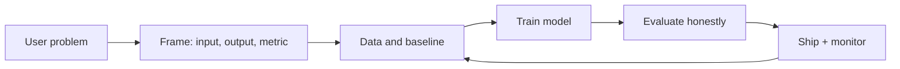

# What Is Machine Learning

## Beginner-Friendly Intuition

Machine learning is the practice of teaching a computer to do a task by showing it examples instead of writing the rules by hand. If you can describe a task as input goes in and an answer comes out, and you have many past inputs paired with the right answers, you can usually train a model that makes useful predictions on inputs it has never seen.

A useful test for any beginner: name the input, the output, where the labels come from, the metric you would judge it by, and one mistake the model is likely to make. If you can answer those five things, you can talk about almost any ML problem.

## Formal Explanation

Machine learning fits a function `f(x) -> y` from data. You collect a dataset of input-output pairs, choose a model family (linear, tree-based, neural, etc.), pick a loss that measures how wrong the predictions are, and run an optimizer that adjusts the model's parameters to reduce the loss. The goal is not to memorize the training set but to generalize, which is checked on a held-out set.

Three flavors cover most problems:

- **Supervised learning** uses labeled examples to predict a target (classification, regression).
- **Unsupervised learning** finds structure in unlabeled data (clustering, dimensionality reduction).
- **Reinforcement learning** learns from rewards collected by acting in an environment.

## Why It Matters in Real Jobs

On the job, ML is judged by whether it improves a real decision: a click-through rate, a fraud loss, an answer that helps a user. Engineers who do well frame the task crisply, build a baseline first, evaluate honestly on data that looks like production, and watch the system after launch. Engineers who struggle skip framing and chase model complexity.

## How It Works Step by Step

1. **Frame the problem.** Write down the user, the decision, the cost of each kind of mistake, and the constraints (latency, privacy, cost).
2. **Collect and inspect data.** Look at sources, missing fields, label noise, time ranges, and obvious leakage.
3. **Build a baseline.** A rule, a logistic regression, or a small tree. The baseline is the bar every later model must beat.
4. **Train and validate.** Split by time when relevant. Use cross-validation only when leakage cannot sneak across folds.
5. **Evaluate.** Pick metrics that match the cost of errors (precision/recall, calibration, AUC, RMSE). Slice by segment.
6. **Ship a small version.** Shadow mode or A/B test with monitoring for input drift, latency, and outcome quality.
7. **Iterate.** Look at errors, feed them back into features, data, or model choice. Repeat.

## Real-World Example

A streaming service wants to recommend movies. The input is a user's recent watch history; the output is a ranked list. A baseline could simply rank by global popularity. A learned model uses watch patterns to personalize the list. The team measures click-through rate and watch time on a held-out cohort, and watches for failure cases like a new user with no history.

Notice how the model is one piece. The data pipeline, the metric, the cold-start fallback, and the monitoring all matter. ML projects fail more often because of those pieces than because of the model itself.

## Common Mistakes

- Jumping to a deep model before defining the user, decision, and metric.
- Training on data that includes information not available at prediction time (leakage).
- Reporting a single average score instead of slicing by user, segment, or time.
- Confusing offline metric improvements with real product wins.
- Forgetting that production traffic drifts, so a model that was good last quarter may be bad now.

## Interview Angle

**Question:** Explain what machine learning is, when you would and would not use it, and how you would scope a new ML problem.

**Strong answer:** Define ML as learning a function from data, not from hand-written rules. Use it when you have many examples, a measurable outcome, and a problem where rules are hard to enumerate. Avoid it when the problem can be solved with a simple deterministic rule, when data is too sparse, or when the cost of a wrong answer is too high without a fallback. Scope by writing down the user, decision, data, baseline, metric, and one likely failure mode before any modeling.

**Weak answer:** Recite a textbook definition and immediately propose a deep neural network without discussing data, baselines, evaluation, or constraints.

**Follow-up questions:**

- When would a rule-based system beat ML?
- What would make your offline metric misleading?
- How would you handle a model that performs well on average but badly on a key segment?
- What would you monitor in production and why?
- How does this answer change if the user's safety is at stake?

## Mini Exercise

Pick a feature you used today (a search bar, a recommendation, a fraud check). Write five bullets: input, output, baseline, primary metric, and one failure mode. Then describe one signal that would tell you the model has degraded after launch.

## Diagram

---
## Navigation

[⬅ Previous](../README.md) | [🏠 Home](../README.md) | [➡ Next](02-ai-vs-ml-vs-deep-learning-vs-data-science.md)
