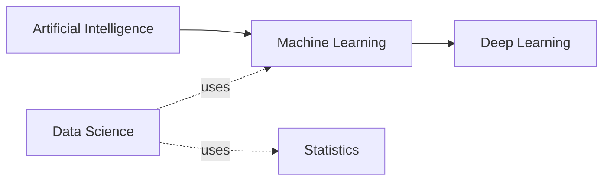

# AI vs ML vs Deep Learning vs Data Science

## Beginner-Friendly Intuition

These terms overlap and people use them loosely, which causes confusion in interviews and at work. The cleanest mental picture is nested: AI is the broad goal of making machines act intelligently. ML is one approach to AI, where the system learns from data. Deep learning is a subfield of ML that uses many-layered neural networks. Data science is a job and a workflow that uses statistics and ML to answer questions about data.

## Formal Explanation

**AI** covers any technique that produces intelligent behavior, including hand-written rules, search, planning, and learning. **Machine learning** is the subset where behavior is learned from data via optimization of an objective. **Deep learning** is the subset of ML that uses neural networks with many layers, typically trained on GPUs with backpropagation. **Data science** is the practice of extracting insight from data and is usually a mix of statistics, ML, and communication, often producing reports or dashboards rather than production systems.

## Why It Matters in Real Jobs

On the job, the term you use signals what kind of work you do. AI engineer roles focus on applied AI systems, ML engineers ship learned models, deep learning specialists work on neural architectures and training, and data scientists answer business questions and run experiments. Knowing the boundaries helps you scope the right team, the right tooling, and the right interview prep.

## How It Works Step by Step

1. Identify the user goal and decision.
2. Decide whether learning from data is needed, or a rule will do.
3. If learning is needed, decide whether tabular methods or deep models fit the data shape.
4. If deep, decide whether to fine-tune, prompt, or train from scratch.
5. Match the team and tooling to the choice (data scientist for analysis, ML engineer for shipping models, AI engineer for AI products).
6. Plan evaluation, observability, and rollout that match the chosen path.

## Real-World Example

A bank wants to reduce fraud. A data scientist analyzes recent fraud cases and reports patterns. An ML engineer turns those patterns into a real-time tabular classifier. A deep learning engineer adds a sequence model over transaction history. An AI engineer wraps the whole thing in a reviewer-facing tool that explains decisions. Each role uses different tools, but all are working on the same problem.

## Common Mistakes

- Using AI as a buzzword for any data work, which hides the engineering tradeoffs.
- Reaching for deep learning on a small tabular dataset where boosted trees would beat it cheaply.
- Confusing data analysis projects with productionized ML systems.
- Treating LLMs as the only AI; classical ML still owns most of the value in industry.
- Asking for an ML engineer when you actually need a data scientist, or vice versa.

## Interview Angle

**Question:** Distinguish AI, ML, deep learning, and data science with a concrete example for each.

**Strong answer:** Use the nested mental model. Give one example each: a chess engine using search is AI but not ML. A logistic regression for churn is ML. A CNN for image classification is deep learning. An A/B-test analysis of a checkout flow is data science. Note that real teams often blend roles.

**Weak answer:** Treat the terms as synonyms or describe deep learning as a type of data science.

**Follow-up questions:**

- When would you choose a classical ML model over a deep one?
- Where does an LLM application fit in this picture?
- Which role best fits an experimentation-heavy growth team?
- What does an ML engineer own that a data scientist usually does not?

## Mini Exercise

Take a system you have used (search, recommendations, voice assistant). Identify the parts that are clearly AI, ML, deep learning, and data analysis. Then propose which role would own each part.

## Diagram

---
## Navigation

[⬅ Previous](01-what-is-machine-learning.md) | [🏠 Home](../README.md) | [➡ Next](03-supervised-unsupervised-self-supervised-reinforcement-learning.md)
