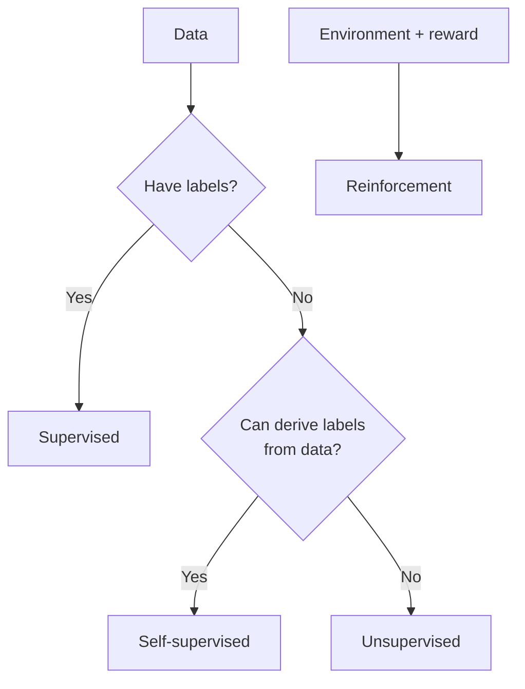

# Supervised, Unsupervised, Self-Supervised, and Reinforcement Learning

## Beginner-Friendly Intuition

The four learning styles differ by where the supervision signal comes from. Supervised learning learns from labeled examples (input, target). Unsupervised learning finds structure in unlabeled data. Self-supervised learning creates labels from the data itself (predict the next word, fill in a masked token). Reinforcement learning learns from rewards earned by acting in an environment over time.

## Formal Explanation

Each style minimizes a different kind of objective:

- **Supervised:** minimize loss between predicted `y_hat` and labeled `y` (cross-entropy, MSE).
- **Unsupervised:** maximize a structural objective without labels (cluster compactness, reconstruction error, density).
- **Self-supervised:** define a pretext task whose labels are derived from the data (next-token prediction, contrastive pairs). This is how LLMs and modern foundation models are pretrained.
- **Reinforcement:** maximize expected reward `E[Σ γ^t r_t]` over a policy that chooses actions, using methods like policy gradients or Q-learning.

## Why It Matters in Real Jobs

Most production ML systems are supervised, because labels carry the most direct signal about what we want. Self-supervised pretraining is what made foundation models possible: it removed the human-labeling bottleneck for the pretraining stage. Unsupervised methods help with exploration and segmentation. Reinforcement learning shines for sequential decision problems but is hard to deploy because reward shaping and safety are tricky.

## How It Works Step by Step

1. Look at what kind of signal you have. Labels? Use supervised. Only data? Try unsupervised or self-supervised.
2. Define the objective explicitly: what would success look like with this signal?
3. Pick the smallest method that uses that signal well (logistic regression before transformers).
4. Evaluate against held-out data, even if the supervision is weak.
5. Combine styles when needed: pretrain self-supervised, then fine-tune supervised, then RL with human feedback.

## Real-World Example

An e-commerce team wants product search. They start with supervised learning: train a ranker on click data. They add unsupervised steps: cluster products to fill in cold-start and explore. For text understanding they use a self-supervised pretrained transformer. To improve a chatbot answering refund questions, they apply RLHF: collect human preferences over answers and train the model to prefer the better one.

## Common Mistakes

- Calling unsupervised what is actually self-supervised (next-token prediction is supervised by the next token).
- Trying RL when you have no good simulator and the cost of bad actions is high.
- Using cluster IDs as features without checking that the clusters mean something to the user.
- Forgetting that even self-supervised models need supervised evaluation.
- Treating RLHF as the only way to align a model when SFT plus rule-based filters often does most of the work.

## Interview Angle

**Question:** Compare supervised, unsupervised, self-supervised, and reinforcement learning with a concrete use case for each.

**Strong answer:** Define each by the source of the supervision signal. Give an example: spam classification (supervised), customer segmentation (unsupervised), LLM pretraining (self-supervised), AlphaGo or RLHF (reinforcement). Note the modern stack often combines them.

**Weak answer:** Confuse self-supervised with unsupervised, or claim RL is dominant in industry production systems.

**Follow-up questions:**

- Why is self-supervised pretraining so important for LLMs?
- When would you use clustering features in a supervised pipeline?
- What makes RL hard to deploy in real systems?
- How does RLHF combine supervised and reinforcement learning?

## Mini Exercise

Pick a single product (search, recs, fraud, support chat). For each of the four styles, describe one component of that product where it would be a reasonable choice and explain why.

## Diagram

---
## Navigation

[⬅ Previous](02-ai-vs-ml-vs-deep-learning-vs-data-science.md) | [🏠 Home](../README.md) | [➡ Next](04-training-validation-test-splits.md)
