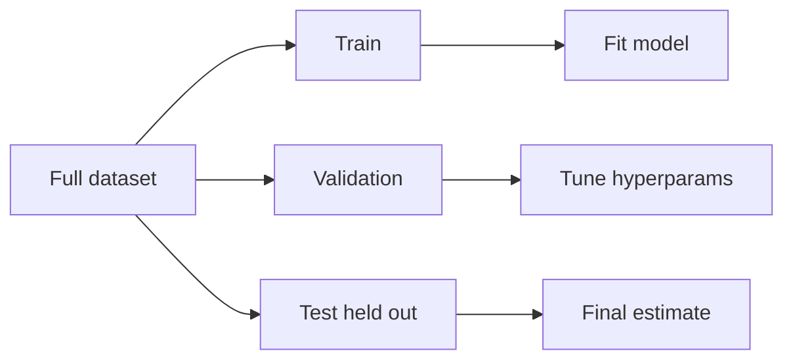

# Training, Validation, and Test Splits

## Beginner-Friendly Intuition

You cannot evaluate a model on the data it learned from, or you will only measure how well it memorized. So you keep some data hidden. The training set is what the model fits. The validation set is what you use to tune knobs (model choice, hyperparameters). The test set is the final, untouched holdout you only look at when you are done. Touching the test set repeatedly turns it into a second validation set, and your real generalization estimate disappears.

## Formal Explanation

The classic split is 60/20/20 or 70/15/15 of i.i.d. data. For time series, split chronologically so the validation and test sets are after the training window. For grouped data (multiple rows per user), split by group so a user does not appear in both train and test. If the dataset is small, use k-fold cross-validation to get a more stable validation estimate, but still keep a held-out test set for the final number.

For imbalanced classification, use **stratified splitting**: split each class proportionally so every fold has the right positive rate. With 1 percent positives and a random 80/20 split on 5,000 rows, an unstratified test fold can easily land with zero positives, making the metric undefined. Stratification fixes this. Most libraries (`sklearn.model_selection.StratifiedKFold`, `train_test_split(stratify=y)`) do it in one line.

**Test set size matters.** A rough rule of thumb: pick a size large enough that the confidence interval on your primary metric is narrower than the smallest effect you would act on. For a binary classifier with accuracy near 0.9, a 1,000-row test set gives a 95 percent CI of roughly plus or minus 1.9 percentage points. A 10,000-row test set tightens it to plus or minus 0.6. If you cannot afford that many labels, accept that the test number is noisy and report the CI alongside the point estimate.

Two failure modes dominate: **leakage** (information from the future or from the label sneaks into features) and **distribution shift** (the test data is too easy or too different from production).

## Why It Matters in Real Jobs

Honest splits are the difference between a model that looks great offline and dies in production. Most ML disasters trace back to a leaky split, a too-easy holdout, or a test set that was peeked at so many times that it stopped representing new data.

## How It Works Step by Step

1. Decide whether the data is i.i.d., grouped, or temporal.
2. Reserve a held-out test set first and lock it away.
3. Split the rest into train and validation, by group or by time as needed.
4. Engineer features only from the training window to avoid leakage.
5. Tune on validation. Do not look at test until the model is final.
6. Refresh splits when the data distribution shifts; old splits go stale.

## Real-World Example

A team builds a churn model. They split rows i.i.d., reach AUC 0.95, and ship. In production, AUC drops to 0.7. The reason: a single user appeared in both train and test, and one of the features encoded the user's eventual churn. Splitting by user_id and excluding the leaky feature drops offline AUC to 0.78, which actually holds in production. The painful lesson is that the higher number was lying.

## Common Mistakes

- Random row splits when the data is grouped or temporal.
- Computing scaling or imputation parameters on the full dataset before splitting (data leakage).
- Tuning on the test set, then quoting that number as generalization.
- Ignoring class balance: a 1% positive rate split randomly may produce a fold with no positives.
- Reusing the same test set for years until it no longer represents real traffic.

## Interview Angle

**Question:** How would you split a dataset for a churn model, and how would your answer change for a time-series forecasting problem?

**Strong answer:** For churn, split by user (group split) so the same person is not on both sides. Hold out a recent time window for the test set if churn behavior shifts. For forecasting, use a chronological split: train on the past, validate on the next window, test on the most recent. Also use rolling-origin evaluation if you want a more robust estimate. Always check leakage: any feature that encodes the future.

**Weak answer:** Use a random shuffle, ignore time and groups, or compute features on the whole dataset before splitting.

**Follow-up questions:**

- When would you use k-fold CV instead of a single split?
- How do you detect leakage from a single feature?
- What if the test set is too small to trust?
- How do you refresh splits as the production distribution shifts?

## Mini Exercise

Take a tabular dataset you know. Write down the unit (row, user, session). Choose a split strategy and justify it in two sentences. Then list two ways leakage could sneak in if you used naive random splitting.

## Diagram

---
## Navigation

[⬅ Previous](03-supervised-unsupervised-self-supervised-reinforcement-learning.md) | [🏠 Home](../README.md) | [➡ Next](05-overfitting-underfitting-bias-variance.md)
