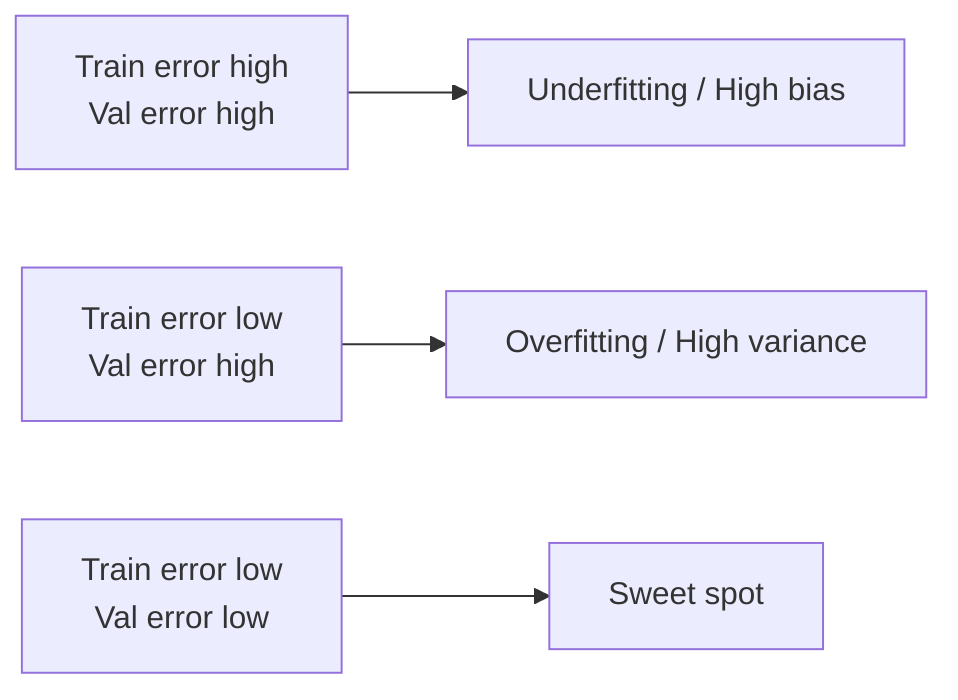

# Overfitting, Underfitting, and the Bias-Variance Tradeoff

## Beginner-Friendly Intuition

An underfit model misses the pattern (high bias). An overfit model memorizes the training set including its noise (high variance). The art is finding the sweet spot where the model captures the real structure without chasing noise. You diagnose this from the gap between training error and validation error: if both are high, you are underfitting; if training error is low but validation error is high, you are overfitting.

## Formal Explanation

The expected test error of a model can be decomposed as `error = bias^2 + variance + irreducible noise`. **Bias** is how far the average model is from the truth; high bias means the model is too rigid for the problem (too few parameters, wrong family). **Variance** is how much the model changes if the training data changes; high variance means the model is too flexible. Regularization, more data, simpler models, and ensembling all reduce variance. Adding capacity, better features, or better optimization reduces bias.

## Why It Matters in Real Jobs

Bias-variance is the framework that turns vague phrases like the model is too simple into a fix. When you see the train-validation gap, you know which lever to pull. This is one of the most common interview tests for ML fundamentals because it shows whether you can debug a model, not just train one.

## How It Works Step by Step

1. Plot training and validation loss as functions of training set size (learning curves) and of model complexity.
2. If both curves are high and close together: high bias. Increase capacity, add features, train longer.
3. If training is low and validation is much higher: high variance. Add regularization, get more data, simplify the model, or ensemble.
4. If both are low and close: you are at the sweet spot. Stop and ship.
5. If validation gets worse with more data, you have a deeper problem (leakage, distribution shift, label noise).

## Real-World Example

A team fits a deep random forest to 1,000 rows of tabular data with default settings (no max_depth, no min_samples_leaf). Training accuracy is 0.96, validation 0.65. The 31-point gap is overfitting; the trees are deep enough to nearly memorize the training set. Solutions: limit tree depth, raise min_samples_leaf, lower the number of trees, or get more data. After tuning (max_depth=6, min_samples_leaf=10), training drops to 0.81 and validation rises to 0.74. The gap is smaller and the model generalizes better. Note that an exact 1.00 training accuracy on 1,000 rows usually indicates leakage, not just overfitting; if you see it, audit the features before tuning.

A learning curve makes the diagnosis visual. Plot training and validation accuracy as you increase training set size from 100 to the full dataset. Underfitting: both curves are low and stay close (e.g., both flat at 0.62). High variance: training is high (0.95) and validation rises slowly toward training as data grows; the gap closes only with more data. Sweet spot: both curves converge to a similar high value as data grows. If the validation curve gets worse with more data, the cause is usually leakage, distribution shift, or label noise rather than capacity.

## Modern Note: Implicit Regularization and Double Descent

The classical bias-variance picture predicts that increasing capacity past the point where the model memorizes the training set should make validation error worse. In modern deep learning this often is not what happens. Very over-parameterized networks often generalize well anyway. Two reasons. First, **implicit regularization**: SGD biases the optimizer toward flat minima, and the learning rate, batch size, and initialization scale together encode a preference for simple solutions even without an explicit penalty. Second, **double descent**: as capacity grows past the interpolation threshold, validation error often falls again, producing a U-shape on top of the classical U-shape. This does not invalidate bias-variance; it just means capacity in deep models interacts with the optimizer in ways the simple decomposition does not capture. The practical takeaway: do not rely only on capacity to diagnose generalization on large neural networks; rely on validation error and learning curves directly.

## Common Mistakes

- Adding capacity to fix overfitting (it makes it worse).
- Adding regularization to a model that is already underfitting.
- Reading the gap from a small validation set where noise dominates.
- Using accuracy on imbalanced data and missing the real bias-variance picture.
- Confusing high test error with overfitting when the real cause is leakage or shift.

## Interview Angle

**Question:** Explain the bias-variance tradeoff and how you would diagnose underfitting versus overfitting in a real model.

**Strong answer:** Define bias as systematic error from a too-rigid model and variance as sensitivity to the training set. Diagnose by comparing training and validation error: high both = bias, big gap = variance. Use learning curves to confirm. Fix bias by adding capacity or features; fix variance with regularization, more data, simpler models, or ensembling.

**Weak answer:** Recite the formula without describing how to spot the symptom in a real run.

**Follow-up questions:**

- How does adding more data change the bias-variance picture?
- When does early stopping help and when does it just hide the problem?
- How is bias-variance related to model capacity and regularization strength?
- Why can ensembling reduce variance without much bias cost?

## Mini Exercise

Train any model on a small dataset twice: once with high regularization, once with none. Compare training and validation error. Write three sentences explaining which run is underfit, which is overfit, and what you would change next.

## Diagram

---
## Navigation

[⬅ Previous](04-training-validation-test-splits.md) | [🏠 Home](../README.md) | [➡ Next](06-features-labels-datasets.md)
