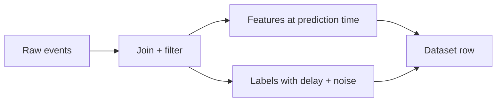

# Features, Labels, and Datasets

## Beginner-Friendly Intuition

A dataset is a table where each row is an example. The columns split into features (the inputs the model sees) and labels (the outputs we want to predict). Good features encode the signal cleanly; good labels reflect the actual decision the system supports. Most ML quality wins come from fixing features and labels, not from changing models.

## Formal Explanation

A feature can be numeric (price, age), categorical (country), ordinal (rating tier), text, image, or derived (rolling 7-day average). Labels can be ground truth (a confirmed fraud chargeback), a proxy (a click on a result), or human judgment. Each label kind brings different noise. A dataset is a snapshot of the world at a moment, with a schema, a sampling process, and a time range. Knowing the sampling process is what tells you whether the data covers the cases you care about.

## Why It Matters in Real Jobs

Many production failures are mislabeled features or mismatched labels. A click-as-label optimizes engagement, not satisfaction. A 'fraud' label that includes only confirmed cases misses the long tail of unconfirmed fraud. Engineers who pause on the dataset definition save weeks of debugging.

## How It Works Step by Step

1. Write the feature schema: name, type, source, freshness, missing-rate.
2. Write the label schema: source, delay, noise, coverage, who decides.
3. Plot distributions and missingness for each feature; spot leakage and outliers.
4. Check the join: are you sure the label belongs to this row?
5. Decide which features are available at prediction time. Drop ones that leak the future.
6. Document assumptions where the dataset will fail (new users, new merchants, new languages).

## Real-World Example

A churn dataset uses 'cancelled within 30 days' as the label. The team finds that 'time since last login' is a strong feature. But this feature is computed at the moment of training, after some users already cancelled, so it leaks. They fix it by computing the feature as of the prediction time. Validation AUC drops from 0.94 to 0.82, which is the real number.

## Common Mistakes

- Using post-event information as a feature (leakage).
- Treating missing values as zero without labeling missingness.
- Optimizing a proxy label that does not match the real decision (clicks vs satisfaction).
- Ignoring label noise and reviewer disagreement.
- Letting a single column secretly encode the user identity, which destroys generalization.

## Interview Angle

**Question:** How do you design features and labels for a new ML problem, and what failure modes do you watch for?

**Strong answer:** Define the user decision first, then choose a label that reflects that decision (not a convenient proxy). Build features that are available at prediction time, with explicit handling of missing values. Document data sources and freshness. Check leakage by training on shuffled labels and seeing if performance is too good.

**Weak answer:** Pick whatever fields are available, treat them as features, and use the most convenient column as the label.

**Follow-up questions:**

- How would you detect label noise?
- What is the difference between a hard label and a soft label?
- How would you handle missing values in a high-stakes setting?
- When is a proxy label good enough and when is it dangerous?

## Mini Exercise

Pick a problem you understand. Write the feature schema (5+ features with type, source, freshness) and the label schema (source, delay, noise). Then circle any feature that might leak.

## Diagram

---
## Navigation

[⬅ Previous](05-overfitting-underfitting-bias-variance.md) | [🏠 Home](../README.md) | [➡ Next](07-models-parameters-hyperparameters.md)
