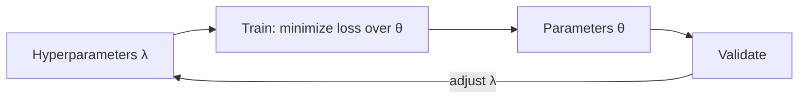

# Models, Parameters, and Hyperparameters

## Beginner-Friendly Intuition

A model is a function with knobs. The knobs that learning adjusts based on data are parameters. The knobs you set before training are hyperparameters. Parameters are large in number and learned. Hyperparameters are few but sensitive: they control how learning happens (learning rate, regularization, tree depth). Wrong hyperparameters can sink a model that is otherwise correct.

## Formal Explanation

Formally, a model is a parametric family of functions `f_θ(x)`. Training picks `θ` to minimize a loss on the training data. Hyperparameters `λ` are not optimized by gradient descent but chosen by validation: you train multiple models with different `λ`, pick the one with the best validation loss, and refit. Common hyperparameters: learning rate, batch size, regularization strength, tree depth, number of layers, dropout rate.

## Why It Matters in Real Jobs

On the job, hyperparameter tuning is half the work. A logistic regression with the wrong regularization can underperform a tuned tree by 10 points. Engineers who know which knobs matter and how to search efficiently save weeks of training time.

## How It Works Step by Step

1. List the hyperparameters and their plausible ranges (log scale for learning rate, regularization).
2. Use a fast search first: grid for small spaces, random for medium, Bayesian or population-based for large.
3. Always evaluate on the validation set, not the training set.
4. Track each run: hyperparameters, data version, code version, validation metric.
5. Refit the chosen configuration on train+validation, then evaluate once on the test set.

## Real-World Example

A team runs a default XGBoost on a fraud dataset and gets 0.78 AUC. They run 50 random configurations of `max_depth`, `learning_rate`, `subsample`, `reg_lambda`, and `n_estimators` over 3-fold CV. The best configuration reaches 0.85 AUC. The improvement came not from a new model but from tuning.

## Common Mistakes

- Tuning on the test set, then quoting that number as generalization.
- Searching too narrow a range and missing the optimum.
- Forgetting to fix the random seed or the data version, so runs are not reproducible.
- Tuning hyperparameters one at a time when they interact (learning rate and batch size).
- Pouring compute into tuning a weak model family instead of trying a stronger one.

## Interview Angle

**Question:** Explain the difference between parameters and hyperparameters and how you would tune a real model.

**Strong answer:** Parameters are learned; hyperparameters are configured. Tune by validation, not test. Use random search or Bayesian optimization for big spaces. Track every run. Refit the best configuration on train+validation before reporting on test.

**Weak answer:** Treat all knobs as 'parameters', tune on the test set, or rely solely on default values.

**Follow-up questions:**

- Why is random search often better than grid search?
- When would you use Bayesian optimization?
- How do you handle hyperparameter tuning when training is expensive?
- What is early stopping doing in this picture?

## Mini Exercise

Pick a model you have used. List 5 hyperparameters, give plausible ranges, and rank them by sensitivity. Justify the ranking.

## Diagram

---
## Navigation

[⬅ Previous](06-features-labels-datasets.md) | [🏠 Home](../README.md) | [➡ Next](08-loss-functions-and-optimization.md)
