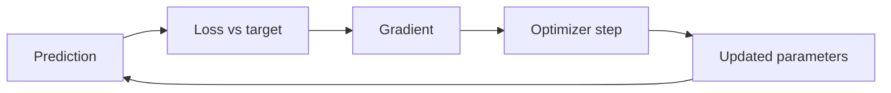

# Loss Functions and Optimization

## Beginner-Friendly Intuition

A loss function tells the model how wrong it is on each example. Optimization is the process that changes the model to make the loss smaller. Pick the wrong loss and you optimize the wrong thing. Pick the wrong optimizer or learning rate and the model will not train at all. These two pieces, the loss and the optimizer, decide whether learning works.

## Formal Explanation

Common losses match common tasks:

- **Regression:** mean squared error (sensitive to outliers), mean absolute error (robust), Huber (a smooth blend).
- **Binary classification:** binary cross-entropy (log loss).
- **Multiclass classification:** softmax cross-entropy.
- **Ranking and retrieval:** pairwise hinge, listwise NDCG-based, contrastive loss.

Optimization typically uses gradient descent variants: SGD with momentum, Adam, AdamW. The learning rate schedule, batch size, and weight decay are the most important knobs. For convex losses there is one global minimum; for deep networks there are many local minima but they are usually close in quality.

## Why It Matters in Real Jobs

Loss design directly encodes what the system rewards. Cross-entropy for a calibrated classifier, MSE for a regressor that should care equally about all errors, weighted loss when one class is rarer or more costly. Engineers who match the loss to the cost of mistakes ship better systems than those who default to whatever the framework picks.

## How It Works Step by Step

1. State the cost of each kind of mistake from the product perspective.
2. Pick a loss that aligns with that cost (asymmetric loss for asymmetric mistakes).
3. Pick an optimizer: Adam/AdamW for most deep models, SGD with momentum when stability matters.
4. Pick a learning rate via warmup and a schedule (cosine, step) when training large models.
5. Watch the training loss curve: if it plateaus too early, lower the LR or change the schedule.
6. Compare loss to a real metric on validation: a lower loss should mean a better metric.

## Real-World Example

A team trains a fraud classifier with default cross-entropy. The class is 1 percent positive. The model converges to predicting negative for everyone, hitting 99 percent accuracy and a recall of 0.04 at the default 0.5 threshold. Switching to a class-weighted loss (`pos_weight = 99`) and tuning the threshold to 0.05 raises recall to 0.31 at precision 0.6. Switching further to focal loss `FL = -alpha (1 - p)^gamma log(p)` with `alpha = 0.25, gamma = 2` raises recall to 0.43 at the same precision. The `(1 - p)^gamma` factor reduces the loss contribution from easy examples (where p is close to 1 for true negatives or close to the right answer in general) and lets the optimizer spend gradient on hard, often minority-class, examples. The intuition: cross-entropy spends most of its gradient on the easy majority-class examples even when those are already classified well; focal loss reweights so the rare hard cases drive the update.

## Decoupled Weight Decay (AdamW vs Adam)

Standard L2 regularization adds `lambda * w` to the gradient before the optimizer step. With Adam, the adaptive per-parameter learning rate effectively rescales this penalty, so weights with large historical gradients get less regularization than weights with small gradients. That is rarely what you want; the penalty becomes data-dependent in a strange way. **AdamW** decouples weight decay: it applies `w <- w - eta * lambda * w` as a separate step after the Adam update, so the decay is uniform across parameters and independent of the gradient history. In practice, AdamW with a tuned weight decay (often around 0.01 to 0.1 for transformers) generalizes meaningfully better than Adam with the same nominal `lambda`. If you are training a transformer or a large vision model and reaching for L2, use AdamW.

## Common Mistakes

- Using MSE for a classification problem.
- Using accuracy as a loss (it is a metric, not a loss).
- Forgetting that the optimizer's default learning rate may be wrong for your model size.
- Ignoring the relationship between batch size and effective learning rate.
- Optimizing a loss that is far from the metric you actually care about.

## Interview Angle

**Question:** Walk through choosing a loss and optimizer for a new ML problem.

**Strong answer:** Start with the cost of mistakes. Map that cost to a differentiable loss. Pick an optimizer that suits the model family (Adam for deep, L-BFGS for small convex). Choose a learning rate via a short warmup or a learning rate finder. Validate that lower loss really does mean a better business metric.

**Weak answer:** Default to cross-entropy and Adam without thinking about the cost of errors or the data shape.

**Follow-up questions:**

- When would you use focal loss or label smoothing?
- Why does learning rate often matter more than the optimizer choice?
- How does weight decay differ from L2 regularization in Adam vs AdamW?
- How do you debug a loss curve that is not decreasing?

## Mini Exercise

Pick a regression and a classification problem. For each, write the loss you would use and one alternative, with one sentence on when the alternative would be better.

## Diagram

---
## Navigation

[⬅ Previous](07-models-parameters-hyperparameters.md) | [🏠 Home](../README.md) | [➡ Next](09-generalization.md)
