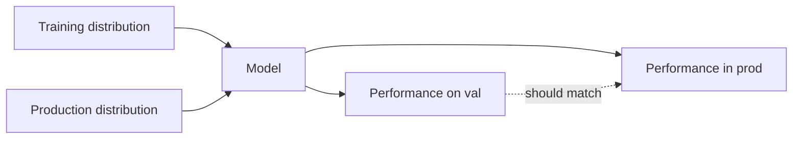

# Generalization

## Beginner-Friendly Intuition

Generalization is the model's ability to perform on data it has not seen. Memorizing the training set is easy; doing well on new data is the whole point. Generalization comes from a combination of enough data, the right model capacity, regularization, and a training process that does not just chase the training loss.

## Formal Explanation

Statistical learning theory gives a bound on the gap between training error and true error that depends on the model's complexity (VC dimension, Rademacher complexity) and the size of the training set. In practice the bounds are loose for deep models, so we rely on empirical generalization: validation and test error. Modern deep learning generalizes despite huge capacity because of implicit regularization, large data, and architectural priors.

**Implicit regularization** is the part of generalization that does not come from a penalty term in the loss. Three sources matter. First, SGD: the gradient noise from mini-batching biases the optimizer toward flat minima, which empirically generalize better than sharp minima. Second, initialization: small initial weights keep the network close to a near-linear regime early in training, and the learning trajectory itself is biased toward simple solutions. Third, architectural priors: convolutions encode translation equivariance, attention encodes permutation invariance over tokens, and these priors mean the effective hypothesis space is much smaller than the parameter count suggests. None of these are visible in the loss function, but they shape what the model learns.

## Why It Matters in Real Jobs

Every product decision rides on generalization. A model that is great offline and bad in production has a generalization problem, often caused by distribution shift, leakage, or overfitting. Building generalizable models is the core skill that separates research notebooks from shipped systems.

## How It Works Step by Step

1. Use a held-out test set that you do not touch during development.
2. Match the validation set to production traffic in time, segment, and source.
3. Use regularization sized to the data: more regularization for smaller datasets.
4. Use ensembling to reduce variance when capacity is high and data is limited.
5. Track production performance over time; generalization can fade as the world drifts.

## Real-World Example

A vision team trains an object detector on daytime urban images and evaluates on the same kind of images. It hits 0.9 mAP. Deployed on a customer with night cameras, it drops to 0.55 mAP. The model generalized within its training distribution but not across it. The proximate cause: training images had high contrast and warm color, while night cameras have low contrast, IR illumination, and a green or grey color cast. The model learned features that depended on the daytime statistics. The fix is to expand the training data to cover the deployment distribution (collect or synthesize night images, add lighting augmentation, mix grayscale crops), and to monitor performance per camera and per time of day so the next regression is caught early rather than after a customer escalation.

## Pre-Deployment Drift Detection Checklist

Before launching a model, run these checks to catch the obvious shifts:

- **Population statistics.** Compute mean, std, and quantiles for every numeric feature on a recent production sample and compare to training. Flag features where the production mean has moved more than 2 training standard deviations.
- **Population Stability Index (PSI).** For each feature, bin the training distribution and compare the production distribution. PSI under 0.1 is stable, 0.1 to 0.25 is some shift, above 0.25 is large shift worth investigating.
- **Categorical drift.** Check for new categories not seen in training and large changes in category proportions.
- **Target drift proxy.** When labels are not yet available in production, monitor a leading proxy (e.g., click rate as a proxy for purchase) and compare to the training-time relationship.
- **Per-segment metric.** Compute the validation metric on the segments most likely to differ in production (new geography, new device, new product). A model that holds up overall but breaks on the segment you actually launch into is the most common production failure.

## Common Mistakes

- Confusing low validation error with generalization to a different domain.
- Repeatedly tuning on the test set, which silently destroys the generalization estimate.
- Ignoring how production data differs from training data.
- Treating dataset size as the only fix for generalization (often features and labels matter more).
- Reporting one number instead of slicing by segment or time.

## Interview Angle

**Question:** How do you build models that generalize, and how do you detect when generalization is failing?

**Strong answer:** Build models with regularization and validation that mirrors production. Detect failure by slicing performance by segment, time, and source, and by monitoring drift in production. When generalization fails, look at distribution shift, leakage, and label drift before changing the model.

**Weak answer:** Equate low test loss with generalization or assume more parameters always generalize better.

**Follow-up questions:**

- Why do deep networks generalize despite huge capacity?
- How does data augmentation help generalization?
- What is the difference between covariate shift and concept drift?
- How do you decide the size of the test set?

## Mini Exercise

Pick a model you trained. Identify three ways production data could differ from training data and which one you can monitor in production.

## Diagram

---
## Navigation

[⬅ Previous](08-loss-functions-and-optimization.md) | [🏠 Home](../README.md) | [➡ Next](10-end-to-end-ml-workflow.md)
