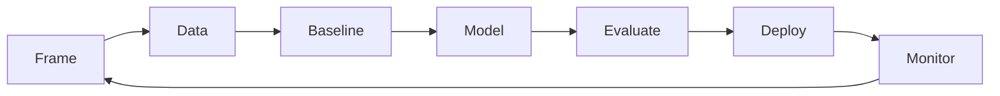

# End-to-End ML Workflow

## Beginner-Friendly Intuition

An ML project is more than a model. It is framing, data, baselines, training, evaluation, deployment, monitoring, and iteration. The model itself is often the smallest piece. A solid end-to-end workflow is what separates a notebook from a system.

## Formal Explanation

A reasonable workflow:

1. **Frame.** User, decision, cost of mistakes, constraints, success metric.
2. **Data.** Source, schema, freshness, splits, labels, leakage check.
3. **Baseline.** Rule or simple model that sets the bar.
4. **Model.** Try a few candidates, tune, evaluate honestly.
5. **Evaluate.** Metrics, slices, error analysis, calibration, robustness.
6. **Deploy.** Shadow mode, then canary, then A/B test with rollback ready.
7. **Monitor.** Inputs, outputs, latency, cost, business outcomes.
8. **Iterate.** Feed errors back into data, features, or model.

## Why It Matters in Real Jobs

Senior engineers are paid for steps 1, 2, 5, 6, 7, 8. The model code is often the easy part. Whoever can drive the full loop is who ships value. Interviewers ask about the workflow to test whether you understand that ML is a system.

## How It Works Step by Step

1. Write a one-pager with the user, decision, data, baseline, metric, and risks.
2. Build a baseline before any modeling. Lock its number.
3. Iterate on a small model and a tiny dataset to debug fast.
4. Scale up only when the small experiment beats the baseline.
5. Plan deployment from day one: monitoring, fallback, rollback.
6. Set up a feedback loop so production errors flow back into training data.

## Real-World Example

A team building a search ranker spends one week framing, three weeks on data and labels, two weeks on a baseline (BM25), three weeks on a learned ranker, two weeks on evaluation and slicing, and two weeks on deployment with shadow + A/B. The model code is two hundred lines. The data, evaluation, and deployment code is many thousands. That ratio is normal.

## Common Mistakes

- Skipping framing and jumping into code.
- Building no baseline, so improvements have nothing to compare against.
- Treating deployment as an afterthought.
- No monitoring, so silent regressions go undetected.
- No feedback loop, so the system never improves after launch.

## Interview Angle

**Question:** Walk me through how you would build an ML system end to end for a problem of your choice.

**Strong answer:** Pick a concrete problem. Walk through framing, data, baseline, modeling, evaluation, deployment, and monitoring. Mention the cost of errors, the metric, and the rollback plan. Keep the model story short and the system story long.

**Weak answer:** Spend the whole answer on model architecture and ignore data, evaluation, and deployment.

**Follow-up questions:**

- What would the rollback plan look like?
- How would you evaluate before going live?
- What signals would tell you the model is degrading in production?
- Where would you instrument the system to debug a bad output?

## Mini Exercise

Pick a project you would build. Write a one-page workflow with all eight steps. Highlight which step is riskiest and how you would de-risk it.

## Diagram

---
## Navigation

[⬅ Previous](09-generalization.md) | [🏠 Home](../README.md) | [➡ Next](../math/01-why-math-matters-for-ml.md)
