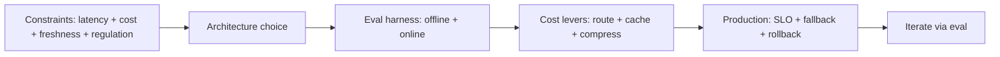

# AI Engineer Roadmap

## How to Use This File

Use this file to practice three core AI-engineering interview
questions: capability and architecture choice, evaluation harness
design, and cost-quality-latency tradeoffs in production. Read
each question, answer out loud for 2-3 minutes, then compare with
the strong and weak patterns. The senior signal is naming
specific tradeoffs and failure modes, not naming model families.

## Core Preparation Checklist

- Know the capability tiers: small open-weights, mid-tier hosted,
  frontier hosted, and the cost-per-call ratio between them.
- Build an eval harness with a regression suite before iterating
  on prompts, models, or retrieval.
- Name specific cost levers: cascade routing, semantic caching,
  prefix caching, structured outputs, prompt compression.
- Know the OWASP LLM Top 10: prompt injection (direct and
  indirect), excessive agency, sensitive disclosure, supply chain.
- Practice the offline-online gap diagnostic: when offline metrics
  do not match business KPIs, what do you check first?
- Have one production failure story you can tell in two minutes,
  with the root cause and the systemic fix.

## Interview Question Sections

### Question 1: Capability and architecture choice

**Question:** A team wants to build an AI-powered customer-support
deflection feature. Walk through how you would choose between
prompting, RAG, fine-tuning, and agents.

**What the interviewer is testing:** Whether you reach for
complexity by default or match the architecture to the actual
constraints (cost, latency, freshness, control).

**Strong answer:** Start with the constraint set: latency budget,
cost ceiling, freshness of source-of-truth, regulated content,
volume. Single-call prompting is the cheapest baseline; reach for
RAG when answers must be grounded in company-specific knowledge
that updates faster than fine-tuning cycles; fine-tune only when
the task style is hard to specify in prompt and worth the
operational overhead; consider agents only when the task path is
genuinely multi-step with tool use, not for a single
classification or generation task. Default to the simplest
sufficient option; raise complexity only when measured benefit
justifies it.

**Weak answer:** Pick agents because they sound advanced. Skip
the constraint analysis. Skip the baseline. Propose fine-tuning
without comparing against in-context options.

**Follow-up questions:**

- What is the latency budget for a chat-style support feature, and
  which architecture fits within it?
- How do you decide between RAG and fine-tuning when the corpus
  updates daily?
- When would you not use an agent even if the task seems
  multi-step?
- How do you measure whether the chosen architecture is the right
  one six months in?

**Common traps:** Defaulting to agents or fine-tuning. Ignoring
the cost-per-call. Treating "freshness" as binary (it is on a
spectrum). Forgetting that single-call prompting plus a small
classifier is often the right answer.

### Question 2: Evaluation harness for an LLM feature

**Question:** Design the evaluation pipeline for an LLM-powered
feature that is going to production.

**Strong answer:** Build a versioned eval set of 200-500
representative inputs with reference answers or rubrics; cover
common cases, hard cases, and adversarial cases. Pick metrics
matched to the task: faithfulness for RAG, exact match for
extraction, code-pass-rate for code, calibrated LLM-as-judge for
open-ended generation. Wire the eval into CI so every PR runs it;
gate merges on regression criteria (hard gate on critical
metrics, soft gate on non-critical). Hard-example regression
suite catches old failures. Online metrics (thumbs-up rate, edit
rate, retention) validate that offline gains transfer. LLM-judge
must be calibrated against humans on a sample; bias audited
(length, position, self-preference); recalibrated on judge model
upgrade. The eval harness is more valuable than any single
prompt; the team that owns it ships safely.

**Weak answer:** Spot-check 10 examples. No regression suite. No
gating. Single metric. No correlation with online behavior.

**Follow-up questions:**

- What is the difference between offline and online eval, and
  when do they disagree?
- How do you calibrate an LLM-as-judge against humans?
- How would you structure a regression suite for a chat assistant?
- When would you intentionally accept an offline regression?

**Common traps:** Eval set too small (under 50). Single metric
masking trade-offs. LLM-judge uncalibrated. No hard-example
suite. Eval set never updated, becomes stale.

### Question 3: Cost-quality-latency tradeoffs

**Question:** Your AI feature costs $0.50 per request and the CFO
wants it under $0.10. Walk through the optimization plan without
sacrificing user-facing quality.

**Strong answer:** Inventory cost first: input tokens, output
tokens, retrieval cost, reranker cost, multi-step orchestration.
Apply the standard levers in order: cascade routing (cheap model
first, escalate on uncertainty signals), semantic plus prefix
caching with ACL-aware keys, prompt compression (shorter system
prompt, structured output to remove explanation tokens), batch at
the GPU boundary, smaller model where the eval shows it works.
Each lever has a quality risk; gate every change with the eval
harness. Track cost per resolved task as the unit metric.
Realistic outcome: 5-10x reduction with limited quality loss when
the routing signal is calibrated and the cache hit rate is
high.

**Weak answer:** "Use a smaller model." No measurement. No
fallback for tasks the small model fails on. No caching strategy.

**Follow-up questions:**

- What is cascade routing and how do you calibrate the routing
  signal?
- What is the difference between exact-match cache, semantic
  cache, and prefix cache?
- How do you keep the cost low without breaking the SLO?
- Where does ACL belong in a cache key?

**Common traps:** Optimizing one lever, ignoring quality. Caching
without ACL (cross-tenant leak). Routing without calibration
(quality regression). Compressing prompts past the point where
they break.

## Sample Q and A

**Q:** When would you not use RAG?

**A:** When the answer can be computed from the user's message
alone (no corpus dependency), when latency budget cannot absorb
retrieval, when the corpus is small enough that the relevant
content fits in context directly, or when the regulatory regime
forbids storing the corpus where the retriever can reach it.
Single-call prompting plus a tightly-scoped system prompt is
often the right answer; RAG adds value when grounding in
external, updating knowledge is the requirement.

## Mini Exercise

Pick an AI feature you have used. Estimate its cost per request
(input tokens times input price plus output tokens times output
price). Identify the largest line item. Propose one cost lever
that would cut it in half and one risk that lever introduces.

## Diagram

---
## Navigation

[⬅ Previous](../case-studies/20-ai-agent-for-workflows.md) | [🏠 Home](../README.md) | [➡ Next](02-ml-engineer-roadmap.md)
