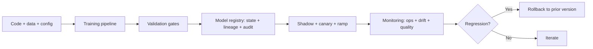

# ML Engineer Roadmap

## How to Use This File

Use this file to practice three core ML-engineering interview
questions: pipeline reproducibility, deployment strategy, and
drift handling in production. Read each question, answer for 2-3
minutes, then compare with the strong and weak patterns. The
senior signal is naming concrete artifacts (registry entries,
gate criteria, runbook steps), not concepts in the abstract.

## Core Preparation Checklist

- Know what to version: code, data snapshot, training config,
  environment, random seeds, and the link from each artifact to
  the trained model.
- Know the deployment ladder: dev, shadow, canary 1-5 percent,
  ramp, full rollout, with hard rollback at every gate.
- Know drift types and tests: data drift (PSI, KS), prediction
  drift (distribution shift on outputs), concept drift (label-
  relationship change), and the proxies for slow-label tasks.
- Know feature store fundamentals: offline plus online stores,
  point-in-time correctness, the training-serving skew problem
  it solves.
- Know the SR 11-7 three-lines-of-defense (builders, validators,
  audit) for regulated ML.
- Have one production drift story ready, with the specific
  metric, the runbook step that caught it, and the recovery time.

## Interview Question Sections

### Question 1: Reproducibility for ML systems

**Question:** A regulator asks how a credit-scoring model was
trained 18 months ago. Walk through what your team must produce
and how you would design the system so the answer takes hours,
not months.

**What the interviewer is testing:** Whether you understand that
ML reproducibility is engineering discipline, not just code
hygiene.

**Strong answer:** Reproducibility requires pinning code (commit
hash), data (immutable snapshot ID), training config
(hyperparameters, random seeds, environment), and the link from
the trained model artifact to those inputs. The model registry
is the single source of truth: every state transition (training,
validation, staging, canary, production, deprecated, retired) is
recorded with timestamps and approvers. Audit logs retain every
training event, evaluation, deployment, and prediction (sampled
if necessary) for the regulatory window (typically 7 years for
financial). When the regulator asks, the team produces a
versioned model card, the validation report from independent
review, monitoring records, and the change log. Building this
later is a 6-12 month project; building it in is days of
discipline at the start.

**Weak answer:** "Code is in git." Ignores data, config,
environment, and the lineage link. No registry, no audit log, no
validation evidence. Months of forensic work when the audit
arrives.

**Follow-up questions:**

- What goes in a model card versus a validation report?
- How do you reproduce a model when the upstream library version
  changed?
- What is independent validation under SR 11-7 and why is it
  required?
- How does feature lineage support audit?

**Common traps:** Versioning code only. No audit log on
governance events. Builder validating own work. No retirement
process for old models.

### Question 2: Deployment strategy for a trained model

**Question:** You have a new model that beats the production
model by 2 points on the offline eval. How do you deploy it
without breaking production?

**Strong answer:** Stage the rollout. Validation gates first:
hard gate on regression of critical metric, soft gate on
non-critical changes. Shadow mode in production: the new model
serves real traffic alongside the current one without exposing
users; metrics are compared on the live distribution for 24-48
hours. Canary at 1-5 percent for 24-48 hours with auto-rollback
on guardrail breach (latency p99, error rate, cost per request,
quality metric). Ramp to 25, 50, 100 percent over days,
monitoring per-segment metrics. Old version retained for 30 days
minimum so rollback is a feature-flag flip. Each gate has named
owners and documented criteria; rollback is rehearsed quarterly
so the path does not bit-rot.

**Weak answer:** Ship it directly. Or ship to 100 percent after
shadow. Or no rollback path. Or no per-segment monitoring.

**Follow-up questions:**

- Why is shadow mode separate from canary?
- What auto-rollback triggers would you set?
- How do you handle a regression that only shows on a 2-percent
  segment?
- What is the difference between blue-green and canary?

**Common traps:** Skipping shadow. Canary too short. No
per-segment monitoring. Old version deleted before the rollback
window ends.

### Question 3: Drift handling in production

**Question:** Your fraud model has been quietly degrading for
three weeks. Walk through how a well-instrumented team would
have caught it within days, and the runbook for the response.

**Strong answer:** Three monitoring layers. Operational (latency,
error rate, throughput) catches infrastructure issues, not
quality. Drift (PSI per feature daily on a sample, KS on
predictions, concept-drift proxies like confidence shift and
agreement with a reference model) catches silent degradation
between training data and production. Quality (accuracy on a
labeled stream when labels arrive, business metrics like fraud
loss prevented and chargeback rate) catches what users feel.
Compound alerts (drift plus prediction shift plus business move)
page the on-call; single-signal alerts go to a dashboard. Runbook
walks the diagnostic: feature drift, upstream pipeline change,
partner data change, real-world shift. Recovery options: pipeline
fix, retrain on fresh data, rollback to a prior model. Postmortem
captures the gap so the next slow drift gets caught earlier.
Without the drift layer, three-week degradation is normal; with
it, three days is the SLA.

**Weak answer:** "Monitor accuracy." No drift detection. No
runbook. Discover the issue from finance complaints.

**Follow-up questions:**

- What is PSI and how do you calibrate the threshold?
- How do you detect concept drift when fraud labels arrive
  weeks late?
- How do you avoid alert fatigue?
- What is the difference between data drift and concept drift in
  remediation?

**Common traps:** Operational monitoring only. PSI threshold
copied without calibration. No proxy for slow labels. No
runbook, so every alert is an investigation.

## Sample Q and A

**Q:** What is training-serving skew and how do you prevent it?

**A:** Training-serving skew is when the same logical feature is
computed differently in training and inference, so the model
sees different distributions than it learned on. The fix is a
feature store with a single feature definition that materializes
to both an offline store (point-in-time correct, for training)
and an online store (low-latency, for serving). Both paths use
the same code. Per-feature drift monitoring catches divergence
when it slips through. The most common cause is two pipelines
(one Python notebook for training, one production service for
serving) that drift apart over time.

## Mini Exercise

Pick an ML system you know. Sketch its CI/CD pipeline: data
tests, model tests, integration tests, validation gates, shadow,
canary, ramp, rollback. Identify the weakest link.

## Diagram

---
## Navigation

[⬅ Previous](01-ai-engineer-roadmap.md) | [🏠 Home](../README.md) | [➡ Next](03-llm-engineer-roadmap.md)
