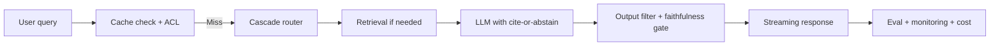

# LLM Engineer Roadmap

## How to Use This File

Three core LLM-engineering interview questions: tokens and
context economics, the prompt-vs-RAG-vs-fine-tune choice, and
hallucination handling. Read each question, answer for 2-3
minutes, then compare patterns. Strong answers name specific
costs, latencies, and failure modes; weak answers name model
families.

## Core Preparation Checklist

- Know the token economics: 1 token is roughly 0.75 English
  words; input vs output prices typically differ by 3-5x;
  context cost scales linearly per token.
- Know the context-window tradeoff: longer context costs more
  per call, dilutes attention, and increases TTFT; KV cache
  memory dominates at long sequences.
- Know decoding parameters: temperature, top-p, top-k, beam
  width, and when each fits.
- Know the prompt vs RAG vs fine-tune decision tree by
  knowledge freshness, customization depth, latency, and
  governance.
- Know structured outputs (JSON Schema, Pydantic) and why they
  matter for production reliability.
- Know prompt injection, both direct and indirect, and the
  defense layers.
- Have one cost-optimization story ready: where the spend was,
  what lever you pulled, what quality tradeoff you accepted.

## Interview Question Sections

### Question 1: Tokens, context, and cost

**Question:** Your team is deploying an LLM-powered feature on a
million-call-per-day workload. Walk through the cost model and
the levers you would pull to keep it under budget without
compromising quality.

**What the interviewer is testing:** Whether you can reason
about LLM economics quantitatively, not in vague terms.

**Strong answer:** Cost equals input tokens times input price
plus output tokens times output price, multiplied by traffic.
At a million calls per day with a 2K context and 500-token
output at typical 2026 frontier prices, the bill is in the
five-figure-per-day range. Levers, in order of leverage:
cascade routing (cheap model for easy queries, escalate to
strong for hard ones; calibrate the routing classifier on real
traffic; typical 5-10x cost reduction); semantic and prefix
caching (embedding-keyed for paraphrases, prefix-keyed for
shared system prompts; ACL-aware keys to prevent cross-tenant
leak); structured output to remove explanation tokens;
prompt-compression (shorter system prompt, retrieved context
trimmed by reranker); model size matched to task (do not pay
for frontier when mid-tier passes the eval). Each lever has a
quality risk; gate every change with the eval harness.

**Weak answer:** "Use a smaller model." No measurement, no
fallback, no caching, no calibration.

**Follow-up questions:**

- What is the difference between TTFT and full-response latency,
  and which matters more for streaming UI?
- How does KV cache memory limit your context-window choice?
- How do you calibrate a cascade router?
- Where does ACL belong in a cache key for a multi-tenant
  product?

**Common traps:** Caching without ACL. Routing without
calibration. Compressing prompts past the eval threshold.
Optimizing one lever and ignoring the others.

### Question 2: Prompt vs RAG vs fine-tune

**Question:** A team wants the model to answer questions about
their internal documentation that updates weekly. Walk through
the architecture choice.

**Strong answer:** Single-call prompting is insufficient: the
model has no access to internal documentation. Fine-tuning is
overkill: weekly updates would mean weekly fine-tunes, with
operational overhead, evaluation cost, and lag. RAG is the fit:
a retrieval index over the documentation, refreshed on update,
plus an LLM that grounds its answers in retrieved chunks with
citations and abstains when evidence is weak. Architecture:
chunking with overlap, hybrid retrieval (BM25 plus dense),
reranker on top-N, ACL filtering, generation with cite-or-
abstain contract, faithfulness eval. Fine-tuning enters only
when the task style (tone, format, structured extraction) is
hard to specify in prompt and worth the operational cost.

**Weak answer:** Fine-tune the model on the documentation. Or
single-call prompting and hope. Or agent because it sounds
advanced.

**Follow-up questions:**

- What chunk size and overlap would you start with, and how do
  you tune them?
- How do you handle documents with permissions (ACL) in the
  retrieval index?
- When is fine-tuning genuinely the right answer?
- What metric tells you the RAG system is working?

**Common traps:** Defaulting to fine-tuning. Skipping the
retrieval-quality eval. Ignoring ACL. No cite-or-abstain
contract.

### Question 3: Hallucination handling

**Question:** Your LLM-powered assistant is occasionally
confident and wrong. Walk through the systems response.

**Strong answer:** Hallucination is a systems problem. Layers:
grounding via retrieval; cite-or-abstain contract that requires
the model to cite sources or refuse; faithfulness eval (each
claim supported by retrieved evidence) calibrated against
humans; output filter for known failure patterns; human review
for low-confidence high-stakes outputs. Eval the contract: when
evidence is weak, abstain rate should be high; when evidence is
strong, faithfulness should be high. Operational monitoring on
abstention rate per segment, faithfulness drift, complaint
rate. Bigger model alone does not fix this; the systems
architecture does.

**Weak answer:** "Use a bigger model." Or "lower the
temperature." No eval, no abstention, no monitoring.

**Follow-up questions:**

- What is faithfulness and how do you measure it?
- When should the model abstain instead of generate?
- How do you calibrate an LLM judge against humans?
- What does an abstention-rate dashboard look like?

**Common traps:** Treating hallucination as a model limitation.
No abstention rule. No faithfulness eval. Lowering temperature
and calling it solved.

## Sample Q and A

**Q:** What is the single most-overlooked production risk in
LLM systems?

**A:** Indirect prompt injection. Direct injection (the user
typing "ignore all previous instructions") gets attention and
defenses. Indirect injection (a retrieved document, web page,
or email containing instructions the model treats as a command)
is harder to defend because it looks like normal content. The
defense pattern is content tagging (treat retrieved content as
data, not instructions), output filtering, and assuming all
external content may be hostile. Any system that ingests
untrusted content (RAG, web search, agent tool outputs) is
exposed.

## Mini Exercise

Pick an LLM feature you have used. Estimate cost per request,
identify the largest line item, and propose one cost lever
plus one quality risk it introduces. Identify one prompt-
injection pathway that the system must defend against.

## Diagram

---
## Navigation

[⬅ Previous](02-ml-engineer-roadmap.md) | [🏠 Home](../README.md) | [➡ Next](04-data-scientist-roadmap.md)
