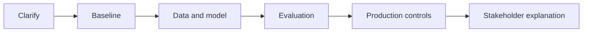

# LLM Engineer Roadmap

## How to Use This File

Use this page to practice structured interview answers for prompting, RAG, fine-tuning choices, evaluation, serving cost, and guardrails. Read each question, answer out
loud, then compare your response with the strong and weak answer patterns. Keep answers concrete:
name the user, data, baseline, metric, failure mode, and production plan.

## Core Preparation Checklist

- Clarify the role, user, decision, and constraints before naming a model.
- State assumptions about data availability, labels, latency, privacy, and cost.
- Start with a simple baseline and explain why added complexity is justified.
- Choose metrics that match the product decision and the cost of mistakes.
- Discuss leakage, drift, monitoring, rollback, and human review.
- Communicate tradeoffs in plain language and connect them to user impact.

## Interview Question Sections

### Question 1: Problem Framing and Baseline

**Question:** You are asked to design or analyze a solution involving prompting, RAG, fine-tuning choices, evaluation, serving cost, and guardrails. What would you clarify
first, and what baseline would you build before using a more complex approach?

**What the interviewer is testing:** Whether you can turn an ambiguous prompt into a measurable
engineering problem without hiding behind model names.

**Strong answer:** Clarify the user decision, available data, label or feedback source, constraints,
and failure cost. Propose a baseline that can be evaluated quickly, then state what evidence would
justify a more advanced model or architecture.

**Weak answer:** Jump straight to a model, skip the baseline, ignore data quality, and never define
how success will be measured.

**Follow-up questions:**

- What data would be available only after the decision is made?
- Which simple baseline would be hardest to beat?
- What metric would be misleading if used alone?

**Common traps:** Optimizing the offline metric without understanding the product decision, assuming
labels are clean, and ignoring high-risk segments.

### Question 2: Evaluation and Failure Modes

**Question:** How would you evaluate a system for prompting, RAG, fine-tuning choices, evaluation, serving cost, and guardrails, and how would you explain its most
important failure modes?

**What the interviewer is testing:** Whether you can connect metrics, error analysis, guardrails, and
production risk.

**Strong answer:** Define a primary metric, guardrail metrics, slice analysis, and a hard-example
set. Explain false positives, false negatives, latency or cost failures, privacy risks, and what
human review should handle.

**Weak answer:** Report one aggregate score and treat it as proof that the system is ready.

**Follow-up questions:**

- How would you detect a regression after release?
- Which segment would you inspect first?
- What would make the evaluation set untrustworthy?

**Common traps:** Confusing correlation with impact, overlooking delayed labels, and failing to
calibrate confidence.

### Question 3: Production Design and Communication

**Question:** How would you move a solution for prompting, RAG, fine-tuning choices, evaluation, serving cost, and guardrails from prototype to production, and how would
you explain the tradeoffs to a non-technical stakeholder?

**What the interviewer is testing:** Whether you understand ownership after launch.

**Strong answer:** Separate offline and online paths, version data and models, add monitoring and
rollback, define escalation, and explain tradeoffs between quality, latency, cost, privacy, and user
trust.

**Weak answer:** Stop at a notebook result or architecture sketch without deployment, monitoring, or
support plans.

**Follow-up questions:**

- What should be logged and what should not be logged?
- What happens when confidence is low?
- How would you roll back a bad release?

**Common traps:** Forgetting operational ownership, treating model output as always safe, and
communicating metrics without business context.

## Mini Exercise

Pick one project from this repository and give a five-minute answer using this structure: clarify,
baseline, data, metric, failure modes, production plan, and tradeoff summary. Rewrite the weakest
part until it is specific enough to defend.

## Diagram

---
## Navigation

[⬅ Previous](02-ml-engineer-roadmap.md) | [🏠 Home](../README.md) | [➡ Next](04-data-scientist-roadmap.md)
