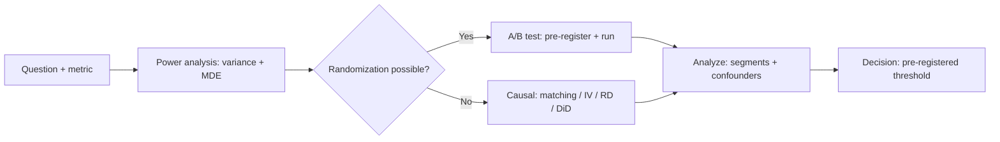

# Data Scientist Roadmap

## How to Use This File

Three core data-science interview questions: experiment design,
causal inference from observational data, and metric selection.
Read each, answer for 2-3 minutes, then compare with the
patterns. Strong answers name specific tests, confounders, and
power calculations; weak answers stop at "run an A/B test".

## Core Preparation Checklist

- Know the difference between p-value, confidence interval, and
  Bayesian credible interval, and what each does and does not
  claim.
- Know power analysis: variance, MDE, alpha, beta determine
  sample size; under-powered tests produce inconclusive
  results.
- Know multiple-testing correction (Bonferroni for strict
  control, Benjamini-Hochberg for FDR) and when each fits.
- Know causal inference toolkit: randomization, instrumental
  variables, regression discontinuity, propensity scores, DAGs.
- Know Simpson's paradox and one example you can reason about
  on the spot.
- Know peeking, novelty effects, and network interference as
  A/B-test threats.
- Have one experiment story ready with the metric, the MDE, the
  result, and what surprised you.

## Interview Question Sections

### Question 1: A/B test design

**Question:** A product team wants to test a UI change. They
have 100K daily active users and want to know if the change
improves a 12-percent conversion rate. Design the test.

**What the interviewer is testing:** Whether you can do a
power calculation and reason about variance, MDE, and
confounders.

**Strong answer:** Define the metric (conversion rate, daily
or per session). Pick a minimum detectable effect grounded in
business value: a 0.5-percentage-point lift on a 12-percent
base is roughly a 4-percent relative lift, which is
ambitious but not absurd for a UI change. Pick power and
alpha (typically 0.8 and 0.05). Compute sample size: roughly
20K per arm for these parameters. With 100K DAU and 50/50
split, that takes around half a day for a session-level
metric, longer if user-level. Run for at least one full
weekly cycle to absorb day-of-week effects; longer if
seasonality matters. Pre-register the hypothesis, metric,
threshold, and stopping rule to prevent peeking. Track
guardrails (latency, error rate, complaint rate). Analyze
with the appropriate test (t-test if approximately normal,
bootstrap if heavy-tailed, mixture model if zero-inflated).
Per-segment analysis to catch heterogeneous effects. Decision
based on the pre-registered threshold, not post-hoc reading.

**Weak answer:** Run for two weeks and look at the p-value.
No power calculation, no MDE, no guardrails, no segment
analysis.

**Follow-up questions:**

- What if the metric is heavy-tailed (revenue per user)?
- How would you handle network effects (users in the same
  team see correlated outcomes)?
- What does peeking do to your false-positive rate?
- When would you use a sequential test instead of a fixed-
  horizon test?

**Common traps:** No power calculation. Heavy-tailed metric
analyzed with a t-test. Peeking. Single-segment analysis
hiding heterogeneous effects.

### Question 2: Causal inference from observational data

**Question:** The team cannot randomize a discount program but
wants to estimate its effect on retention. Walk through the
analysis.

**Strong answer:** Without randomization, the burden is to
argue the analysis identifies a causal effect, not just a
correlation. Steps: define the treatment (received discount)
and outcome (retention). Identify confounders (customers who
got the discount may be more engaged to start with). List the
DAG: which variables affect treatment and outcome. Choose a
strategy. Propensity-score matching: model probability of
treatment, match on similar propensity, compare matched
outcomes. Instrumental variables: find a variable that
affects treatment but not outcome directly (eligibility
criteria that are arbitrary). Regression discontinuity:
exploit a threshold (e.g., spend over $50 triggers the
discount). Diff-in-diff: pre/post change versus a comparable
group that did not get the treatment. Each method has
assumptions; document them and stress-test with sensitivity
analysis. Confidence intervals on the effect size.
Communicate clearly: "under these assumptions, the estimated
treatment effect is X with CI Y."

**Weak answer:** Compare retention of users who got the
discount with users who did not. No confounders adjusted.

**Follow-up questions:**

- What is Simpson's paradox and how could it bite this
  analysis?
- How do you check the parallel-trends assumption in
  diff-in-diff?
- When is propensity-score matching unreliable?
- How would you communicate uncertainty to a non-technical
  stakeholder?

**Common traps:** No confounder analysis. Single method, no
robustness check. Treating correlation as causation.
Communicating point estimates without uncertainty.

### Question 3: Metric selection for a feature

**Question:** A feature is launching. Pick the metrics. The
team wants to optimize for "user value."

**Strong answer:** Three tiers. North-star metric: a
long-term outcome the team is accountable for (retention,
revenue per user, time saved). Slow to move. Primary metric:
a faster-moving driver that plausibly causes the north-star
(deflection rate for support, edit rate for code assist,
acceptance rate for copilot). Guardrail metrics: latency, cost,
complaint rate, fairness disparity. A change must improve the
primary without regressing guardrails. Watch for Goodhart's
law: every metric is gameable. Acceptance rate becomes
sycophancy. Deflection rate becomes confident wrong answers.
Mitigate by tracking multiple metrics together, periodic
human eval, and long-term outcome correlation. Per-segment
analysis to catch group-specific regressions. Pre-register
the success threshold. The team that spends time on metric
design ships value; the team that copies vanity metrics
optimizes the wrong thing.

**Weak answer:** "Track accuracy." Or "track engagement." No
guardrails, no segment analysis, no Goodhart-awareness.

**Follow-up questions:**

- What is Goodhart's law and how does it apply here?
- How do you balance primary and guardrails?
- How do you connect a fast proxy to a slow north-star?
- What does a per-segment metric dashboard look like?

**Common traps:** One metric, no guardrails. No correlation
check between proxy and north-star. No segment analysis.

## Sample Q and A

**Q:** What is Simpson's paradox?

**A:** A pattern where an effect appears in subgroups but
reverses in the aggregate (or vice versa) due to a confounder
that differs across subgroups. Classic example: a treatment
that helps both men and women but hurts the overall
population, because the treatment group has a different
gender composition than the control. The fix is identifying
the confounder and analyzing within strata, or fitting a
regression that includes the confounder as a covariate.

## Mini Exercise

Pick a metric you have analyzed. Identify the population, the
unit of randomization (or the missing randomization), the
MDE, the confounders, and one likely Simpson's paradox
pathway. Sketch the analysis plan.

## Diagram

---
## Navigation

[⬅ Previous](03-llm-engineer-roadmap.md) | [🏠 Home](../README.md) | [➡ Next](05-common-ml-interview-questions.md)
