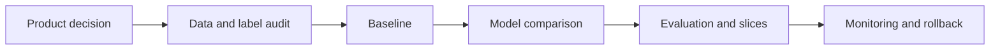

# Common ML Interview Questions

## How to Use This File

Use this page to practice the questions that appear across ML Engineer, AI Engineer, Data Scientist,
and Applied Scientist interviews. Do not answer by naming a model first. For every question, state
the user decision, data available at decision time, baseline, metric, failure mode, and production
control.

Answer out loud before reading the strong answer. Then rewrite your response until it contains one
specific example, one measurable metric, and one reason the simple baseline might be enough.

## Core Preparation Checklist

- Clarify the user, decision, prediction horizon, and cost of a wrong answer.
- Define the label source and whether labels are delayed, noisy, biased, or unavailable.
- Identify leakage risks before choosing features.
- Start with a rule, heuristic, or simple model baseline.
- Choose metrics that match the decision: not just accuracy, but precision, recall, PR-AUC,
  calibration, cost, lift, latency, and guardrails when relevant.
- Inspect errors by segment, time, cohort, geography, device, language, and risk tier.
- Explain monitoring, rollback, human review, and retraining triggers.
- Communicate tradeoffs in product terms rather than metric names alone.

## Interview Question Sections

### Question 1: How do you start an ML problem from an ambiguous product prompt?

**Strong answer:** I first clarify the decision the system will support, who uses the output, what
action changes, and what mistakes cost. Then I define the target variable, prediction horizon, data
available before the decision, label source, and constraints such as latency, privacy, fairness, and
interpretability. I propose a baseline that can be measured quickly, then decide whether more complex
modeling is justified by error analysis.

**Weak answer:** I collect data, train a model, and choose the model with the best accuracy.

**Follow-up questions:**

- What if labels are delayed by weeks?
- What data might leak future information?
- How would your answer change if false positives are more expensive than false negatives?
- What would you build if there is no labeled data yet?

**Common traps:** Skipping the decision, assuming labels are clean, picking accuracy for imbalanced
tasks, and failing to define the baseline.

### Question 2: How do you choose between logistic regression, tree ensembles, and neural networks?

**Strong answer:** I match the model to the data, constraints, and error analysis. Logistic
regression is a strong baseline for sparse or interpretable tabular problems. Tree ensembles often
work well for nonlinear interactions in structured data with mixed feature types. Neural networks are
more compelling for unstructured data or when representation learning matters. I would compare them
against the same split, metric, calibration needs, latency budget, maintainability, and explanation
requirements.

**Weak answer:** Neural networks are best because they are more powerful.

**Follow-up questions:**

- When would a simpler model win in production?
- How do you compare calibrated probabilities across models?
- What constraints make interpretability more important than raw score?
- How would you handle categorical features and missing values?

**Common traps:** Treating model choice as a leaderboard problem, ignoring data volume, and ignoring
operational constraints.

### Question 3: How do you evaluate a model beyond one aggregate score?

**Strong answer:** I use a primary metric tied to the product decision, guardrails for safety and
business impact, and slice analysis for important segments. I inspect confusion patterns, calibration,
threshold behavior, hard examples, and temporal drift. For online systems, I separate offline model
quality from production monitoring and A/B test or staged rollout criteria.

**Weak answer:** I report test accuracy and say the model is ready.

**Follow-up questions:**

- What metric would you use for fraud detection?
- How would you evaluate a ranking model?
- How do you choose a threshold?
- What would make your validation set untrustworthy?

**Common traps:** Optimizing offline metrics that do not match product value, hiding segment failures,
and forgetting calibration.

### Question 4: How do you handle data leakage and train-serving skew?

**Strong answer:** I trace when each feature is created and whether it is available before the
prediction. I use time-based or entity-based splits when random splits are unsafe, remove future
information, version feature definitions, and compare offline feature generation with online serving
logic. I add monitoring for missing values, distribution shift, and impossible feature values.

**Weak answer:** I rely on the train-test split to catch leakage.

**Follow-up questions:**

- Which features are suspicious in churn prediction?
- How can target encoding leak labels?
- How do you detect skew after deployment?
- What logging is needed to debug serving-time features?

**Common traps:** Randomly splitting user histories, using post-outcome events as features, and
ignoring feature freshness.

### Question 5: How do you explain an ML model to a non-technical stakeholder?

**Strong answer:** I explain the decision, baseline, expected improvement, tradeoffs, and failure
controls in plain language. I avoid claiming the model is always right. I describe where the model is
confident, where humans review decisions, which metrics show success, and what rollback plan exists
if quality drops.

**Weak answer:** I list the algorithm, hyperparameters, and offline score.

**Follow-up questions:**

- How do you explain false positives and false negatives?
- What would you say if the model performs worse for a key segment?
- How do you communicate uncertainty?
- What should a dashboard show after launch?

**Common traps:** Overpromising model capability, hiding uncertainty, and presenting metrics without
business context.

## Mini Exercise

Pick one case study from `case-studies/`. Answer these in writing: user decision, target, data
available at decision time, baseline, primary metric, guardrail metric, leakage risk, monitoring
signal, and rollback trigger. Then give a three-minute spoken answer without reading your notes.

## Diagram

---
## Navigation

[⬅ Previous](04-data-scientist-roadmap.md) | [🏠 Home](../README.md) | [➡ Next](06-statistics-interview-questions.md)
