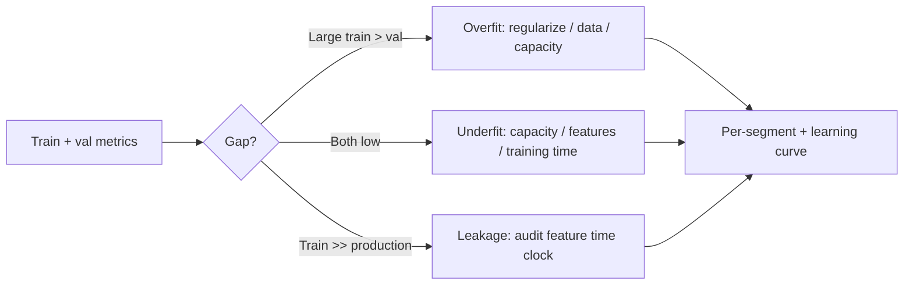

# Common ML Interview Questions

## How to Use This File

Three core ML-fundamentals interview questions: bias-variance,
metric selection under cost asymmetry, and leakage. Read each,
answer for 2-3 minutes, then compare with the patterns. Strong
answers diagnose specifically; weak answers stop at definitions.

## Core Preparation Checklist

- Know bias-variance, the train-validation gap that signals each,
  and the standard remedies.
- Know how to pick a metric under cost asymmetry: cost-weighted
  loss, recall at fixed FPR, expected dollar value.
- Know the leakage taxonomy: target leakage, train-test
  contamination, time leakage, group leakage.
- Know calibration and when post-hoc calibration is needed.
- Know per-segment evaluation and how aggregate metrics hide gaps.
- Have one over- or under-fitting story ready with the diagnostic
  signal and the fix.

## Interview Question Sections

### Question 1: Bias-variance tradeoff

**Question:** A model gets 0.99 train accuracy and 0.65
validation accuracy. Walk through the diagnosis and the
response.

**Strong answer:** A 34-point gap is severe overfitting. The
model has memorized training noise. Standard responses, in order
of cost: more training data; stronger regularization (L1, L2,
dropout, weight decay); reduce model capacity (smaller network,
shallower trees, fewer features); data augmentation if applicable;
early stopping based on validation loss; cross-validation to
verify the gap is not artifact of a single split. Each lever has
tradeoffs: more data is best but slow; regularization is cheap
but limited; capacity reduction may underfit. Diagnose by per-
segment analysis (does the gap concentrate in one slice?),
learning curves (does the gap close with more data?), and
feature importance (does the model rely on a noisy feature?).

**Weak answer:** "Add more regularization." No diagnosis, no
data inspection, no segment analysis.

**Follow-up questions:**

- What does a learning curve tell you?
- How would you distinguish overfitting from data leakage?
- When does increasing regularization make things worse?
- Why is per-segment analysis useful?

**Common traps:** Treating gap as overfitting without checking
leakage. Reaching for capacity reduction before data and
regularization. Ignoring per-segment heterogeneity.

### Question 2: Metric selection under cost asymmetry

**Question:** A fraud detection system flags 1 percent of
transactions. A missed fraud costs 10 dollars on average; a false
decline costs 1 dollar (in customer friction and refunds). Pick
the metric the model should optimize.

**Strong answer:** Accuracy is wrong: a model that always says
"not fraud" gets 99 percent accuracy with zero recall. ROC-AUC is
better but does not encode the 10:1 cost asymmetry. The right
metric encodes the cost: expected dollar loss equals (1 minus
recall) times average fraud cost plus FPR times average false-
decline cost. Optimize the threshold to minimize expected loss;
for this 10:1 ratio, the optimal point is well into the
high-recall region. Per-segment expected loss to catch group-
specific gaps. Calibration matters because the threshold depends
on probabilities; a tree-based model usually needs post-hoc
calibration on a held-out set.

**Weak answer:** "Use F1." Or "use AUC." Without engaging the
cost asymmetry.

**Follow-up questions:**

- How would the metric change if the cost ratio were 100:1?
- What is recall at fixed FPR and when is it the right metric?
- How do you calibrate a tree-based model?
- How do you handle a metric where the cost is variable per
  transaction?

**Common traps:** Picking a metric with no cost grounding.
Optimizing AUC and ignoring threshold selection. Treating
calibration as optional for threshold-driven systems.

### Question 3: Leakage diagnosis

**Question:** A churn model achieves 0.95 AUC offline and 0.55
AUC in production. Walk through the diagnosis.

**Strong answer:** The 40-point gap signals leakage or major
distribution shift. Audit features against the prediction-time
clock: any feature whose value depends on the churn event
(timestamps after, signals only present post-decision, system
state computed in retrospect) is target leakage. Common culprits:
"days_since_last_login" computed at the date of a known churn,
support-ticket counts including post-churn tickets,
billing-status fields updated after the churn marker. The fix is
strict feature-engineering hygiene: compute every feature from
data available at the prediction-time cutoff, with point-in-time
joins via a feature store. Other suspects: train-test
contamination (overlapping users), distribution shift
(production users differ from training), data freshness gaps. The
diagnostic is per-feature analysis: which features have the
biggest gap between training and production distributions?

**Weak answer:** "Retrain on more data." Without auditing for
leakage.

**Follow-up questions:**

- How does a feature store prevent target leakage?
- What is point-in-time correctness?
- How do you distinguish leakage from distribution shift?
- What would you do if a useful feature is also a leakage
  source?

**Common traps:** Retraining without auditing features.
Treating any production gap as drift instead of leakage. No
feature-by-feature distribution comparison.

## Sample Q and A

**Q:** When does a simpler model beat a complex one in
production?

**A:** When the complex model overfits noise that a regularized
simpler model ignores; when the complex model's marginal accuracy
gain is small and its operational cost (latency, retraining time,
debugging difficulty) is large; when the data distribution shifts
faster than the complex model can adapt; when interpretability is
a hard requirement (regulated decisions, debugging by domain
experts). The senior pattern is: start simple, measure honestly,
add complexity only when it pays for itself in a metric the
business cares about.

## Mini Exercise

Pick a model you have built. State the train and validation
metrics, diagnose any gap as overfitting, underfitting,
leakage, or distribution shift, and propose one fix with the
expected cost.

## Diagram

---
## Navigation

[⬅ Previous](04-data-scientist-roadmap.md) | [🏠 Home](../README.md) | [➡ Next](06-statistics-interview-questions.md)
