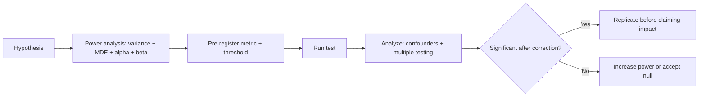

# Statistics Interview Questions

## How to Use This File

Three core statistics interview questions: hypothesis testing
under multiple comparisons, Simpson's paradox, and Bayesian
priors. Read each, answer for 2-3 minutes, then compare with the
patterns. Strong answers cite specific tests and pitfalls; weak
answers stop at "compute a p-value."

## Core Preparation Checklist

- Know what a p-value is and is not. It is the probability of
  data this extreme under the null; it is not the probability
  the null is true.
- Know multiple-testing correction: Bonferroni for strict
  control, Benjamini-Hochberg for FDR, when each fits.
- Know Simpson's paradox with one example you can sketch on
  the spot.
- Know power analysis: variance, MDE, alpha, beta determine
  sample size.
- Know peeking and sequential testing as A/B-test threats.
- Know the Bayesian setup: prior plus likelihood gives
  posterior; the prior matters more when data is sparse.
- Have one statistical-trap story ready (a result that looked
  significant but was not, or vice versa).

## Interview Question Sections

### Question 1: Multiple comparisons

**Question:** A team runs 25 metrics on an A/B test and reports
3 statistically significant at p < 0.05. Walk through how you
would interpret this.

**What the interviewer is testing:** Whether you spot the
multiple-comparisons problem and know how to address it.

**Strong answer:** With 25 independent tests under the null,
the expected number of false positives is 1.25. Three
significant results without correction is plausibly noise.
Apply Bonferroni (alpha divided by number of tests, here 0.002)
for strict family-wise control, or Benjamini-Hochberg for FDR
when the team is willing to accept some false positives in
exchange for power. After correction, see how many remain
significant. If only one survives Bonferroni, the team should
treat that as a candidate finding, not a confirmed effect, and
replicate before claiming impact. Pre-registering the primary
metric (one or two, not 25) avoids the issue from the start.

**Weak answer:** "Three significant results means the test
worked." Without acknowledging the multiplicity issue.

**Follow-up questions:**

- What is the difference between Bonferroni and BH-FDR?
- When is each appropriate?
- How does pre-registration prevent multiple-comparisons
  abuse?
- What does "family-wise error rate" mean?

**Common traps:** No correction. Cherry-picking the
significant metrics. Reporting all 25 without distinguishing
primary from secondary.

### Question 2: Simpson's paradox

**Question:** A drug helps recovery rates in both men (60
percent vs 50 percent) and women (40 percent vs 30 percent),
but the overall recovery rate is lower for the treatment group.
Explain how this is possible and what to do.

**Strong answer:** Simpson's paradox: the gender mix differs
between treatment and control. If the treatment group has many
more women (lower base rate) and the control group has many
more men (higher base rate), the aggregate can show a reversed
effect even though both subgroups benefit. The fix is to
analyze within strata or fit a regression that controls for the
confounder (gender). Always check that the trend holds across
the population subgroups; aggregating without thinking about
confounders can flip the sign of the effect. The general
lesson: in observational data, mixture composition matters; in
randomized data, large sample sizes make this rare but not
impossible (block randomization helps).

**Weak answer:** "The data must be wrong." Or "the subgroup
effects are coincidental."

**Follow-up questions:**

- What is a confounder?
- How does randomization prevent Simpson's paradox?
- What if you cannot randomize?
- How would you communicate the result to a stakeholder?

**Common traps:** Reporting only aggregates. Missing the
confounder. Treating the paradox as data error.

### Question 3: Bayesian thinking

**Question:** A medical test for a rare disease (1 in 10000
prevalence) is 99 percent accurate. A patient tests positive.
What is the probability the patient has the disease?

**Strong answer:** Bayes: P(disease | positive) = P(positive |
disease) times P(disease) divided by P(positive). With 99
percent sensitivity and (assume) 99 percent specificity, plus
1-in-10000 prevalence: P(positive | disease) = 0.99, P(disease)
= 0.0001, P(positive | no disease) = 0.01, P(no disease) =
0.9999. P(positive) = 0.99 times 0.0001 plus 0.01 times 0.9999
= 0.000099 plus 0.009999 = 0.010098. P(disease | positive) =
0.000099 divided by 0.010098 = approximately 0.0098, or about
1 percent. The test does not turn a 1-in-10000 prior into a
99-percent posterior because the false-positive volume from a
huge population dominates the small true-positive volume. The
implication: rare-disease screening at population level is
high-risk; confirmatory testing follows.

**Weak answer:** "99 percent because the test is 99 percent
accurate." Misses the base-rate issue.

**Follow-up questions:**

- What is the base-rate fallacy?
- How does the answer change if prevalence is 1 in 100
  instead of 1 in 10000?
- How does this apply to spam filtering or fraud detection?
- What is a likelihood ratio and why is it sometimes more
  useful than reporting separately?

**Common traps:** Ignoring the base rate. Confusing
sensitivity, specificity, and predictive value.

## Sample Q and A

**Q:** What is statistical power and why does it matter?

**A:** Power is the probability of detecting a true effect of
a specified size, equal to 1 minus the type-II error rate.
Standard target is 0.8. Under-powered tests produce
inconclusive results: a non-significant p-value does not
distinguish "no effect" from "effect we could not detect."
Power depends on variance, MDE, alpha, and sample size; a
power calculation before the test pre-commits to a sample
size that can detect the effect of interest. Many "negative"
results in industry experiments are actually under-powered;
the senior practitioner asks "could the test have detected
the effect we care about?" before interpreting the result.

## Mini Exercise

Pick a hypothesis test you might run. State the metric,
expected variance, MDE, alpha, beta, and required sample
size. Identify one confounder that could create a Simpson's
paradox if not handled.

## Diagram

---
## Navigation

[⬅ Previous](05-common-ml-interview-questions.md) | [🏠 Home](../README.md) | [➡ Next](07-classical-ml-interview-questions.md)
