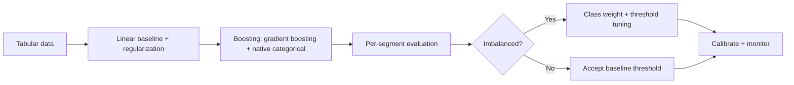

# Classical ML Interview Questions

## How to Use This File

Three core classical-ML interview questions: model selection on
tabular data, regularization choice, and class imbalance. Read
each, answer for 2-3 minutes, then compare with the patterns.
Strong answers reason about variance, signal structure, and
deployment cost; weak answers stop at "use XGBoost."

## Core Preparation Checklist

- Know when linear, tree-based, and kernel models are each the
  right fit on tabular data.
- Know the regularization trio: L1 (sparsity), L2 (smooth
  shrinkage), elastic net (both).
- Know imbalance remedies: class weights, focal loss, threshold
  tuning, SMOTE plus its risks, cost-sensitive metrics.
- Know calibration: when models need post-hoc calibration and
  how (Platt scaling, isotonic regression).
- Know feature engineering pitfalls: target encoding leakage,
  high-cardinality handling, time-window correctness.
- Have one tabular-modeling story ready with the model choice
  and why it beat the alternatives.

## Interview Question Sections

### Question 1: Model selection on tabular data

**Question:** A team has 50K rows of tabular data with mixed
numeric and categorical features and a 20-percent positive
class. Which model would you start with and why?

**Strong answer:** Gradient boosting (XGBoost, LightGBM,
CatBoost) is the strong default for tabular data of this size.
It handles mixed types, captures non-linear interactions, is
robust to outliers, and beats linear models when interactions
matter. Starting points: 50K rows is comfortable for boosting.
Mixed types means CatBoost or LightGBM with native categorical
support saves engineering. 20-percent positive class is mild
imbalance, addressed by scale_pos_weight or class_weight. Begin
with default hyperparameters and a quick CV to set a baseline,
then tune learning rate, max depth, regularization. Compare
against a logistic regression baseline; if logistic is within a
small margin, it may be the better production choice
(simplicity, latency, interpretability). Sometimes deep
learning on tabular data wins, but only with much more data
and structured features; for 50K rows, boosting is the answer.

**Weak answer:** "Use XGBoost." Without justification, without
the linear baseline, without considering deployment cost.

**Follow-up questions:**

- When does logistic regression beat boosting on tabular data?
- Why does deep learning rarely win on small tabular datasets?
- How do you handle a categorical feature with 100K levels?
- What are the operational tradeoffs between trees and linear
  models?

**Common traps:** Defaulting to neural networks for tabular.
Skipping the linear baseline. Ignoring deployment cost.

### Question 2: Regularization choice

**Question:** You have 1000 features, 500 of which are likely
noise. Pick a regularization strategy.

**Strong answer:** L1 (lasso) is the natural fit because it
drives uninformative coefficients to exactly zero, performing
implicit feature selection. The geometry: the L1 unit ball has
corners that intersect the loss minimum at axis points,
producing sparse solutions. L2 (ridge) shrinks all
coefficients smoothly, useful when all features carry some
signal but you want to control variance. Elastic net combines
both: L1 for sparsity, L2 for stability when correlated
features compete (without L2, L1 picks one of two correlated
features arbitrarily). Tune the regularization strength via
cross-validation; the optimal point is often where the
validation curve flattens. Standardize features before
applying L1 or L2; otherwise the penalty is sensitive to
scale.

**Weak answer:** "Use L2." Or "use lasso." Without engaging
the noise structure or the standardization requirement.

**Follow-up questions:**

- What is the geometric intuition for L1 producing sparsity?
- When would you use elastic net over pure L1?
- Why must you standardize features before regularizing?
- How does regularization interact with cross-validation?

**Common traps:** No standardization. Picking strength without
CV. Ignoring correlated features that L1 handles unstably.

### Question 3: Class imbalance

**Question:** A medical screening model has 0.5 percent
positive rate. Walk through how you would handle the imbalance.

**Strong answer:** Multiple approaches, often combined. First,
fix the metric: accuracy is meaningless; use precision-recall
AUC, recall at fixed FPR, or expected dollar loss. Then the
training-time interventions: class weights in the loss
(scale_pos_weight in boosting, class_weight in sklearn) push
the model to attend to positives without changing the data;
focal loss for deep models down-weights easy negatives.
Resampling alternatives: SMOTE generates synthetic positives
(useful but risks creating implausible samples), random
oversampling repeats positives (overfits), random
undersampling drops negatives (loses information). At
inference, threshold tuning is the most direct lever: pick the
threshold by the operating point on the precision-recall
curve; do not default to 0.5. Calibration plus post-hoc
threshold often beats elaborate training tricks. Per-segment
metrics catch group-specific gaps that the aggregate hides.

**Weak answer:** "Use SMOTE." Without the metric fix, without
threshold tuning, without segment analysis.

**Follow-up questions:**

- Why is accuracy a bad metric for 0.5-percent prevalence?
- When does SMOTE help and when does it hurt?
- How do you tune the decision threshold?
- How does focal loss differ from class weighting?

**Common traps:** Accuracy as the metric. SMOTE applied
blindly. Default 0.5 threshold for an imbalanced classifier.
No per-segment analysis.

## Sample Q and A

**Q:** When does interpretable beat accurate on tabular data?

**A:** When the use case requires explanations: regulated
decisions (credit, hiring), debugging by domain experts,
generating actionable insights for stakeholders. A 1-percent
accuracy gain at the cost of explainability is often a bad
trade in production. Modern tooling (SHAP, monotonic
constraints in boosting, generalized additive models) lets
you keep most of the accuracy while preserving interpretation.
The senior pattern is to start with the interpretable baseline,
measure the cost of the accuracy gap, and choose the operating
point.

## Mini Exercise

Pick a tabular dataset you have worked with. Choose the model,
regularization strategy, imbalance handling, and primary
metric. Justify each choice in one sentence. State one risk
each choice introduces.

## Diagram

---
## Navigation

[⬅ Previous](06-statistics-interview-questions.md) | [🏠 Home](../README.md) | [➡ Next](08-deep-learning-interview-questions.md)
