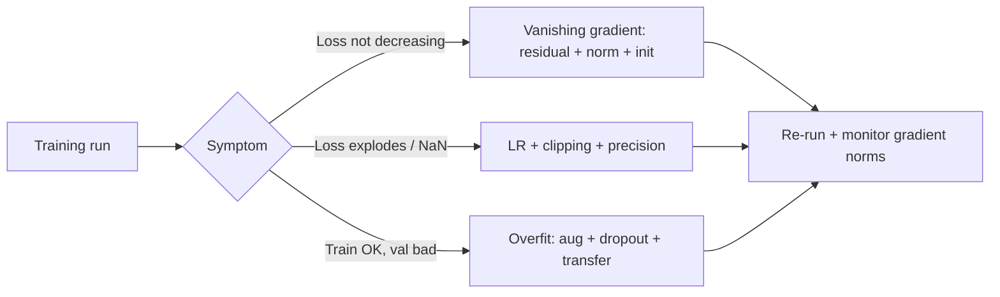

# Deep Learning Interview Questions

## How to Use This File

Three core deep-learning interview questions: backprop and
gradient flow, regularization in deep networks, and training
diagnostics for divergence. Read each, answer for 2-3 minutes,
then compare with the patterns. Strong answers diagnose
specifically; weak answers stop at "use Adam."

## Core Preparation Checklist

- Know backpropagation as the chain rule applied recursively.
- Know vanishing and exploding gradients, and the architectural
  responses (residual connections, batch and layer norm,
  careful initialization, gradient clipping).
- Know regularization stack: weight decay, dropout, label
  smoothing, data augmentation, early stopping, mixup.
- Know optimizer choice: SGD with momentum, Adam, AdamW, and
  when each fits.
- Know learning-rate scheduling: warmup, cosine, step decay.
- Know mixed-precision training (fp16, bf16) and loss scaling.
- Have one training-divergence story ready with the diagnostic
  signal and the fix.

## Interview Question Sections

### Question 1: Backprop and gradient flow

**Question:** Your 50-layer network trains slowly and the early
layers barely change. Walk through what is happening and how to
fix it.

**Strong answer:** Vanishing gradients. As the gradient
backpropagates through many layers, repeated multiplication by
small numbers (saturating activation derivatives, weight values
below 1) shrinks the signal until it is too small to update
early layers meaningfully. The architectural responses: residual
(skip) connections, which let the gradient flow directly to
early layers via the identity shortcut, are the single biggest
unlock that made ResNet-style architectures with 100+ layers
trainable. Use ReLU or GELU instead of saturating activations
(sigmoid, tanh). Batch or layer normalization stabilizes
activations layer-to-layer. Careful initialization (He for
ReLU, Xavier for tanh) keeps initial activation variance from
collapsing. If the issue is exploding instead of vanishing,
gradient clipping bounds the update magnitude.

**Weak answer:** "Increase the learning rate." Without
diagnosing the gradient flow.

**Follow-up questions:**

- What does a residual connection do mathematically?
- Why does batch norm stabilize training?
- What is the difference between He and Xavier
  initialization?
- How would you detect vanishing versus exploding gradients in
  practice?

**Common traps:** Treating slow learning as an LR issue when
the architecture is the problem. No diagnostic on the
gradient norms by layer.

### Question 2: Regularization in deep networks

**Question:** A vision model overfits a 5K-image dataset. The
team wants to stay with their architecture. Walk through the
regularization plan.

**Strong answer:** Multiple stacked techniques, each with a
different mechanism. Weight decay (L2 on parameters)
discourages large weights; standard for neural networks.
Dropout zeroes random activations during training, forcing
redundant representations. Data augmentation expands the
effective dataset (random crops, flips, color jitter for
images, plus stronger Mixup or CutMix). Label smoothing
prevents the model from becoming overconfident. Early
stopping based on validation loss prevents the late-training
overfit. For 5K images specifically, transfer learning from a
pre-trained backbone is the highest-leverage move: fine-tune
only the head with a low LR on the backbone, or full fine-tune
with very small LR. Match model size to data: 5K images cannot
support training a large model from scratch.

**Weak answer:** "Add dropout." Without the augmentation,
transfer learning, or capacity matching.

**Follow-up questions:**

- Why does dropout sometimes hurt with batch norm?
- What is mixup and when is it most effective?
- When would you not freeze the backbone in transfer learning?
- How do you decide model capacity for a small dataset?

**Common traps:** Single regularization technique. No transfer
learning. No augmentation tuning. Model size mismatched to
data.

### Question 3: Training diagnostics for divergence

**Question:** Your training loss spikes to NaN at step 12000.
Walk through the diagnostic.

**Strong answer:** Three suspects. Learning rate too high:
check the LR schedule; if the LR ramped above a threshold,
the optimizer overshot and destabilized. Numerical precision:
fp16 without loss scaling can underflow gradients, producing
NaN; check whether mixed-precision is enabled and loss scaling
configured (or switch to bf16, which has wider dynamic range).
Bad data: a corrupted batch with extreme values can spike the
loss; inspect the batch at step 12000 and check for outliers
or NaN inputs. Other diagnostics: gradient norm history (did
norms grow steadily before the spike?), activation
distributions, and the loss curve shape just before the NaN.
Mitigations: gradient clipping (cap the gradient norm at, say,
1.0), learning-rate warmup (linear ramp from a small value),
loss scaling for fp16, data validation at the loader. Log
checkpoints every N steps so a divergent run can be restarted
from a healthy state instead of from scratch.

**Weak answer:** "Lower the learning rate." Without the data
inspection or precision check.

**Follow-up questions:**

- What is loss scaling and why is it needed for fp16?
- How do you detect a bad batch in the data loader?
- What does gradient clipping do mathematically?
- How do you choose a warmup schedule?

**Common traps:** Treating divergence as always an LR issue.
No data validation. No mixed-precision check.

## Sample Q and A

**Q:** Adam versus SGD with momentum: when do you choose each?

**A:** Adam adapts the learning rate per parameter using
running estimates of first and second moments; it converges
faster on noisy or sparse-gradient problems, which describes
most modern deep-learning workloads. SGD with momentum
generalizes better on some image classification tasks
(historically observed), takes longer to converge but reaches
flatter minima. For most modern pretraining and fine-tuning,
AdamW (Adam with decoupled weight decay) is the default. SGD
with momentum still wins on some computer-vision benchmarks
where careful LR scheduling beats Adam's adaptivity. Match the
optimizer to the task and the published recipes for the
architecture.

## Mini Exercise

Pick a training run you have done. State the optimizer, LR
schedule, regularization stack, and one symptom of training
trouble (slow learning, divergence, overfitting). Match the
symptom to a diagnostic and a fix.

## Diagram

---
## Navigation

[⬅ Previous](07-classical-ml-interview-questions.md) | [🏠 Home](../README.md) | [➡ Next](09-llm-interview-questions.md)
