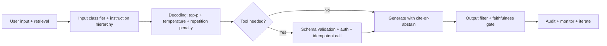

# LLM Interview Questions

## How to Use This File

Three core LLM interview questions: decoding choice, function-
calling design, and hallucination handling under production
constraints. Read each, answer for 2-3 minutes, then compare
with the patterns. Strong answers name specific parameters and
failure modes; weak answers stop at "use temperature 0.7."

## Core Preparation Checklist

- Know greedy, top-k, top-p (nucleus), beam search, and when
  each fits.
- Know temperature, repetition penalty, frequency penalty as
  decoding controls.
- Know function calling (tool use) and the runtime contract:
  schema, validation, execution, observation back to the model.
- Know structured outputs (JSON Schema, Pydantic) and why they
  matter for production reliability.
- Know hallucination categories: knowledge cutoff, false
  reasoning, fabricated citations, format failure under
  pressure.
- Know prompt injection (direct and indirect) and the layered
  defenses.
- Have one production LLM debugging story ready.

## Interview Question Sections

### Question 1: Decoding choice for production

**Question:** A chat assistant returns answers that feel
robotic and repetitive. The team's instinct is to raise the
temperature. Walk through a more rigorous response.

**Strong answer:** First diagnose: is the issue determinism or
distribution shape? Greedy decoding always picks the most
likely token, producing repetitive outputs especially when the
model is uncertain (the most-likely token at each step adds up
to a degenerate path). Top-p (nucleus) sampling adapts to
distribution shape: when the model is confident, the nucleus
is small and the output is similar to greedy; when the model
is uncertain, the nucleus widens and produces diverse outputs.
Top-k uses a fixed cutoff regardless of confidence. Temperature
sharpens or flattens the distribution; high temperature can
produce nonsense. For a chat assistant: top-p around 0.9 with
moderate temperature (0.7-0.9) plus a repetition penalty often
fixes the robotic-and-repetitive failure without the
hallucination risk of temperature alone. Test with the eval
harness; pick the operating point that improves diversity
without breaking task quality.

**Weak answer:** "Set temperature to 1.0." Without engaging
top-p or repetition penalty.

**Follow-up questions:**

- What is the difference between top-p and top-k?
- When does beam search fail for open-ended generation?
- What is repetition penalty and when does it hurt?
- How would you eval the decoding change?

**Common traps:** Treating temperature as the only knob.
Beam search for open-ended generation. No eval after change.

### Question 2: Function-calling design

**Question:** Your LLM-powered assistant needs to look up
account balances via a tool call. Design the tool interface and
the production controls.

**Strong answer:** Define the tool schema: name (clear,
specific, e.g., get_account_balance), description (when the
model should use it), arguments (account_id with type, format,
length constraints), return shape. Strict JSON Schema validation
on the model's emitted call rejects malformed arguments. The
runtime applies authorization (does the requesting user have
access to this account?), executes the tool, and returns the
result as an observation message the model can reason over.
Errors return as observations, not silent failures, so the
model can retry or escalate. Idempotency keys on state-changing
calls prevent duplicate side effects. Audit log every tool call
with caller identity, arguments hash, decision, timestamp.
Rate limits per user. Risky tools (refunds, deletes) require
human approval before execution. Treat tool outputs as
untrusted; an upstream change in the API response could carry
malicious content (indirect injection).

**Weak answer:** "Pass the account ID and let the model
handle errors." No schema validation, no authorization, no
audit log.

**Follow-up questions:**

- What is excessive agency on the OWASP LLM list?
- How do you defend against indirect prompt injection in tool
  outputs?
- Why are idempotency keys important?
- What goes in the audit log?

**Common traps:** Vague tool descriptions causing wrong-tool
calls. No argument validation. No authorization layer. No
audit log.

### Question 3: Hallucination under production constraints

**Question:** Your LLM-powered customer-support assistant
occasionally fabricates policies that do not exist. Walk
through the systems response.

**Strong answer:** Hallucination is a systems problem, not a
model bug. Layered fix: ground answers via retrieval from the
authoritative policy corpus; require cite-or-abstain (the
model must cite a source or say it does not know); use a
calibrated faithfulness eval (each claim supported by retrieved
evidence) to measure the contract's effectiveness; output
filter for known fabrication patterns; abstention rate
monitoring per segment. When evidence is weak, the model
abstains; when strong, it cites. Operational monitoring on
abstention rate and faithfulness drift catches regressions.
Bigger model alone does not fix this; the contract and the
eval do.

**Weak answer:** "Use a bigger model." Or "use lower
temperature." Without the grounding, contract, and monitoring.

**Follow-up questions:**

- What is faithfulness and how do you measure it?
- When should the model abstain instead of generate?
- How do you detect a regression in abstention behavior?
- How do you prevent the model from ignoring its citation
  contract?

**Common traps:** Treating hallucination as a model
limitation. No grounding. No abstention rule. Lower
temperature and call it solved.

## Sample Q and A

**Q:** What is the most important production control for an
LLM feature that ingests untrusted user input plus retrieved
content?

**A:** Layered defense against prompt injection. Direct
injection: input classifier plus instruction hierarchy
(system role outranks user content, enforced by the API).
Indirect injection: tag retrieved content (treat as data, not
instructions), output filter to catch outputs that follow
embedded instructions, and assume any retrieved content may
be hostile. The single most-overlooked defense is the
indirect-injection layer; a system that ingests retrieval or
tool output without it is exploitable.

## Mini Exercise

Pick an LLM feature you have used or designed. Specify the
decoding parameters, the function-calling tools (if any), and
the hallucination defenses (grounding, abstention, output
filter). Identify the weakest layer.

## Diagram

---
## Navigation

[⬅ Previous](08-deep-learning-interview-questions.md) | [🏠 Home](../README.md) | [➡ Next](10-rag-interview-questions.md)
