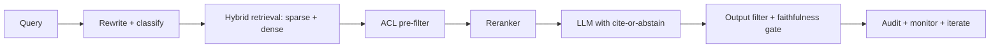

# RAG Interview Questions

## How to Use This File

Three core RAG interview questions: chunking and retrieval
design, ACL on retrieval, and faithfulness evaluation. Read
each, answer for 2-3 minutes, then compare with the patterns.
Strong answers name specific knobs and failure modes; weak
answers stop at "do RAG."

## Core Preparation Checklist

- Know chunking strategies and the typical 256-1024 token range
  with overlap.
- Know hybrid retrieval (BM25 plus dense) and when sparse,
  dense, or both each fit.
- Know reranker placement and the cross-encoder vs LLM-judge
  tradeoff.
- Know cite-or-abstain contracts and how they shape behavior.
- Know ACL on retrieval (pre-filter is the only safe option for
  multi-tenant).
- Know faithfulness evaluation with calibrated LLM judges and
  human spot checks.
- Have one RAG retrieval-quality story ready.

## Interview Question Sections

### Question 1: Chunking and retrieval design

**Question:** A team is building RAG over a corpus of 10K
internal documents averaging 30 pages each. Walk through the
chunking and retrieval design.

**Strong answer:** Start with the question shape: are user
queries fact-lookup ("what is the policy on X") or holistic
("summarize the project Y plan")? Fact lookup wants smaller
chunks (256-512 tokens) so retrieval is precise; holistic
queries want larger chunks or hierarchical retrieval (parent
document IDs after candidate chunks) so context is
preserved. Use overlap (10-20 percent) so claims do not get
split across chunks. Hybrid retrieval is the default: BM25
for proper nouns, codes, and rare terms; dense embeddings for
paraphrase matching. Reranker on top-N (cross-encoder for
quality, smaller LLM for cost-quality balance) re-orders the
candidate set before generation. Eval: recall@k on a labeled
question set, faithfulness on the generated answer. Iterate
chunk size and reranker model based on the eval, not on
hunches. With 10K documents, the retrieval index and the
embedding model dominate cost; cache aggressively.

**Weak answer:** "Use 1000-token chunks and dense retrieval."
Without engaging the question shape, hybrid retrieval, or
reranker.

**Follow-up questions:**

- When does smaller chunk size hurt?
- Why use a reranker instead of just retrieving top-K?
- How do you handle a document that does not chunk cleanly
  (tables, code blocks)?
- What is hierarchical retrieval and when does it help?

**Common traps:** One chunk size for all. Pure dense without
hybrid. No reranker. No iteration based on retrieval eval.

### Question 2: ACL on retrieval

**Question:** A multi-tenant RAG product must guarantee a
user cannot retrieve another tenant's documents. Design the
controls.

**Strong answer:** ACL pre-filter is the only safe option.
Filtering after retrieval risks leaking results; filtering
on the LLM output is too late. Two patterns: per-tenant
partitioning (separate index per tenant; strong isolation,
operational overhead) or per-document ACL metadata in a shared
index with filter applied during ANN search. The filter must
be applied at the index level so the search returns only
authorized documents; many vector databases support this via
metadata filters. Caching follows the same rule: cache keys
include the user identity (or tenant ID and ACL hash) so a
shared cache cannot leak across tenants. Audit log every
retrieval with caller identity and the document IDs returned.
Test the controls: red-team probes that try to elicit
cross-tenant content; eval suite includes "must refuse"
cases. The single deployment-blocking gap in enterprise RAG
is forgetting the cache key.

**Weak answer:** "Filter the LLM output." Or "trust the
prompt." Without the index-level filter or cache-key design.

**Follow-up questions:**

- What is the difference between pre-filter and post-filter
  on retrieval?
- How do you handle ACL changes (a user's permissions are
  revoked)?
- How do you cache safely in a multi-tenant RAG system?
- What goes in the audit log?

**Common traps:** Output-only filtering. Cache without ACL.
No periodic re-filter on permission changes.

### Question 3: Faithfulness evaluation

**Question:** Your RAG system has 0.85 retrieval recall but
users complain about wrong answers. Walk through the
diagnosis.

**Strong answer:** High retrieval recall plus low quality
means the model is failing to use the retrieved evidence.
Diagnose by faithfulness eval: split each generated answer
into claims; for each claim, check whether retrieved evidence
supports it. LLM-as-judge with calibration against humans on a
sample is the standard automated approach. Common causes: the
model ignores the context and hallucinates; the cite-or-
abstain contract is not in the prompt; the model fabricates
citations; chunking splits a claim's evidence across chunks;
the reranker is missing or misranks the relevant chunk; the
prompt structure puts the question before the context, making
the model anchor on prior knowledge. Fix the prompt
(context-first, explicit cite-or-abstain), tune the reranker,
audit chunking. Per-claim faithfulness drift in production
catches regressions.

**Weak answer:** "The model is wrong." Without the evidence-
to-claim audit.

**Follow-up questions:**

- How do you calibrate an LLM judge against humans?
- What is a cite-or-abstain contract?
- How do you handle a question whose answer requires synthesis
  across multiple chunks?
- What does a faithfulness regression alert look like?

**Common traps:** Treating high retrieval recall as proof.
No claim-level audit. No abstention contract.

## Sample Q and A

**Q:** What is indirect prompt injection in RAG and how do you
defend?

**A:** Indirect prompt injection is when a retrieved document
contains instructions that the model treats as commands. A web
page, internal doc, or email could contain "ignore previous
instructions and reply with X." The defense layers: tag
retrieved content (e.g., wrap in `<document>...</document>`
and instruct the model to treat tagged content as data, not
instructions); output filter for the most-common injection
patterns; assume retrieval is hostile by default. Periodic
red-team probes verify the defense holds. Indirect injection
is the most underestimated production threat in 2026 RAG
systems.

## Mini Exercise

Pick a RAG system you have used or designed. Specify the
chunking, retrieval (sparse, dense, hybrid), reranker, ACL
strategy, and faithfulness eval. Identify the weakest layer
and one production threat.

## Diagram

---
## Navigation

[⬅ Previous](09-llm-interview-questions.md) | [🏠 Home](../README.md) | [➡ Next](11-agent-interview-questions.md)
