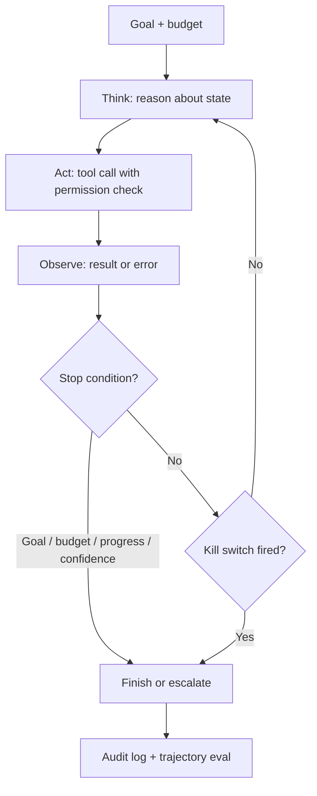

# Agent Interview Questions

## How to Use This File

Three core agent interview questions: tool design and
permissions, stop conditions and budgets, and kill-switch
design. Read each, answer for 2-3 minutes, then compare with
the patterns. Strong answers default to the least autonomy that
solves the problem; weak answers reach for autonomy.

## Core Preparation Checklist

- Know the agent loop (think, act, observe, repeat) and the
  cost-per-loop math.
- Know stop conditions: goal met, max steps, cost budget,
  progress detector, low confidence escalation.
- Know workflow vs single-agent vs multi-agent and when each
  fits.
- Know tool design: schemas, validation, error feedback, least
  privilege, approval gates.
- Know idempotency, audit logs, and kill switches.
- Know the OWASP LLM Top 10 entry on excessive agency.
- Have one agent failure story ready (looping, wrong tool, or
  unauthorized action) with the systemic fix.

## Interview Question Sections

### Question 1: Tool design and permissions

**Question:** Design the tool set for an IT-support agent that
can reset passwords, look up tickets, and (with approval)
delete user accounts.

**Strong answer:** Classify each tool by reversibility and
blast radius. Read-only (look_up_ticket): runs freely, no
approval, audit log. State-changing reversible (reset_password):
schema validation on user_id, authorization check (does the
agent's user have permission to reset this account?),
idempotency key to prevent duplicate resets, audit log,
optional approval for high-privilege accounts.
Irreversible / high-impact (delete_account): mandatory human
approval gate before execution, multi-step confirmation,
audit log retained for the regulatory window. Tool descriptions
must be specific so the model picks the right one ("call
look_up_ticket for any read-only inquiry; never call
delete_account without explicit user confirmation").
Argument validation rejects malformed calls and returns the
error as an observation so the model can self-correct. Treat
tool outputs as untrusted; a compromised downstream API
could carry malicious content (indirect injection).

**Weak answer:** "Give the agent all three tools." Without the
classification, validation, or approval gate.

**Follow-up questions:**

- What is excessive agency on the OWASP LLM Top 10?
- How do you handle an idempotency-key collision?
- How do you defend against indirect prompt injection in tool
  outputs?
- What is least privilege and how does it apply here?

**Common traps:** Same permissions for all tools. No approval
gate for irreversible. No idempotency. No audit log.

### Question 2: Stop conditions and budgets

**Question:** Your agent occasionally enters infinite loops on
production traffic, burning $500 per stuck task. Walk through
the structural fix.

**Strong answer:** Layered stop conditions. Goal-completion
check is the obvious one but easy to miss when the model is
unsure. Hard caps: max steps (typical 10-30 depending on task
complexity), max cost budget per task (input plus output
tokens, plus tool call costs), max wall time. Progress
detector: compare the last two or three observations; same
tool plus same arguments twice in a row, or identical
observation hashes, mean the agent is stuck; trigger a forced
replan or escalate to human. Low-confidence escalation: if the
model's self-reported confidence stays low across iterations,
hand off to a human. Cost monitoring: per-task cost
distribution; alert on tail spend; emergency kill switch on
budget overrun. Without these layers, one stuck loop is a
$500 incident; with them, it is a $5 ceiling enforced
automatically.

**Weak answer:** "Set max steps to 20." Without the progress
detector or budget.

**Follow-up questions:**

- What is a progress detector and how do you implement it?
- How do you set the max-steps value for a new task?
- What happens when the budget is hit mid-task?
- How do you distinguish a hard problem from a stuck loop?

**Common traps:** Single stop condition. No cost budget. No
progress detector. No escalation path.

### Question 3: Kill-switch design

**Question:** Your autonomous agent system has a million
tasks-per-day workload. Design the kill switch.

**Strong answer:** A kill switch is a single control that
halts running loops, drains in-flight tool calls, and freezes
deployments on emergency triggers. Triggers: cost over budget
by N percent in a short window (auto), error rate above
threshold (auto), abuse pattern detected (auto), unauthorized-
action rate above zero (auto), manual emergency (human
operator). The mechanism: a feature flag the orchestrator
checks before each iteration; existing in-flight tool calls
finish or time out; new tasks queue or reject. Test it
quarterly with a controlled drill: trigger the switch in a
canary pool, verify all loops halt, verify the drain
completes within the SLA, verify the audit log captures the
event. The switch is named, documented, and on the operator's
runbook for the system.

**Weak answer:** "Kill the process." Without the trigger
design, drain semantics, or test schedule.

**Follow-up questions:**

- What triggers should auto-fire the kill switch?
- How do you handle in-flight irreversible actions when the
  switch fires?
- How do you test the kill switch without disrupting
  production?
- What goes in the post-kill audit log?

**Common traps:** No automatic triggers. No drain semantics.
Untested kill switch. No documented operator runbook.

## Sample Q and A

**Q:** When is multi-agent justified over single-agent?

**A:** When subtasks are genuinely independent
(parallelizable; e.g., processing 100 documents in parallel)
or need distinct tools and contexts that single-agent prompting
cannot juggle. Otherwise, single-agent with good prompting is
simpler, cheaper, and easier to debug. The honest default for
most production systems is single-agent. Multi-agent
introduces coordination overhead, error propagation, and
distributed-tracing complexity; it pays off only when the work
genuinely separates.

## Mini Exercise

Pick a task you might assign to an agent. Specify the autonomy
level (workflow, single-agent, multi-agent), three tools with
permission classes, stop conditions with concrete values, one
kill-switch trigger, and one trajectory metric you would
track.

## Diagram

---
## Navigation

[⬅ Previous](10-rag-interview-questions.md) | [🏠 Home](../README.md) | [➡ Next](12-ml-system-design-interview-questions.md)
