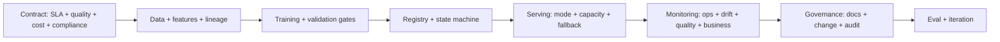

# ML System Design Interview Questions

## How to Use This File

Three core ML system design interview questions: contract-first
design, online vs batch decision, and capacity and fallback
planning. Read each, answer for 2-3 minutes, then compare with
the patterns. Strong answers cover all eleven layers (contract,
data, features, training, registry, serving, monitoring,
governance, eval, cost, iteration); weak answers stop at the
model.

## Core Preparation Checklist

- Know the eleven layers of an ML system: contract, data,
  features, training, registry, serving, monitoring,
  governance, eval, cost, iteration.
- Know online vs batch vs streaming vs async, and the decision
  tree by latency, freshness, throughput, and cost.
- Know capacity planning: peak QPS, latency budget per
  component, autoscaling.
- Know fallback patterns: cached previous response, smaller
  model, rule-based, clearly-labeled unavailable.
- Know per-segment monitoring and the offline-online gap
  diagnostic.
- Have one production system you can sketch end-to-end in 5
  minutes.

## Interview Question Sections

### Question 1: Contract-first design

**Question:** Design a fraud-scoring system for a payment
platform. Start.

**Strong answer:** Begin with the contract, not the model.
Inputs: transaction (amount, merchant, device, account age,
velocity features, location, prior disputes). Outputs:
approve, challenge, block, route to review, plus confidence
and reason codes. Latency: sub-second user-facing (typically
under 150 ms p99 because the payment is held). Throughput:
peak QPS (3-5x daily average). Freshness: features must reflect
the user's activity in the last few minutes. Quality bar: cost-
weighted (missed fraud cost vs false-decline cost). Fairness:
per-protected-group disparity threshold. Failure mode: outage
falls back to rule-based score, payments still process, flagged
for offline review. Cost ceiling: per-prediction target.
Compliance: PCI for payment data, applicable regulator. The
contract is the document everything else builds against;
skipping it produces a system that solves an unclear problem.

**Weak answer:** "Train a fraud model." Without the contract.

**Follow-up questions:**

- What is the difference between cost-weighted metric and ROC?
- How do you handle a regulator-required explanation for each
  decision?
- What are the fairness constraints in payment systems?
- How would the contract change if the payment is held
  asynchronously?

**Common traps:** Jumping to architecture. No latency budget.
No fairness or compliance call-outs. No fallback.

### Question 2: Online vs batch decision

**Question:** Design a recommendation system for a streaming
media product. Walk through the inference mode.

**Strong answer:** Hybrid is the answer for most production
recommenders. Pure online (compute on each request) is too
expensive at 50K QPS. Pure batch (precompute nightly) is too
stale for engagement-driven products where the user just
clicked something. The hybrid pattern: batch precompute
candidate sets per user (top 1K) overnight, online reranker
scores the candidates with fresh contextual features (last
click, time of day, device) at request time, returning top 10.
Streaming feature pipeline updates per-user activity in an
online feature store with sub-minute freshness; the reranker
uses these. Cost: batch precompute amortizes over many
requests; online reranker is the per-request cost driver; far
cheaper than pure online while keeping freshness. Failure
modes: reranker outage falls back to the batch top-10 (degraded
but functional). Per-segment monitoring on engagement metrics.

**Weak answer:** "Online so it is fresh." Without engaging
cost or the hybrid pattern.

**Follow-up questions:**

- What is the cost per prediction online vs batch?
- How do you handle cold-start users in a hybrid system?
- What goes in the streaming feature pipeline?
- How does the architecture change at 10x traffic?

**Common traps:** Pure online for cost-sensitive workloads.
Pure batch where freshness matters. No fallback path.

### Question 3: Capacity and fallback planning

**Question:** Your online inference service has a p99 latency
SLO of 150 ms. The current p99 is 230 ms. Walk through the
remediation plan.

**Strong answer:** P99 is a tail problem; the median is
likely fine. Investigate the tail. Decompose the latency
budget by component: network, queue wait, preprocessing,
feature lookup, model, postprocessing, postlogic. Profile the
slowest 1 percent of requests; identify the dominant
contributor. Common causes: GPU cold starts (provision warm
capacity), feature-store lookup tail (cache hot features,
add timeouts), preprocessing on heavy inputs (validate at
ingest, reject early), retry-induced latency (cap retry budget).
Fallback design: timeout per component with a sane default
(simpler model, cached prediction, default response), so a
slow dependency does not breach the SLO. Capacity provisioning
for peak QPS (typically 3-5x average) with autoscaling on QPS,
queue depth, or latency. Test with synthetic load. Monitor p50,
p95, p99 separately; the median improving while the tail grows
is a real failure pattern.

**Weak answer:** "Add more replicas." Without component
profiling or fallback design.

**Follow-up questions:**

- What is the difference between p50 and p99 in capacity
  planning?
- How do you handle a cold-start GPU?
- What is graceful degradation and how do you implement it?
- What does a fallback model look like for an LLM feature?

**Common traps:** Capacity for average not peak. No
component-level latency budget. No fallback. Replicas as the
only lever.

## Sample Q and A

**Q:** What separates a strong ML system design answer from a
weak one?

**A:** Coverage of all the layers, not depth in one. Weak
candidates spend 15 minutes on the model and skip monitoring,
governance, and iteration. Strong candidates name the contract
first, then walk through each layer in 2-3 sentences:
data, features, training, registry, serving, monitoring,
governance, eval, cost, iteration. The senior signal is
"production is a discipline, not a deploy"; the junior signal
is "I picked a fancy architecture."

## Mini Exercise

Pick an ML feature you can imagine. Sketch each of the eleven
layers in two sentences each. Identify the layer most likely
missing in a typical first design.

## Diagram

---
## Navigation

[⬅ Previous](11-agent-interview-questions.md) | [🏠 Home](../README.md) | [➡ Next](13-behavioral-ai-interviews.md)
