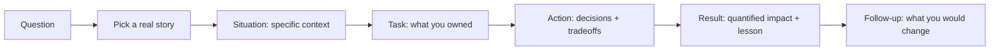

# Behavioral AI Interviews

## How to Use This File

Three core behavioral interview questions for AI roles:
ownership of an AI incident, ambiguity in product requirements,
and disagreement with a stakeholder over a tradeoff. Read each,
practice the STAR-format response (Situation, Task, Action,
Result), then compare with the patterns. Strong answers name
specific decisions and lessons; weak answers stay generic.

## Core Preparation Checklist

- Have three production stories ready: one success, one
  failure, one ambiguous. Each in STAR format, 2-3 minutes.
- Know how to discuss a tradeoff (cost-quality, latency-
  accuracy, autonomy-safety) in business terms.
- Know how to handle a question about a stakeholder
  disagreement; the senior signal is data plus empathy, not
  winning the argument.
- Have one story about working with a non-technical
  stakeholder where you translated technical concepts.
- Know how to introspect on a project that did not work; what
  you would do differently.
- Avoid generic ownership claims; specifics (numbers, dates,
  decisions) carry the weight.

## Interview Question Sections

### Question 1: Ownership of an AI incident

**Question:** Tell me about a time an AI system you owned
caused a production issue. What happened, what did you do, and
what changed afterward?

**What the interviewer is testing:** Whether you operate AI
systems with maturity and learn from incidents. They want
specifics, not generic ownership talk.

**Strong answer:** Pick a real incident. Frame:
- **Situation.** "Our recommendation system started serving
  the same item to 80 percent of users for an hour. Engagement
  dropped 30 percent in that window."
- **Task.** "I was on-call. I had to identify the cause, stop
  the bleeding, and prevent recurrence."
- **Action.** "Rolled back to the previous model version via
  the feature flag (5-minute SLA). Investigated: found a
  feature pipeline change that day had silently broken the
  user-history feature, so the model fell back to popularity
  ranking. Drafted the postmortem with timeline, root cause,
  and three action items: a per-feature distribution alert
  (PSI > 0.25), a shadow-mode requirement for feature-pipeline
  changes, and a clear ownership boundary between the model
  team and the feature pipeline team."
- **Result.** "Recovery within 90 minutes from detection. The
  three actions shipped within two weeks. The same class of
  incident has not recurred in the 14 months since; the per-
  feature alert has caught two near-incidents that would have
  been similar."

**Weak answer:** "We had an issue and I fixed it." No
specifics, no postmortem, no preventive action.

**Follow-up questions:**

- What was the hardest part of that incident?
- What would you do differently?
- How did you communicate with stakeholders during the
  incident?
- Was there a control you wished you had had?

**Common traps:** Generic story. Blaming others. No
preventive action. No quantified impact.

### Question 2: Ambiguity in product requirements

**Question:** Describe a project where the product
requirements were unclear. How did you handle it?

**Strong answer:** Pick a real ambiguity story. Frame:
- **Situation.** "Product asked for an AI feature that
  'helps users write better emails.' The success criteria
  were not defined."
- **Task.** "I needed to clarify the goal, propose a metric,
  and get alignment before building anything."
- **Action.** "Ran a 30-minute discovery with product, design,
  and the support team. Identified that 'better' meant fewer
  edits before send. Proposed edit rate as the primary metric,
  acceptance rate as a secondary, latency p95 as a guardrail.
  Pre-registered a target lift (5 percent fewer edits in the
  first month). Built a small prototype on a single use case
  (reply suggestions) and ran a 1-percent canary before
  expanding."
- **Result.** "The metric clarification produced a different
  scope than product had originally pitched (auto-compose was
  the original ask; we shipped reply suggestions instead).
  Edit rate improved 8 percent over the first month. Product
  adopted the metric framework for two later AI features.
  Without the discovery, we would have built the wrong
  feature."

**Weak answer:** "I asked product for clarification and built
what they asked for." No metric design, no scope refinement.

**Follow-up questions:**

- How did you decide which metric mattered?
- What did you do when product disagreed with your scope?
- How did you communicate the scope change to stakeholders?
- What would you do if discovery had been impossible?

**Common traps:** No metric design. Building before clarifying.
No story about the scope change.

### Question 3: Disagreement with a stakeholder

**Question:** Tell me about a time you disagreed with a
stakeholder about a technical tradeoff. How did you handle it?

**Strong answer:** Pick a real disagreement story. The senior
signal is data plus empathy, not winning the argument. Frame:
- **Situation.** "Product wanted to ship a chatbot at
  temperature 1.0 for diversity. I was concerned about
  hallucination rate."
- **Task.** "Resolve the disagreement with data, not
  authority."
- **Action.** "Ran a quick eval at temperature 0.5, 0.7, and
  1.0 on the existing eval set. At 1.0, hallucination rate
  was 4x higher with no measurable diversity gain on the
  product-relevant dimension. Brought the data to the
  product meeting. Proposed temperature 0.7 as the operating
  point with the option to revisit if user feedback signaled
  too-bland responses. Listened to product's concern about
  blandness; agreed to track a content-variety metric in
  production."
- **Result.** "Shipped at 0.7. Hallucination rate stayed
  within target. Content-variety metric was acceptable; one
  product variation experiment later raised it back to 0.85
  with new safety classifiers in place. Product team and ML
  team both felt the decision was data-driven, not
  authority-driven."

**Weak answer:** "I told them no and they accepted." No data,
no compromise, no follow-up.

**Follow-up questions:**

- What if the data had supported the stakeholder's position?
- How do you handle a stakeholder who disregards the data?
- What would you do if you had been wrong?
- How did you keep the relationship healthy after the
  disagreement?

**Common traps:** Adversarial framing. No data. No empathy
for the stakeholder's concern. No follow-up tracking.

## Sample Q and A

**Q:** Tell me about a project that did not go well.

**A:** Pick a real failure. Honest framing: what you would do
differently, the structural lesson, the impact on subsequent
work. The interviewer is screening for self-awareness and
growth, not perfect execution. Avoid the trap of describing a
"failure" that is actually a humblebrag ("I worked too hard").
Pick a real one: a wrong architecture choice, a missed
production risk, a misjudgment of user need. Describe what
you learned, what changed in your process, and one
concrete habit you adopted afterward.

## Mini Exercise

Write your three stories (success, failure, ambiguous) in
STAR format, 2-3 minutes each. Test them on a peer; ask
whether the specifics carry the weight or whether you sound
generic. Revise the weakest part.

## Diagram

---
## Navigation

[⬅ Previous](12-ml-system-design-interview-questions.md) | [🏠 Home](../README.md) | [➡ Next](14-resume-project-strategy.md)
