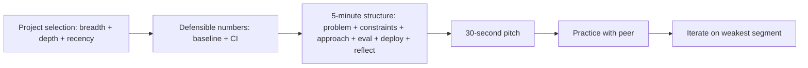

# Resume Project Strategy

## How to Use This File

Three core questions on resume projects for AI and ML roles:
project selection, scope and impact framing, and interview-
ready storytelling. Read each, draft your answer, then compare
with the patterns. Strong answers name specific decisions and
defensible numbers; weak answers list technologies.

## Core Preparation Checklist

- Pick projects that demonstrate a production tradeoff (cost,
  latency, fairness, security, governance), not just modeling.
- Have one project that shows the full pipeline (data,
  baseline, model, evaluation, deployment, monitoring) end-to-
  end.
- Have defensible numbers: "improved metric by X percent" with
  the baseline, sample size, and confidence interval ready.
- Have a 30-second pitch and a 5-minute deep dive for each
  project.
- Know what you would do differently; the senior signal is
  honest reflection.
- Avoid resume buzzword stacks ("used PyTorch, Hugging Face,
  LangChain"); they tell the interviewer nothing about
  judgment.

## Interview Question Sections

### Question 1: Project selection

**Question:** Walk me through how you chose your portfolio
projects.

**What the interviewer is testing:** Whether your project
selection demonstrates judgment about what matters in
production AI.

**Strong answer:** Pick projects against three criteria:
breadth (cover multiple production concerns: not all modeling,
not all infrastructure), depth (one project should go deep
enough to defend in a 5-minute interview), and recency (one
project from the last 6 months ideally). Specifically: one
project on the modeling axis (a real model with baseline,
metric, evaluation, error analysis); one on the infrastructure
axis (deployment, monitoring, drift, rollback); one on the LLM
axis (prompting, RAG, agents, eval harness). For each, I have
the metric improvement with the baseline and confidence
interval, the production tradeoff I made, and one thing I
would do differently. The mistake to avoid is a portfolio of
five toy notebooks; one production-quality project beats five
half-built ones.

**Weak answer:** "I built a recommendation system, a chatbot,
and a sentiment classifier." Without the production tradeoffs
or numbers.

**Follow-up questions:**

- Which project is the strongest and why?
- What is one project you started but did not finish, and why?
- How do you decide when a project is done?
- What does production-ready mean for a portfolio project?

**Common traps:** Resume-as-buzzword-stack. Five toy projects
at the same depth. No quantified impact.

### Question 2: Scope and impact framing

**Question:** How do you frame impact on a project where the
metric is unclear or the numbers are small?

**Strong answer:** Pick the metric that aligns with the
project's purpose, even if the absolute number is small.
Frame the metric in business or user terms, not technical:
"reduced manual review time by 40 percent on a 1000-document
sample" lands better than "improved F1 from 0.78 to 0.84."
For early-stage projects without production data, use a
defensible offline metric with the baseline, sample size, and
confidence interval. Acknowledge limits explicitly: "evaluated
on a synthetic dataset because production data was not
available." Quality of reflection beats inflated impact: "I
improved the metric by 5 percent and learned that the next
gain requires a 10x larger dataset" is a stronger signal than
"I built a state-of-the-art model" with no number to back it.
The senior interview signal is calibrated honesty; inflated
claims signal junior thinking.

**Weak answer:** "Achieved 0.95 accuracy" with no baseline or
context. Or "built a state-of-the-art model" with no
benchmark.

**Follow-up questions:**

- What was the baseline?
- What was the variance of your evaluation?
- How did you choose the metric?
- What would the impact look like at scale?

**Common traps:** Inflated claims. No baseline. Technical
metric without business framing. No acknowledgment of limits.

### Question 3: Interview-ready storytelling

**Question:** Walk me through your strongest project in 5
minutes.

**Strong answer:** A defensible 5-minute walkthrough has a
shape:
- **Problem (30 seconds).** What the project solved and for
  whom. Why it mattered.
- **Constraints (30 seconds).** Latency, cost, fairness, data
  availability, regulatory.
- **Approach (1 minute).** Baseline first; explain why a
  simple baseline was not enough; describe the architecture
  choice and one alternative you considered and rejected.
- **Evaluation (1 minute).** Metrics, sample size, confidence,
  per-segment results. Honest about what worked and what did
  not.
- **Deployment (1 minute).** How it shipped: shadow, canary,
  rollout. Monitoring. Rollback path.
- **Reflection (1 minute).** One thing you would do
  differently. One thing the project taught you.

The structure proves you can think about an AI system end-to-
end. Skipping any of the six segments signals a gap; rambling
without structure signals not enough preparation.

**Weak answer:** Spend 4 minutes on the model and 30 seconds
on everything else. Or rattle off technologies without
explaining tradeoffs.

**Follow-up questions:**

- How did you handle [a specific failure mode the interviewer
  invents]?
- How would you scale this to 10x?
- What is the next thing you would build?
- What surprised you?

**Common traps:** Modeling-heavy with no production. Rambling
without structure. No reflection. No surprises.

## Sample Q and A

**Q:** What makes a project resume-relevant for an AI
engineering role?

**A:** Production realism. A project that ships even a small
demo with a measurable improvement, monitoring on a single
metric, and a rollback path teaches more about production AI
than a notebook with state-of-the-art numbers. The hiring
manager wants someone who can ship safely, not someone who can
beat a leaderboard. Specifically: one end-to-end project with
data, model, eval, deployment, and monitoring; one project
with a real production tradeoff named; one project where you
reflected on a failure honestly. Three deep projects beat ten
shallow ones.

## Mini Exercise

Pick your strongest project. Write the 30-second pitch and the
5-minute deep dive. Test them on a peer. Identify the weakest
30 seconds and rewrite it with one specific number and one
specific decision you made.

## Diagram

---
## Navigation

[⬅ Previous](13-behavioral-ai-interviews.md) | [🏠 Home](../README.md) | [➡ Next](15-final-revision-checklist.md)
