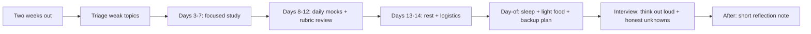

# Final Revision Checklist

## How to Use This File

Three core questions on the final two weeks before AI and ML
interviews: cadence and triage, mock interview structure, and
day-of preparation. Read each, draft your plan, then compare
with the patterns. The senior signal is structured prep, not
last-minute cramming.

## Core Preparation Checklist

- Two-week cadence: triage your weak areas, schedule mocks,
  end with rest before the day.
- Mock interview discipline: timeboxed, recorded if possible,
  reviewed against the rubric.
- Day-of habits: sleep, hydration, light food, calm
  environment for video, backup plan for tech failure.
- Resume and portfolio: in order, with the strongest project
  on top, defensible numbers ready.
- Behavioral stories rehearsed: three in STAR format.
- Calibrated honesty: know what you do not know; have a
  graceful "I would investigate" pattern for unfamiliar topics.

## Interview Question Sections

### Question 1: Two-week cadence

**Question:** You have an AI engineer interview in two weeks.
Walk through how you would prepare.

**What the interviewer is testing:** This is more of a
self-assessment question; the senior pattern is structure.

**Strong answer:** Triage in week one, mock in week two, rest
in the final two days. Day-by-day:
- **Days 1-2.** Audit the weakest topic by self-assessment:
  read the company's AI engineering blog posts, list the
  topics they emphasize, score yourself on each. Focus on
  the bottom 30 percent of self-rated topics for the next
  week. Practice writing answers in 2-3 minutes out loud.
- **Days 3-7.** Two hours per day on weak areas. Use the
  cheatsheets and quizzes here as scaffolding; build out the
  reasoning chain for each topic. Specifically prepare for
  ML system design with the eleven-layer template; practice
  one full system design in 25 minutes against the clock.
- **Days 8-12.** One mock per day (with a peer or a coach if
  possible). Topics rotated: one ML system design, one
  behavioral, one technical deep dive. Record. Review against
  the rubric: what did you say, what did you miss, what would
  the strong answer have included.
- **Days 13-14.** Rest. Light review. Sleep well. Confirm
  logistics: time zone, link, backup contact.

**Weak answer:** "I will read papers." Without structure or
mock practice.

**Follow-up questions:**

- How do you decide which topic is weakest?
- What does a mock interview look like?
- How do you avoid burning out before the interview?
- What if the interview is in three days, not two weeks?

**Common traps:** No mocks. No rest. Cramming new content the
day before.

### Question 2: Mock interview discipline

**Question:** Walk through how you would run a mock interview
for an ML system design round.

**Strong answer:** Treat it like the real thing. 45-60
minutes. The peer reads a system design prompt that the
candidate has not seen. The candidate runs the interview as
if it were real: clarification questions, sketching, talking
through the layers, handling follow-ups. The peer takes notes
on a rubric (the mocks/ folder in this repo has standardized
rubrics): clarity of contract framing, baseline discipline,
metric selection, monitoring, governance, fallback design,
communication. After the timebox, the peer reads the rubric
out loud: what landed, what was thin, what was missing.
Identify the single largest gap and prepare to address it
specifically before the next mock. Two mocks per topic before
the real interview, ideally with different peers. Record
audio so you can hear filler words, pacing, and unclear
explanations.

**Weak answer:** "I will practice with a friend." Without the
rubric, the timebox, or the structured review.

**Follow-up questions:**

- Where do you find a peer for mocks?
- What does the rubric look like for a behavioral mock?
- How do you handle a peer who is too easy or too hard?
- How do you incorporate feedback without losing your style?

**Common traps:** Untimed mocks. No rubric. No recording. No
follow-up on the gaps.

### Question 3: Day-of preparation

**Question:** What does the day of an AI engineer interview
look like for you?

**Strong answer:** Sleep is the single highest-leverage prep.
Eight hours the night before; no late-night cramming. The
morning: light food, hydration, 15 minutes of physical
movement (a walk, light exercise) to settle nerves. Review
your three behavioral stories and the 5-minute pitch for
your strongest project; do not learn anything new. Confirm
logistics: link, time zone, camera and audio test 30 minutes
before. Have a backup plan: phone number for the interviewer,
a charged hotspot, a notebook for notes if the video drops.
During the interview, think out loud (the interviewer cannot
read your mind), ask clarifying questions before diving in,
and budget time across the prompt (do not spend 20 minutes
on the data layer and skip monitoring). Be honest about what
you do not know; "I have not used X in production but I
would investigate Y, Z, and W" is far stronger than
fabricating expertise. After the interview, write a short
note to yourself: what landed, what was hard, what to
research before the next round.

**Weak answer:** "Just relax." Without the logistics, the
backup plan, or the honest-not-knowing pattern.

**Follow-up questions:**

- How do you handle a question you do not know?
- How do you manage time during a system design?
- What is your backup plan if the video drops?
- How do you process the interview afterward?

**Common traps:** Cramming. No backup plan. Faking expertise
on unfamiliar topics. No reflection after.

## Sample Q and A

**Q:** What is the single thing that separates a strong
candidate from a weak one in an AI interview?

**A:** Calibrated reasoning under uncertainty. The strong
candidate names the constraint, picks a baseline, justifies
the architecture, names the metric, names the failure mode,
and admits what they do not know. The weak candidate either
performs confidence on every topic (sounds expert until
probed) or freezes on unfamiliar ground. The senior signal is
"I have not used X in production but I would expect Y, and I
would validate by Z." That pattern beats specific knowledge in
most rounds, because the interviewer can teach the topic but
not the reasoning.

## Mini Exercise

Build your two-week prep schedule on paper. Identify your
weakest topic by self-assessment. Schedule 5 mocks across the
two weeks. Identify the rest days. Identify the day-before
logistics check.

## Diagram

---
## Navigation

[⬅ Previous](14-resume-project-strategy.md) | [🏠 Home](../README.md) | [➡ Next](../mocks/01-ai-engineer-mock.md)
