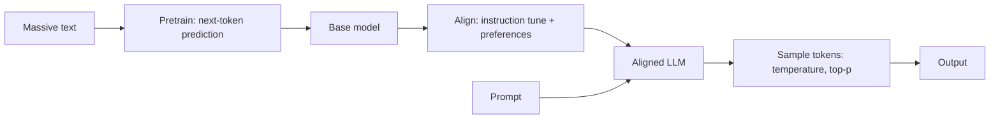

# What Is An LLM

## Beginner-Friendly Intuition

A large language model is a next-word predictor trained on enormous amounts of text. Given some text, it
predicts the most likely next token, then the next, and so on, generating fluent language one piece at a
time. That simple objective, scaled to billions of parameters and trillions of tokens, produces a system
that can summarize, translate, answer questions, and write code. It is not a database of facts; it is a
probabilistic pattern machine.

## Formal Explanation

An LLM is a transformer (usually decoder-only) trained with a self-supervised objective: predict the next
token given the previous ones. Pretraining on web-scale text yields a base model that captures statistical
structure of language. It is then aligned, via instruction tuning and preference optimization, to follow
instructions and behave helpfully. At inference it produces a probability distribution over the vocabulary
for the next token and samples from it (with temperature and top-p controls). Because output is sampled,
the same prompt can give different answers, and confident-sounding text can still be wrong.

## Why It Matters in Real Jobs

LLMs power chat assistants, copilots, search, summarization, and agents. The engineering lesson is that the
model is a component, not the product: it is fluent but unreliable about facts, has a knowledge cutoff, and
costs money per token. Real value comes from wrapping it in a task contract, grounding it with retrieval
when facts matter, evaluating it, and controlling cost and latency. "Use a bigger model" is rarely the
right first move.

## How It Works Step by Step

1. **Pretrain:** learn next-token prediction on massive text (the base model).
2. **Align:** instruction-tune and preference-optimize so it follows instructions.
3. **Prompt:** give it context and a task at inference.
4. **Generate:** sample tokens one at a time using temperature and top-p.
5. **Wrap:** add retrieval, tools, evaluation, and guardrails to make it useful and safe.

## Real-World Example

A support assistant uses an LLM to draft replies. On its own the model might confidently state a refund
policy that does not exist, because it is predicting plausible text, not looking up truth. Grounding it with
retrieval (hand it the actual policy) and a cite-or-abstain contract turns a fluent guesser into a reliable
assistant. The model supplied the language; the system supplied the trust.

## Common Mistakes

- Treating an LLM as a fact database instead of a probabilistic generator.
- Assuming a confident answer is a correct one.
- Reaching for a bigger model before defining the task and grounding facts.
- Ignoring the knowledge cutoff and per-token cost.

## Interview Angle

**Question:** What is an LLM and what are its core limitations?

**Strong answer:** A transformer trained to predict the next token, then aligned to follow instructions.
It is fluent but can hallucinate, has a knowledge cutoff, and costs per token, so I treat it as a component
and ground facts with retrieval and a clear contract.

**Weak answer:** "An AI that knows everything and answers questions."

**Follow-up questions:**

- Why can an LLM sound confident and be wrong?
- What does temperature control?
- When is RAG needed instead of the model's memory?

## Mini Exercise

Pick a task you would give an LLM. Write its task contract in three lines, name one fact it should not
answer from memory, and the control you would add to handle that.

## Diagram

---
## Navigation

[⬅ Previous](../generative-ai/08-generative-ai-evaluation.md) | [🏠 Home](../README.md) | [➡ Next](02-tokenization-for-llms.md)
