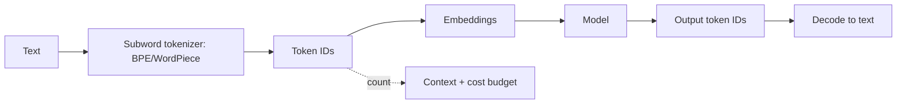

# Tokenization for LLMs

## Beginner-Friendly Intuition

LLMs do not read characters or whole words; they read tokens, which are pieces of words. "Tokenization" is
the step that chops text into these pieces and maps them to numbers the model can process. Common words
become single tokens, rare words split into several. This is why "the" is one token but a long technical
term might be four, and why your bill is measured in tokens, not words.

## Formal Explanation

Tokenization converts text into a sequence of integer token IDs from a fixed vocabulary, usually built by a
subword algorithm like Byte-Pair Encoding (BPE), WordPiece, or SentencePiece. Subword tokenization balances
two extremes: character-level (tiny vocabulary, very long sequences) and word-level (huge vocabulary, fails
on unseen words). By merging frequent character sequences into tokens, it keeps the vocabulary bounded
(often tens of thousands of tokens) while still representing any word by composing pieces. The model embeds
each token ID into a vector before processing.

## Why It Matters in Real Jobs

Tokens are the unit of cost, context, and speed. Context windows are measured in tokens, API pricing is per
token, and latency grows with token count. Tokenization quirks have real effects: numbers and code can
tokenize inefficiently, non-English text often uses more tokens per word (a cost and fairness issue), and a
prompt that looks short in characters may be long in tokens. Understanding this helps you estimate cost and
debug context-limit errors.

## How It Works Step by Step

1. **Build a vocabulary** of subword tokens from a large corpus (for example via BPE merges).
2. **Encode** input text into token IDs by greedily matching the longest known pieces.
3. **Embed** each token ID into a vector for the model.
4. **Generate** token IDs at the output, then decode them back into text.
5. **Count tokens** to manage context limits and cost.

## Real-World Example

A developer is surprised their RAG prompt hits the context limit even though it "looks short". Inspection
shows the documents contain long code identifiers and JSON, which tokenize into many pieces, so 2,000
characters became 1,500 tokens instead of the expected 500. Knowing tokenization, they trim and compress
the context. Separately, they notice their non-English support traffic costs more per message because those
languages use more tokens per word.

## Common Mistakes

- Confusing tokens with words or characters when estimating cost and context.
- Forgetting that code, numbers, and non-English text tokenize inefficiently.
- Ignoring tokenization when a prompt unexpectedly exceeds the context window.
- Assuming token counts are the same across different models. Vocabularies and merge tables differ;
  the same string can be 800 tokens in GPT-4 and 1100 in LLaMA-3, or vice versa. Always count with
  the actual model's tokenizer.
- Forgetting that special tokens (BOS, EOS, system tags, chat markers like `<|im_start|>`) count
  against the budget too. A formatted chat with 6 turns can lose 40-60 tokens to formatting alone.
- Tokenizing long numbers naively. "1234567890" might split into 4-6 pieces; arithmetic gets harder
  for the model. Comma-formatted numbers and scientific notation often tokenize more compactly.
- Assuming rare-word tokenization is graceful. A misspelled brand name or a technical acronym can
  fragment into 5+ pieces, inflating cost and confusing retrieval.

## Interview Angle

**Question:** Why do LLMs use subword tokenization instead of words or characters?

**Strong answer:** Subwords keep the vocabulary bounded while still representing any word, including unseen
ones, by composing pieces. Word-level fails on out-of-vocabulary terms; character-level makes sequences too
long. Tokens are also the unit of cost and context.

**Weak answer:** "It splits text into words for the model."

**Follow-up questions:**

- How does subword tokenization handle a word it never saw?
- Why might non-English text cost more?
- How does tokenization relate to the context window?

## Mini Exercise

Estimate how a sentence with a long technical term and a number would tokenize (roughly how many tokens),
and explain one reason your estimate in tokens differs from the word count.

## Diagram

---
## Navigation

[⬅ Previous](01-what-is-an-llm.md) | [🏠 Home](../README.md) | [➡ Next](03-transformer-decoder-architecture.md)
