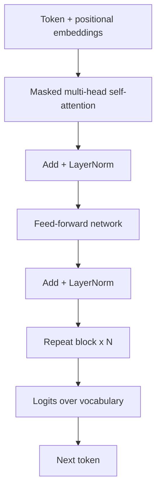

# Transformer Decoder Architecture

## Beginner-Friendly Intuition

Modern LLMs are decoder-only transformers. "Decoder-only" means the model reads text left to right and
predicts the next token, never peeking at future tokens. It stacks the same building block many times: each
block lets every token attend to the tokens before it (attention) and then transforms the result (a small
neural network). Stack dozens of these and you get a system that models language deeply.

## Formal Explanation

A decoder block has two sublayers: masked multi-head self-attention and a position-wise feed-forward
network, each wrapped with a residual connection and layer normalization. The mask is causal: token i can
attend only to tokens 1..i, which enforces left-to-right generation. Attention computes
`softmax(QK^T / sqrt(d_k)) V`, mixing information across positions; the feed-forward layer transforms each
position independently. Positional information is injected (learned or rotary embeddings) because attention
is order-agnostic. The final layer projects to logits over the vocabulary for next-token prediction.

## Why It Matters in Real Jobs

The architecture explains the system's behavior and costs. Causal attention is why generation is sequential
(one token at a time) and why the KV cache exists to make it efficient. The quadratic cost of attention in
sequence length is why long context is expensive and why serving systems care about cache memory.
Understanding the blocks lets you reason about latency, context limits, and why certain optimizations
(flash attention, KV cache) matter.

## How It Works Step by Step

1. **Embed** tokens and add positional information.
2. **Masked self-attention:** each token attends only to earlier tokens via `softmax(QK^T/sqrt(d_k))V`.
3. **Feed-forward:** transform each position independently, with residual and norm.
4. **Repeat** the block N times to build deep representations.
5. **Project to logits** over the vocabulary and predict the next token.

## Real-World Example

During chat generation, the model produces one token, appends it, and predicts the next. Recomputing
attention over the entire growing prefix every step would be wasteful, so the serving system keeps a KV
cache of past keys and values; each new token only attends against the cache. This single architectural
consequence, born from causal attention, is why production LLM inference is engineered around cache memory
and batch scheduling.

## Common Mistakes

- Confusing decoder-only (GPT-style, generation) with encoder-only (BERT-style, embeddings).
- Forgetting the causal mask is what enforces left-to-right generation.
- Saying transformers have built-in order (they need positional embeddings).
- Ignoring the quadratic attention cost when reasoning about long context.

## Interview Angle

**Question:** Describe the decoder block of an LLM.

**Strong answer:** Masked multi-head self-attention plus a feed-forward network, each with residual and
layer norm, stacked N times. The causal mask enforces left-to-right prediction; positional embeddings add
order; attention is `softmax(QK^T/sqrt(d_k))V`, which costs quadratically in length, hence the KV cache.

**Weak answer:** "It is a transformer that generates text," with no blocks or masking.

**Follow-up questions:**

- Why is the attention mask causal?
- What is the KV cache and why does it exist?
- Why are positional embeddings needed?

## Mini Exercise

Sketch one decoder block listing its two sublayers and the residual and norm placement. Then explain in two
sentences why the causal mask forces sequential generation.

## Diagram

---
## Navigation

[⬅ Previous](02-tokenization-for-llms.md) | [🏠 Home](../README.md) | [➡ Next](04-pretraining.md)
