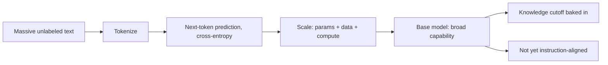

# Pretraining

## Beginner-Friendly Intuition

Pretraining is the long, expensive phase where a model learns language by reading enormous amounts of text
and repeatedly predicting the next token. Nobody hand-labels this data; the text is its own supervision
(the next word is the answer). Out of this simple game, at massive scale, the model absorbs grammar, facts,
reasoning patterns, and styles. The result is a "base model" that knows a lot but is not yet good at
following instructions.

## Formal Explanation

Pretraining optimizes a self-supervised next-token objective (cross-entropy loss) over a huge corpus of
text. Because the label is just the next token in the data, no human annotation is needed, which is what
allows web-scale training. Scale matters: performance improves predictably with more parameters, more data,
and more compute (scaling laws), within limits set by data quality and compute budget. The output is a base
model with broad capabilities but no particular alignment to user intent; it completes text rather than
helpfully answering.

## Why It Matters in Real Jobs

Pretraining is why LLMs are general-purpose and why they have a knowledge cutoff (they only know what was in
the training data up to a date). It is also why facts cannot be "updated" by prompting alone; new knowledge
must come from retrieval or further training. Few teams pretrain from scratch (it is enormously expensive),
but understanding it explains the model's strengths, its cutoff, and why alignment is a separate later step.

## How It Works Step by Step

1. **Collect and clean** a massive, diverse text corpus.
2. **Tokenize** it into token sequences.
3. **Train** the transformer to predict the next token, minimizing cross-entropy.
4. **Scale** parameters, data, and compute per scaling-law guidance and budget.
5. **Produce a base model** that completes text but is not yet instruction-aligned.

## Real-World Example

A base model, given "The capital of France is", reliably completes "Paris", showing it absorbed facts. But
asked "Summarize this email politely", it might just continue the email rather than summarize, because it
learned to predict plausible continuations, not to follow instructions. That gap is exactly what the next
phase, instruction tuning, fixes. The base model is raw capability awaiting alignment.

## Common Mistakes

- Thinking pretraining produces a helpful assistant (it produces a text completer).
- Believing prompting can add knowledge past the training cutoff.
- Ignoring data quality, assuming more data always helps regardless of quality.
- Confusing pretraining (broad, unlabeled) with fine-tuning (narrow, task-specific).

## Interview Angle

**Question:** What is pretraining and what does it produce?

**Strong answer:** Self-supervised next-token training on web-scale text, producing a base model with broad
capability but no instruction alignment. It explains the knowledge cutoff and why new facts need retrieval
or further training, not prompting.

**Weak answer:** "The model is trained on data so it learns things," with no objective or base-vs-aligned
distinction.

**Follow-up questions:**

- Why does pretraining need no labels?
- What are scaling laws?
- Why is a base model not yet a good assistant?

## Mini Exercise

Explain why a base model can complete "Water boils at" correctly but might not follow "Translate this to
French". Name the next training phase that closes that gap.

## Diagram

---
## Navigation

[⬅ Previous](03-transformer-decoder-architecture.md) | [🏠 Home](../README.md) | [➡ Next](05-instruction-tuning.md)
