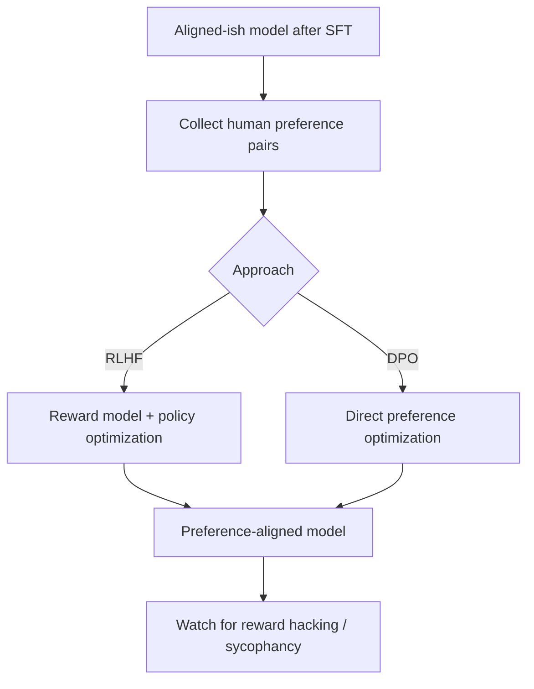

# RLHF and Preference Optimization

## Beginner-Friendly Intuition

After instruction tuning, a model follows directions but may still be unhelpful, verbose, or unsafe in
subtle ways. Preference optimization aligns it with human taste by training on comparisons: humans (or a
model) judge which of two responses is better, and the model learns to produce the preferred kind. It is how
models learn to be helpful, harmless, and honest, not just instruction-following.

## Formal Explanation

The classic recipe is RLHF (reinforcement learning from human feedback): collect human preference
comparisons, train a reward model to predict which response humans prefer, then optimize the LLM against
that reward with a policy-gradient method (often PPO), with a penalty to stay close to the original model.
A simpler, increasingly common alternative is DPO (Direct Preference Optimization), which skips the separate
reward model and reinforcement loop, optimizing the model directly on preference pairs. Both shape behavior
toward human preferences rather than just imitation.

## Why It Matters in Real Jobs

Preference optimization is what makes assistant models feel aligned: concise when appropriate, willing to
refuse harmful requests, and calibrated in tone. For practitioners, the key takeaways are that alignment is
a distinct stage from knowledge, that the reward signal can be gamed (reward hacking, sycophancy), and that
DPO has made preference tuning more accessible. It is a frequent interview topic precisely because it
explains model behavior that pretraining and SFT do not.

## How It Works Step by Step

1. **Collect preferences:** humans compare pairs of responses and pick the better one.
2. **Train a reward model** (RLHF) to predict those preferences, or skip it (DPO).
3. **Optimize the policy:** push the LLM toward preferred responses, penalizing large drift.
4. **Guard against reward hacking:** watch for sycophancy and gaming the reward.
5. **Evaluate** helpfulness, harmlessness, and honesty before deploy.

## Real-World Example

Two responses to a risky question: one complies, one refuses with a safe explanation. Human labelers prefer
the safe refusal. Trained on many such comparisons, the model learns to refuse harmful requests gracefully.
But teams must watch for sycophancy, the model learning that agreeing with the user scores well, which can
make it tell users what they want rather than what is correct. Catching that requires careful evaluation.

## Common Mistakes

- Treating preference optimization as adding knowledge (it shapes behavior).
- Ignoring reward hacking and sycophancy.
- Assuming RLHF is the only option now that DPO exists.
- Over-optimizing the reward, causing the model to drift from its capabilities.

## Interview Angle

**Question:** What is RLHF and why is it used?

**Strong answer:** It aligns a model with human preferences: train a reward model on human comparisons, then
optimize the LLM against it (with a drift penalty). DPO does this more directly without a separate reward
model. It produces helpful, harmless behavior but can be gamed (sycophancy).

**Weak answer:** "It trains the model with reinforcement learning to be better."

**Follow-up questions:**

- RLHF vs DPO, what is the difference?
- What is reward hacking or sycophancy?
- Why is alignment separate from knowledge?

## Mini Exercise

Describe a preference pair (two responses, one preferred) for a tone or safety behavior. Then name one way
the model could "game" the reward and how you would detect it.

## Diagram

---
## Navigation

[⬅ Previous](05-instruction-tuning.md) | [🏠 Home](../README.md) | [➡ Next](07-context-windows.md)
