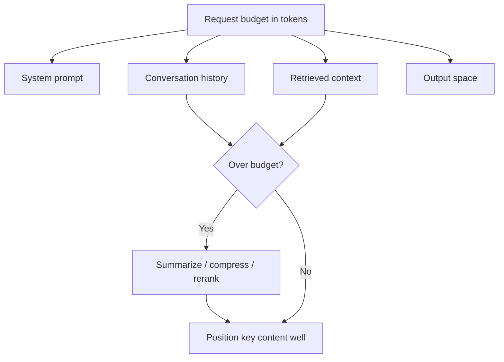

# Context Windows

## Beginner-Friendly Intuition

The context window is how much text the model can consider at once, measured in tokens. It is the model's
working memory for a single request: the system prompt, the conversation, retrieved documents, and the
answer all have to fit. When you exceed it, something must be dropped or summarized. Bigger windows let you
include more, but they cost more and do not guarantee the model uses everything well.

## Formal Explanation

The context window is the maximum number of tokens (input plus output) a model processes in one forward
pass. It is bounded by the architecture and the attention cost, which grows quadratically with sequence
length, so larger windows are expensive in compute and memory. Even within the window, models exhibit the
"lost in the middle" effect: information at the start and end is used more reliably than information buried
in the middle. So effective context is about both fitting and positioning the important content well.

## Why It Matters in Real Jobs

Context limits drive real design choices: how much to retrieve in RAG, how to summarize long conversations,
and how to manage agent memory. Cost scales with tokens, so stuffing a huge context is expensive and can
even reduce quality. A common failure is assuming "just use the long-context model and dump everything in",
which raises cost and can bury the key fact in the middle. Managing context deliberately is core LLM
engineering.

## How It Works Step by Step

1. **Budget the window:** account for system prompt, history, retrieved context, and output.
2. **Prioritize:** include the most relevant content and place it where the model attends best.
3. **Compress or summarize** when content exceeds the budget.
4. **Trim history:** summarize old turns in long conversations.
5. **Measure:** verify quality and cost; more context is not always better.

## Real-World Example

A chat assistant accumulates a long conversation and starts hitting the context limit, dropping the user's
original request. The fix is to summarize earlier turns into a compact running note and keep the latest
turns verbatim, preserving intent within budget. Separately, a RAG system that dumped 20 passages into a
long-context model performs worse than one that reranks to 4 well-placed passages, because the answer was
getting lost in the middle.

## Common Mistakes

- Assuming a bigger context window removes the need to manage content.
- Ignoring the lost-in-the-middle effect when ordering context.
- Forgetting that output tokens also count against the window.
- Letting conversation history grow until it crowds out the actual question.

## Interview Angle

**Question:** How do you handle content that exceeds the context window?

**Strong answer:** Budget the window across prompt, history, retrieval, and output; prioritize and position
the most relevant content; summarize or compress the rest. I do not assume a bigger window solves it, since
cost rises and quality can drop from lost-in-the-middle.

**Weak answer:** "Use a model with a bigger context window."

**Follow-up questions:**

- What is the lost-in-the-middle effect?
- Why does context cost grow with length?
- How do you manage a long conversation?

## Mini Exercise

For a chat assistant with a fixed token budget, list what competes for the window and write a rule for
trimming history without losing the user's original goal.

## Diagram

---
## Navigation

[⬅ Previous](06-rlhf-and-preference-optimization.md) | [🏠 Home](../README.md) | [➡ Next](08-prompt-engineering.md)
