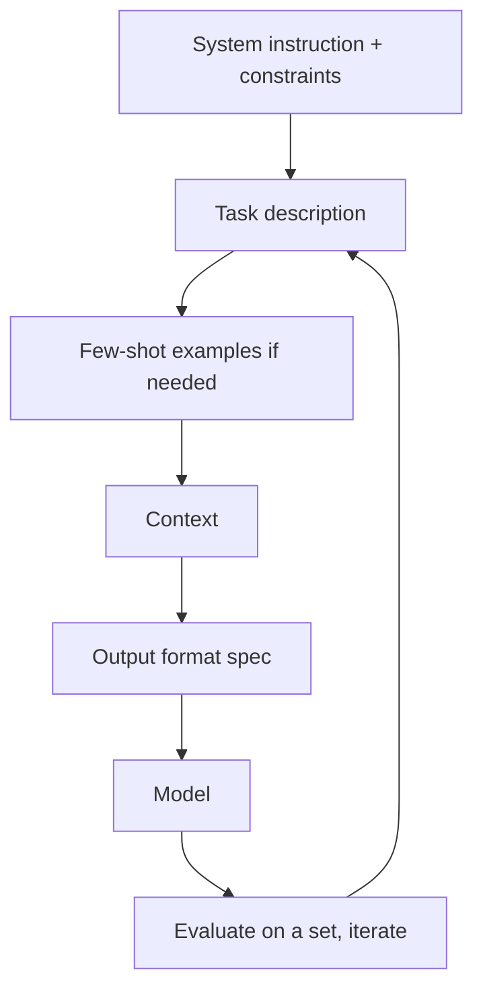

# Prompt Engineering

## Beginner-Friendly Intuition

Prompt engineering is shaping the input so the model gives you what you want. The same model can produce a
vague answer or a precise one depending on how you ask: clear instructions, examples, a defined output
format, and the right context. It is the cheapest, fastest lever to try first, before retrieval or
fine-tuning, because it requires no training and takes minutes to iterate.

## Formal Explanation

A prompt typically has parts: a system instruction (role and rules), the task description, optional few-shot
examples (demonstrations of input to output), the relevant context, and an output-format specification.
Techniques include zero-shot (instruction only), few-shot (examples included), chain-of-thought (ask the
model to reason step by step for complex problems), and structured output (request JSON conforming to a
schema). Good prompts are explicit about the task, constraints, format, and what to do when uncertain.

## Why It Matters in Real Jobs

Prompting is the first and often sufficient intervention. Many "we need to fine-tune" requests are really
"our prompt is underspecified". A clear contract, plus a few examples and a strict output format, fixes a
large share of quality problems at zero training cost. Prompting is also where you encode safety behavior
(refuse, abstain) and output structure that downstream code can parse reliably.

## How It Works Step by Step

1. **Specify the task** and constraints explicitly in a system instruction.
2. **Add examples** (few-shot) if the task or format is hard to describe.
3. **Define the output format** (for example strict JSON) for machine consumption.
4. **Add reasoning** (chain-of-thought) for complex multi-step problems.
5. **Iterate against an eval set,** not single examples, to avoid overfitting the prompt.

## Real-World Example

A classification feature returns inconsistent labels. The original prompt just said "classify this ticket".
Rewriting it to list the exact label set, give two examples per label, and require a JSON output with a
"label" and "reason" field makes the output reliable and parseable, no fine-tuning needed. The team
validates on 100 labeled tickets rather than eyeballing one, so they know the prompt change actually helped.

## Common Mistakes

- Vague prompts that omit the task constraints or output format.
- Tuning the prompt on one example instead of an eval set (overfitting).
- Reaching for fine-tuning when a clearer prompt would suffice.
- No instruction for the uncertain or unsafe case (abstain, refuse).

## Interview Angle

**Question:** When do you prompt-engineer versus fine-tune?

**Strong answer:** Prompting first; it is free and fast. I make the task, constraints, examples, and output
format explicit and iterate on an eval set. I move to retrieval for facts and fine-tuning only when a clear
prompt provably cannot achieve the needed reliability.

**Weak answer:** "Just write a good prompt," with no structure, examples, or evaluation.

**Follow-up questions:**

- What is chain-of-thought and when does it help?
- How do you get reliable structured output?
- How do you avoid overfitting a prompt?

## Mini Exercise

Take a weak prompt ("summarize this") and rewrite it with an explicit task, one example, an output format,
and an abstain rule. State how you would validate the improvement.

## Diagram

---
## Navigation

[⬅ Previous](07-context-windows.md) | [🏠 Home](../README.md) | [➡ Next](09-function-calling-tool-use.md)
