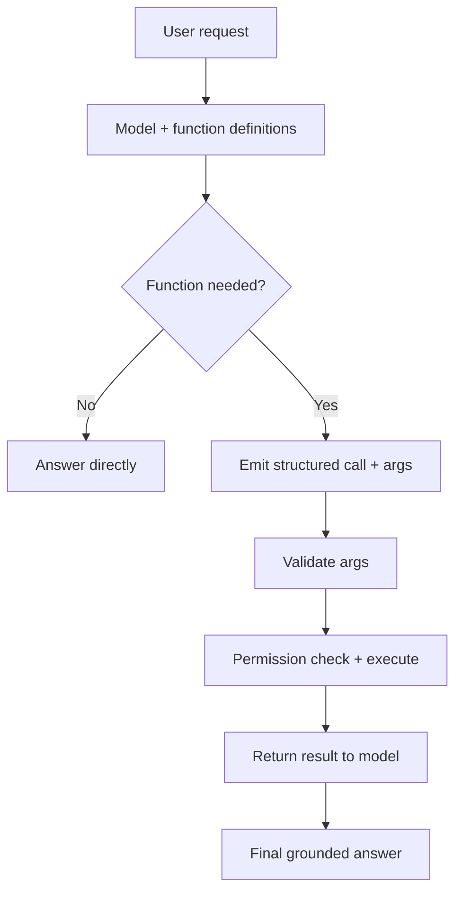

# Function Calling Tool Use

## Beginner-Friendly Intuition

Function calling lets an LLM do things beyond writing text: look up data, call an API, run a calculation. You
describe the functions available (name and arguments), and instead of guessing an answer, the model outputs
a structured request to call one. Your code runs it and returns the result. This is how an LLM connects to
live data and real systems reliably, rather than hallucinating values.

## Formal Explanation

You provide the model with tool (function) definitions: a name, a description, and a JSON schema for the
arguments. Given a user request, the model decides whether to answer directly or emit a structured function
call with arguments matching the schema. The runtime validates the arguments, executes the function, and
returns the result to the model, which continues. This is the foundation of agents and of grounding the
model in authoritative sources (a database, a calculator, a search API) instead of its unreliable memory.

## Why It Matters in Real Jobs

Function calling turns an LLM from a text generator into something that can act on real systems with
structured, validated inputs. It is how you get reliable numbers (call a calculator, not the model's
arithmetic), live data (query the database), and actions (create a ticket). It is also where reliability and
safety concentrate: clear schemas, argument validation, permissions, and approval gates for risky calls. It
underpins both tool-augmented single calls and full agents.

## How It Works Step by Step

1. **Define functions:** name, description, and a strict argument schema.
2. **Model decides:** answer directly or emit a structured call with arguments.
3. **Validate** the arguments against the schema; reject and return an error if invalid.
4. **Execute** the function with permission checks.
5. **Return the result** to the model to compose the final answer.

## Real-World Example

A user asks "What is my account balance and is it enough for a 500 dollar transfer?" Rather than inventing a
number, the model calls `get_balance(account_id)`, receives 1,200 dollars, and answers correctly that the
transfer is covered. The arithmetic and the data both came from authoritative sources via function calls.
The transfer action itself is gated behind confirmation, separating safe lookups from consequential actions.

## Common Mistakes

- Letting the model compute or recall values it should fetch via a function.
- No argument validation, passing malformed inputs to the function.
- Vague function descriptions, so the model calls the wrong one.
- Allowing consequential actions with no permission or confirmation.

## Interview Angle

**Question:** How does function calling make an LLM more reliable?

**Strong answer:** It lets the model fetch authoritative data and perform actions through structured,
validated calls instead of hallucinating. I define clear schemas, validate arguments, check permissions, and
gate risky actions. It is the basis of grounding and of agents.

**Weak answer:** "The model can call functions to do stuff," with no schemas or validation.

**Follow-up questions:**

- How does the model know which function to call?
- Why validate arguments and return errors to the model?
- Which calls need confirmation or permissions?

## Mini Exercise

Define one read-only function and one action function for an assistant. Write each schema and specify the
validation and the confirmation rule for the action.

## Diagram

---
## Navigation

[⬅ Previous](08-prompt-engineering.md) | [🏠 Home](../README.md) | [➡ Next](10-llm-evaluation.md)
