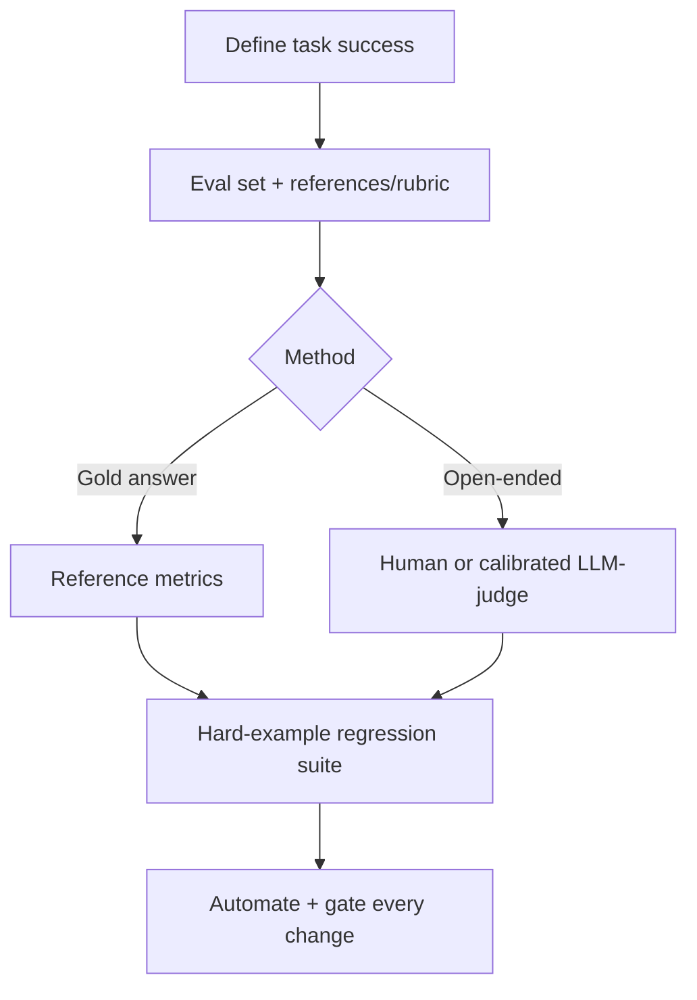

# LLM Evaluation

## Beginner-Friendly Intuition

Evaluating an LLM feature is hard because there is often no single right answer, and the same prompt can
give different outputs. "It looks good" is not evaluation. You need a repeatable way to measure quality on
representative inputs, catch regressions when you change a prompt or model, and tie the score to what users
actually need.

## Formal Explanation

LLM evaluation combines several approaches. Reference-based metrics (exact match, BLEU, ROUGE) work when
there is a gold answer but are weak for open-ended generation. Human evaluation is the gold standard but
slow and costly. LLM-as-judge uses a strong model to score outputs against a rubric, scalable but must be
calibrated against human labels to be trusted. Task-specific metrics (faithfulness for RAG, pass rate for
code, exact match for extraction) tie to the real goal. A good setup includes a curated eval set, a
hard-example regression suite, and automation in the deployment pipeline.

## Why It Matters in Real Jobs

Without evaluation, every change is a gamble: a prompt tweak that helps one case may break ten others, and
you would not know until users complain. Evaluation-driven development, define the metric and eval set,
then iterate, is what makes LLM work engineering rather than guessing. It also protects against silent
regressions when you upgrade models or prompts.

## How It Works Step by Step

1. **Define success** for the task in measurable terms (faithfulness, pass rate, format validity).
2. **Build an eval set** of representative inputs with references or rubrics.
3. **Choose a method:** reference metrics, human review, or calibrated LLM-as-judge.
4. **Add a hard-example suite** of tricky and should-refuse cases.
5. **Automate and gate:** run on every change; recalibrate the judge against humans.

## Real-World Example

A team upgrades the model behind a summarizer expecting improvement, but their eval set (50 documents with
rubric-scored summaries) shows faithfulness dropped because the new model is more concise and omits key
facts. Because they evaluated, they caught it before launch and adjusted the prompt. Their LLM-as-judge was
trusted only because they had checked it against human scores on a sample first.

## Common Mistakes

- Eyeballing a few outputs instead of using a fixed eval set.
- Trusting LLM-as-judge scores without calibrating against humans. **LLM-as-judge has known biases**:
  **length bias** (favors longer answers), **position bias** (when comparing two responses, often picks
  the one shown first or last), **self-preference** (a judge model favors outputs from its own family),
  and **language bias** (English-fluent judges score English answers higher). Mitigations: randomize
  position when scoring pairs, use a different model family as judge than the one being evaluated,
  spot-check 5-10 percent against human raters and report agreement, and report calibration over time
  (judge accuracy can drift when the judge model is updated).
- Using BLEU or ROUGE alone for open-ended tasks.
- No regression suite, so prompt or model changes silently break old cases.
- **Eval set size that does not match the decision.** Rules of thumb: 50-100 examples for early
  iteration, 200-500 for serious comparison between candidates, 1000+ for launch decisions and for
  detecting <2 percent quality differences. Bootstrap confidence intervals on the metric tell you
  whether your set is large enough to distinguish two candidates.
- **Eval contamination.** Models are pretrained on internet text; popular benchmarks (MMLU, HumanEval)
  may be in the training data of the model you are evaluating. Symptoms: suspiciously high scores,
  metric stagnation when you change non-relevant variables. Mitigations: build private eval sets from
  internal data, paraphrase public benchmarks, and check for verbatim memorization with simple
  string-search tests.

## Interview Angle

**Question:** How do you evaluate an LLM feature?

**Strong answer:** Define a task-specific metric, build a representative eval set plus a hard-example
regression suite, and choose reference metrics, human review, or a calibrated LLM-as-judge. Automate it in
the pipeline so every change is gated.

**Weak answer:** "Check if the outputs look good."

**Follow-up questions:**

- How do you build and calibrate an LLM-as-judge?
- Why are BLEU and ROUGE weak for open-ended tasks?
- What goes in a regression suite?

## Mini Exercise

For an LLM feature you can imagine, define the success metric, describe a five-example eval set with
references or a rubric, and name one hard case the regression suite must include.

## Diagram

---
## Navigation

[⬅ Previous](09-function-calling-tool-use.md) | [🏠 Home](../README.md) | [➡ Next](11-hallucinations.md)
