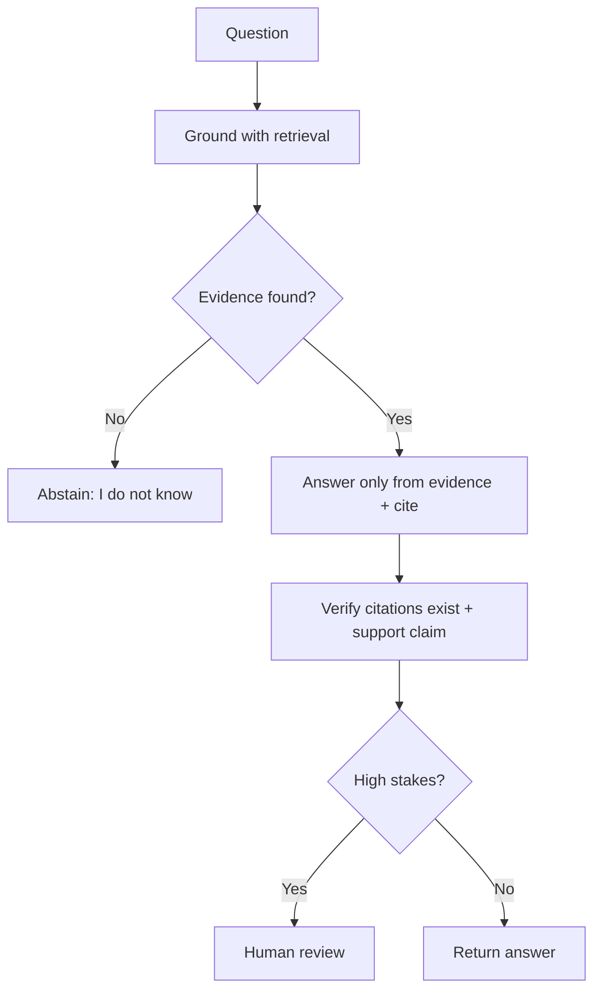

# Hallucinations

## Beginner-Friendly Intuition

A hallucination is when an LLM states something false as if it were true. It is not lying or malfunctioning;
it is the model doing exactly what it was trained to do, predict plausible text, even when it has no
grounding for the claim. The danger is that hallucinations are fluent and confident, so they look like
correct answers. Reducing them is about grounding and constraint, not hoping the model "knows better".

## Formal Explanation

Hallucinations arise because the model generates the most probable continuation, not the most factual one,
and it has no built-in mechanism to check truth. Types include factual errors (wrong facts), fabricated
sources or citations, and unsupported reasoning. Mitigations: ground the model with retrieval so answers
come from real evidence, enforce a cite-or-abstain contract, lower temperature for factual tasks, ask the
model to express uncertainty, and verify outputs (check citations, validate against sources). No single fix
eliminates hallucination; you stack defenses and measure the residual rate.

A useful **taxonomy of hallucination types**:

- **Factual error.** A claim that is verifiably wrong (e.g., wrong date, wrong number).
- **Source fabrication.** Citation to a paper, case, URL, or product that does not exist. Most damaging
  in legal, medical, and academic contexts because the citation looks credible.
- **Context conflation.** Two retrieved documents are merged into a single fabricated claim that neither
  one supports. Common in RAG when chunks are short or related.
- **Unsupported reasoning.** The model's logical chain looks valid but rests on an unstated and false
  premise.
- **Self-reinforcement.** In multi-turn conversations or chains-of-thought, the model treats its own
  earlier (incorrect) statements as established fact and builds on them.

**Per-claim measurement** is the rigorous way to track hallucination rate. For each generated answer,
extract the verifiable claims (facts, numbers, citations), check each against authoritative sources, and
compute the per-claim accuracy. Report at the claim level, not the answer level: an answer with 9 correct
claims and 1 hallucinated number is 90 percent accurate at the claim level, which is more honest than
counting it as "wrong." Per-claim eval requires either a labeled dataset or an LLM-as-judge configured
specifically for fact verification (with calibration). For RAG systems combined with fine-tuning,
hallucinations can still occur on questions adjacent to but not answered by the retrieved documents; the
model fills the gap with prior knowledge instead of abstaining. A faithfulness eval (does every claim in
the answer have support in the retrieved passages?) catches this.

## Why It Matters in Real Jobs

In domains like medical, legal, or financial, a confident hallucination is a liability, not a quirk. The
fact that hallucinations are fluent makes them more dangerous than obvious errors, because users trust them.
The professional stance is to assume the model can hallucinate and design the system to catch or prevent it:
grounding, abstention, verification, and human review for high-stakes outputs. Interviewers want to see you
treat this as a system design problem.

## How It Works Step by Step

1. **Ground:** use retrieval so answers draw on real evidence, not memory.
2. **Constrain:** require the model to answer only from provided context and cite sources.
3. **Enable abstention:** instruct it to say "I do not know" when evidence is missing.
4. **Tune sampling:** lower temperature for factual tasks.
5. **Verify and review:** validate citations, and route high-stakes outputs to humans.

## Real-World Example

A legal assistant asked about a statute confidently cites a case that does not exist, a fabricated citation.
Adding RAG so it answers only from a real case database, requiring every claim to cite a retrieved source,
and validating that cited cases exist before returning, eliminates the fabricated citations. Where evidence
is missing, it now abstains. The model did not get smarter; the system stopped trusting it blindly.

## Common Mistakes

- Assuming a bigger or newer model will not hallucinate.
- No abstention path, so the model fills gaps with fabrication.
- Trusting citations without verifying they exist and support the claim.
- High temperature on factual tasks, increasing made-up content.

## Interview Angle

**Question:** Why do LLMs hallucinate and how do you reduce it?

**Strong answer:** They predict plausible text, not truth, with no built-in fact check. I ground with
retrieval, require cite-or-abstain, lower temperature for factual tasks, verify citations, and route
high-stakes cases to humans. I measure the residual hallucination rate.

**Weak answer:** "Use a better model so it stops making things up."

**Follow-up questions:**

- Why are hallucinations especially dangerous?
- How does RAG reduce them, and what does it not fix?
- How would you measure the hallucination rate?

## Mini Exercise

Take a domain where a wrong answer is costly. List three defenses you would stack against hallucination and
one way you would measure whether they worked.

## Diagram

---
## Navigation

[⬅ Previous](10-llm-evaluation.md) | [🏠 Home](../README.md) | [➡ Next](12-guardrails.md)
